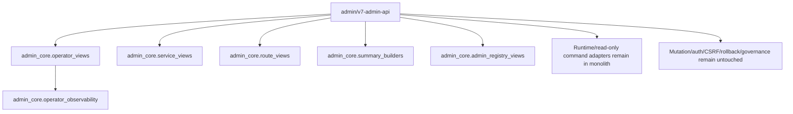

# PROGRAM API.3 OPERATOR VIEWS, SERVICE VIEWS AND PERFORMANCE FOUNDATION REPORT

Project: V7 Vozduh
Workspace: `/Users/ponch/Documents/New project`
Branch: `Updatesystem`

## Human Explanation

API.3 continued the admin monolith decomposition without touching runtime authority. The main decision was to reuse the already-existing operator observability owner instead of creating a second operator model. Service, route, and shared summary builders were extracted into read-only `admin_core` modules, while `admin/v7-admin-api` kept thin compatibility wrappers and all HTTP/auth/action boundaries.

No execution, rollback, governance mutation, auth, CSRF, audit writer, closure writer, deploy, service restart, or autoswitch apply path was changed.

## What Moved

New modules:

- `admin_core/operator_views.py`
- `admin_core/service_views.py`
- `admin_core/route_views.py`
- `admin_core/summary_builders.py`

Moved/read-only extracted areas:

- operator view facade over `admin_core.operator_observability`
- service matrix builders
- service recommendation builders
- Trusted RU route summary builders
- query/pagination helpers
- bounded JSONL reader foundation
- schema contract foundation

## What Remained

Still in `admin/v7-admin-api`:

- HTTP handler dispatch
- auth/RBAC/CSRF/session context
- runtime command reads
- overview orchestration
- mutation handlers
- audit writer calls
- closure writer calls
- rollback/execution/governance action surfaces
- UI shell

## Architecture Diagram



## Endpoint Parity

Endpoint inventory before and after API.3:

- endpoint count: `264` -> `264`
- summary unchanged: `true`
- stable endpoint definitions unchanged: `true`

Expected metadata drift:

- monolith source line count: `36459` -> `36046`

## Tests

Commands:

```bash
PYTHONPYCACHEPREFIX=/tmp/api3_pycache python3 -m py_compile admin/v7-admin-api admin_core/operator_views.py admin_core/service_views.py admin_core/route_views.py admin_core/summary_builders.py
python3 -m unittest tests.unit.test_api3_read_only_views
python3 -m unittest discover tests
```

Results:

- compile: `OK`
- focused API.3 tests: `OK`, `6` tests
- full suite: `OK`, `211` tests

## Performance Findings

API.3 adds performance foundation but no cache. This keeps behavior stable.

Foundation added:

- bounded JSONL reader helper
- query/pagination shared helpers
- reusable service summary builders
- reusable route summary builders
- schema contracts for later fixture parity

Remaining performance hotspots:

- `overview()` broad aggregation
- per-user route probes in `route_status()`
- Trusted/direct live diagnostic calls
- traffic SQLite summaries
- large `Handler`
- large `html_page_v2`

## Metrics

- lines removed from monolith: `413`
- new API.3 admin_core lines: `710`
- API.3 test lines: `127`
- remaining monolith size: `36046`

## API.4 Recommendation

API.4 should extract the read-only overview aggregation layer into `admin_core.overview_views`.

Start only after adding `/api/overview` fixture/parity tests. Keep auth, handlers, mutation, runtime execution, rollback, governance, audit writers, and closure writers out of scope.

## Final Verdicts

- `operator_views_extracted=true`
- `service_views_extracted=true`
- `route_views_extracted=true`
- `summary_builders_extracted=true`
- `schema_contracts_created=true`
- `performance_foundation_extended=true`
- `runtime_behavior_preserved=true`
- `governance_behavior_preserved=true`
- `tests_pass=true`
- `safe_to_begin_API4=true`
