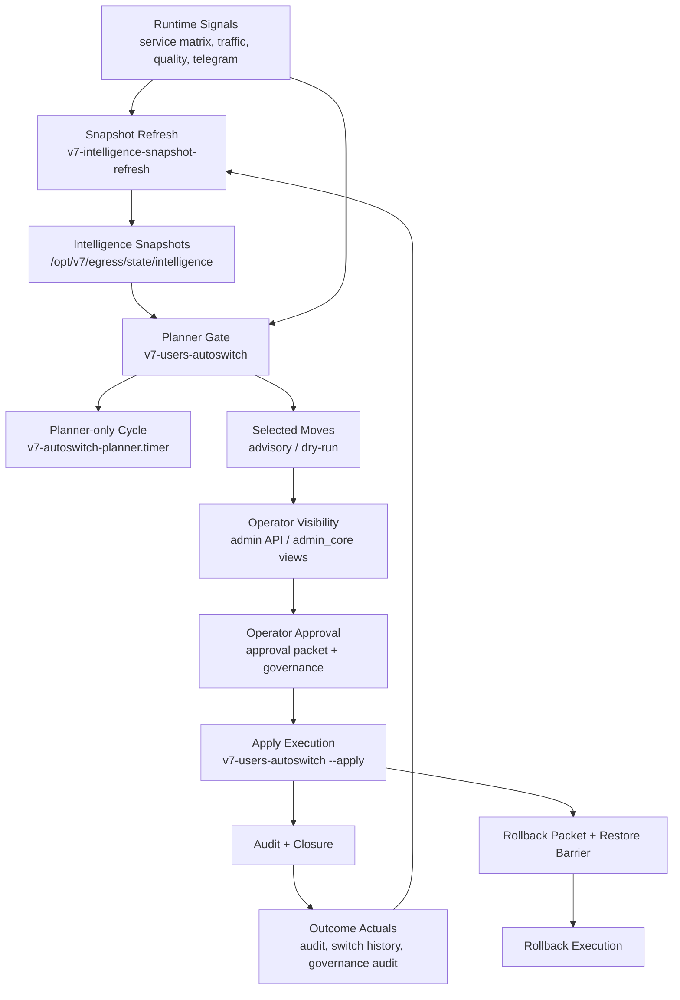

# PROGRAM V7 Runtime Nervous System And Operating Policy Certification Report

Date: 2026-06-04

Project: V7 Vozduh

Workspace: `/Users/ponch/Documents/New project`

Branch: `Updatesystem`

Program: `PROGRAM_V7_RUNTIME_NERVOUS_SYSTEM_AND_OPERATING_POLICY_CERTIFICATION`

Safety posture: no autonomy enabled, no users moved, no autoswitch apply, no routing mutation, no planner/governance/execution/rollback ownership changed, no new planner, no new governance path, no new execution path, no new runtime authority, no new truth source, no new snapshot root.

Evidence folder: `runtime_nervous_system_evidence/`

Full regression:

```text
PYTHONPYCACHEPREFIX=/private/tmp/runtime_nervous_pycache python3 -m unittest discover tests
Ran 292 tests in 19.035s
OK
```

## Executive Verdict

V7 already has the components of a runtime nervous system, but it is not yet certified as a complete Runtime Operating System.

The closest runtime orchestrator remains `tools/v7-users-autoswitch`, with systemd timers as triggers. Current production truth shows an important evolution from older Z6 evidence: the active recurring runtime cycle is now `v7-autoswitch-planner.timer/service`, which runs `/usr/local/bin/v7-users-autoswitch` without `--apply`. The movement-capable `v7-users-autoswitch.timer/service` exists but is currently held/inactive in the latest production truth.

This means the system has a usable planner-only shadow cycle, but it lacks a certified sustained intelligence snapshot refresh cadence and a fully current trigger ownership certification. Therefore:

- Runtime policy can be defined now.
- Runtime operating behavior is partially certified.
- Runtime autonomy is not certified.
- Operator-visible and operator-approval promotion remain blocked.

## Reality Audit

Latest known convergence truth before this program:

| Layer | Truth |
| --- | --- |
| Local branch | `Updatesystem` |
| Local commit | `4905000186f74763e5f91c63ae44be2e3330816d` |
| GitHub branch | `origin/Updatesystem` |
| GitHub commit | `4905000186f74763e5f91c63ae44be2e3330816d` |
| Production commit | `4905000186f74763e5f91c63ae44be2e3330816d` |
| Convergence | `PASS`, `ALIGNED`, `FULLY_ALIGNED` |
| Runtime access | `READY` |
| Runtime truth | `KNOWN` |

Current runtime reality:

| Component | Current status | Certification impact |
| --- | --- | --- |
| `v7-autoswitch-planner.timer/service` | Active planner-only trigger | Must be recognized as current planner cycle owner. |
| `v7-users-autoswitch.timer/service` | Inactive/held in latest sample | Apply authority is not continuously active. |
| `v7-intelligence-snapshot-refresh.service/timer` | Missing | Sustained snapshot freshness is not certified. |
| `tools/v7-intelligence-snapshot-refresh` | Existing CLI by prior OUTCOME.1 evidence | Reuse; do not create new snapshot writer/root. |
| Intelligence snapshot root | Existing `/opt/v7/egress/state/intelligence/` | Canonical root; no duplicate root allowed. |

## Runtime Reality Map

| Runtime function | Owner | Truth source | Trigger | Consumer | Failure behavior |
| --- | --- | --- | --- | --- | --- |
| Planner decision | `tools/v7-users-autoswitch` | registry, service matrix, current routes, intelligence snapshots | CLI/admin, `v7-autoswitch-planner.timer` | selected moves, admin/operator views | dry-run, no apply, fail closed when gate stops |
| Selected moves | `tools/v7-users-autoswitch` | planner candidate state | planner cycle | operator/admin, apply path | empty list or stop reason on unsafe inputs |
| Apply execution | `tools/v7-users-autoswitch --apply` under governed apply authority | selected moves, restore barrier, live route truth | `v7-users-autoswitch.timer/service` when restored or approved execution | runtime route state, audit, rollback | blocked by barrier/policy/eligibility; no movement without apply |
| Governance approval | admin/operator governance path | approval packets, governance audit | operator action or approved program block | execution/rollback handlers | no approval means no execution |
| Rollback packet | `tools/v7-users-autoswitch` and operator execution support | pre-move state, selected moves, runtime state | apply/rollback lifecycle | operator rollback | rollback unavailable if packet missing/stale |
| Restore barrier | autoswitch/apply governance lifecycle | barrier state files and reports | pre-apply and post-apply lifecycle | planner/apply/rollback | stale/missing barrier blocks movement |
| Snapshot refresh | `tools/v7-intelligence-snapshot-refresh` | runtime state, outcome mapper, signal sources | manual/CLI today; no systemd cadence found | planner, admin, RI views | missing/stale/volatile/source mismatch stops runtime trust |
| Recommendation | RI/advisory modules consumed by `v7-users-autoswitch` | snapshot families, trust/prediction scores | planner/admin view | operator decision support | advisory only, no execution authority |
| Trust | RI6 trust logic and snapshots | live outcomes, historical quality, service behavior | refresh/calibration | recommendation/confidence gate | low trust de-escalates authority |
| Prediction | RI6 prediction logic and snapshots | outcome actuals and signal state | refresh/calibration | recommendation/confidence gate | low/missing prediction blocks promotion |
| Outcome collection | outcome mapper and audit readers | switch history, runtime audit, operator audit | mapper/read integration | calibration/trust | missing actuals block certification |
| Audit | audit logging tools and audit JSONL | runtime/governance/execution events | runtime/governance actions | evidence, closure, reports | missing audit blocks closure |
| Closure | reports and operator observability | audit completion and certification evidence | post-action review | next program gate | no closure means no promotion |
| Convergence | `v7-convergence-status`, `v7-truth-check`, `v7-safe-deploy` | local/GitHub/production commit and runtime fingerprint | explicit pre-live-action check | Codex/operator | UNKNOWN or mismatch means STOP |

## Snapshot Operating Policy

Policy: intelligence snapshots are the only runtime-consumable intelligence truth for planner/advisory decisions. Runtime may read snapshots; runtime must not recompute heavy intelligence during the critical path.

| Rule | Runtime behavior | Failure behavior | Owner | Evidence/certification |
| --- | --- | --- | --- | --- |
| Single snapshot root | Use `/opt/v7/egress/state/intelligence/` only. | New root forbidden. | snapshot refresh CLI + release process | OUTCOME.1 and this report |
| Snapshot refresh | Use existing `tools/v7-intelligence-snapshot-refresh`. | If refresh owner/cadence unknown, no promotion. | snapshot refresh owner | CLI exists by prior evidence; systemd missing |
| Snapshot freshness | Planner may consume only fresh, stable snapshot families. | stale/missing/volatile/source mismatch stops advisory promotion and selected moves as configured. | `tools/v7-users-autoswitch` gate | fast-path gate and OUTCOME.1 evidence |
| Snapshot cadence | Must be explicit: timer or governed pre-planner refresh gate. | Missing cadence blocks operator-visible and autonomy stages. | future SNAPSHOT cadence program | not certified |
| Heavy computation | Heavy RI workers run outside runtime critical path. | If runtime needs heavy computation, stop and move it into snapshot refresh. | RI/snapshot owner | policy defined |

Snapshot policy verdict: defined, not fully operationally certified because production has no snapshot refresh service/timer.

## Outcome Operating Policy

Policy: outcomes are calibration truth, not execution authority. They feed trust, prediction, and recommendation quality, but cannot directly move users.

Outcome state taxonomy:

| State | Definition | Runtime behavior | Calibration behavior |
| --- | --- | --- | --- |
| `SUCCESS` | Planned move or recommendation achieved expected service/risk result without rollback. | May increase confidence only after audit closure. | Positive actual for trust/prediction/recommendation quality. |
| `FAILURE` | Move or recommendation produced worse service/risk result or violated policy expectation. | De-escalate affected service/channel/user class. | Negative actual; reduce trust and prediction confidence. |
| `PARTIAL_SUCCESS` | Some target metrics improved while others regressed or confidence is incomplete. | Keep advisory; block promotion until more actuals. | Mixed actual; lower weight than success/failure. |
| `ROLLBACK_REQUIRED` | Runtime/operator evidence requires return to prior route/state. | Execution authority must prefer rollback path, not new optimization. | Strong negative actual; rollback quality becomes mandatory evidence. |
| `UNKNOWN` | Missing, stale, conflicting, or insufficient actuals. | No quality claim; no authority promotion. | Excluded or low-confidence calibration input. |

| Rule | Runtime behavior | Failure behavior | Owner | Evidence/certification |
| --- | --- | --- | --- | --- |
| Outcome definition | Outcome actuals are derived from switch history, operator execution audit, governance audit, and runtime audit. | Missing source means no calibration claim. | outcome mapper/readers | OUTCOME.1 |
| Retention | Keep raw audit/event sources server-owned. | Do not copy into a new truth source. | runtime/audit owner | policy |
| Archive/expiration | Historical outcomes may be archived only by a separate governed retention block. | unknown retention means no deletion. | future retention owner | not implemented here |
| Calibration usage | Outcomes may adjust prediction/trust/recommendation scores. | no actuals means low confidence. | RI6/snapshot owner | RI6 + OUTCOME.1 |
| Execution authority | Outcomes never execute movement. | direct outcome-to-apply path forbidden. | governance/runtime owner | policy |

Outcome policy verdict: defined and partially evidenced by OUTCOME.1 live calibration, but long-term retention/archive policy remains future work.

## Recommendation Operating Policy

Policy: recommendations are advisory until separately certified for operator-visible or approval stages.

Recommendation states:

| State | Policy | Runtime behavior | Failure behavior | Owner |
| --- | --- | --- | --- | --- |
| `APPEARS` | Store/display only through existing snapshot/admin view paths. | Operator may inspect evidence. | If source unknown, hide/de-escalate. | recommendation/snapshot owner |
| `DISPLAYABLE` | Allowed only when snapshots are fresh and quality gate is satisfied. | Show recommendation, reason, confidence, rollback context. | Do not display as actionable if quality uncertified. | operator view owner |
| `IGNORED` | A recommendation may be ignored without side effects. | No runtime mutation. | No penalty unless outcome evidence later proves systematic miss. | operator/governance owner |
| `USED_FOR_CALIBRATION` | Recommendation outcome may update quality metrics after closure. | Feed outcome mapper and trust/prediction quality. | Missing closure means no calibration. | outcome owner |
| `USED_FOR_APPROVAL_EVIDENCE` | May support operator approval only after operator-visible readiness. | Approval packet references evidence, not authority. | Low confidence blocks approval promotion. | governance owner |
| `REJECTED` | Rejected recommendation must remain auditable. | Keep reason/evidence for learning. | Repeated rejected/failed class lowers trust. | audit/outcome owner |

| Rule | Runtime behavior | Failure behavior | Owner | Evidence/certification |
| --- | --- | --- | --- | --- |
| Recommendation source | Read from snapshot-backed advisory outputs. | Missing/stale snapshots suppress recommendation confidence. | RI/snapshot owner | OUTCOME.1, RI reports |
| Runtime usage | Runtime may include advisory scores in dry-run/planner output. | Advisory output must not create apply authority. | `tools/v7-users-autoswitch` | local code/report evidence |
| Operator visibility | Operator may see recommendations only after quality certification. | Current `recommendation_quality_certified=false` blocks promotion. | operator/intelligence owner | production shadow report |
| Approval use | Approval packets may reference recommendations only as evidence, not authority. | low confidence requires manual review/de-escalation. | governance owner | policy |

Recommendation policy verdict: defined; recommendation quality remains not certified.

## Trust Operating Policy

Policy: trust is a confidence modifier and de-escalation signal. Trust must never bypass governance.

Trust state behavior:

| Trust state | Runtime behavior | Failure behavior |
| --- | --- | --- |
| trust increases | May raise display confidence only after fresh evidence and closure. It does not grant execution. | If no audit closure, ignore increase. |
| trust decreases | De-escalate recommendation confidence and authority level. | Block operator approval or autonomy for affected class. |
| trust stale | Treat as low confidence. | Require refresh or stop promotion. |
| trust confidence low | Keep shadow/advisory only. | No operator approval/bounded autonomy. |
| trust unavailable | Treat as unknown. | Fail closed for promotion. |

| Rule | Runtime behavior | Failure behavior | Owner | Evidence/certification |
| --- | --- | --- | --- | --- |
| Trust source | Snapshot/trust summaries produced by RI workers. | Missing trust means no promotion beyond shadow. | RI6/snapshot owner | RI6 report |
| Trust threshold | Higher authority requires sufficient trust evidence. | low trust de-escalates to shadow/operator review. | authority policy owner | this report |
| Trust decay | stale trust must be treated as low confidence. | stale trust blocks operator approval/autonomy. | snapshot policy owner | policy |
| Governance | Trust cannot authorize movement. | any trust-to-execution path is forbidden. | governance owner | policy |

Trust policy verdict: defined.

## Prediction Operating Policy

Policy: prediction is a bounded risk estimate and calibration input, not a runtime executor.

Prediction state behavior:

| Prediction state | Runtime behavior | Failure behavior |
| --- | --- | --- |
| prediction accurate | May increase future confidence after outcome closure. | No direct authority change. |
| prediction inaccurate | Lower model/service/channel trust. | Block affected recommendation class until recalibrated. |
| prediction stale | Treat as low confidence. | Require refresh before promotion. |
| prediction unavailable | Continue planner only without prediction promotion. | No operator-visible/approval escalation. |
| prediction low confidence | Show only as weak evidence if operator-visible is certified. | De-escalate to shadow. |
| prediction conflicts with suitability | Prefer safer policy: require operator review and block autonomy. | No automatic execution. |

| Rule | Runtime behavior | Failure behavior | Owner | Evidence/certification |
| --- | --- | --- | --- | --- |
| Prediction source | Use snapshot-backed prediction summaries. | missing prediction blocks authority promotion. | RI6/snapshot owner | RI6 report |
| Prediction use | Planner/operator views may show predicted suitability/risk. | low confidence prevents approval/autonomy readiness. | recommendation/trust owner | policy |
| Calibration | Actual outcomes must recalibrate prediction. | no actuals means no quality certification. | outcome owner | OUTCOME.1 |
| Runtime weight | Runtime may consume prediction cheaply from snapshots. | heavy prediction inside runtime path is forbidden. | runtime/snapshot owner | policy |

Prediction policy verdict: defined.

## Authority Escalation Policy

Authority ladder:

| Level | Allowed behavior | Required evidence | De-escalation trigger | Verdict |
| --- | --- | --- | --- | --- |
| SHADOW | dry-run only, no movement, no apply | convergence known, planner-only path, snapshot gate visible | stale snapshot, unknown trigger owner, low confidence | PARTIAL |
| OPERATOR_VISIBLE | show recommendations and reasons to operator | fresh sustained snapshots, recommendation quality, audit path, no execution authority | stale/missing snapshots or uncertified quality | NOT READY |
| OPERATOR_APPROVAL | operator-approved bounded execution packet | operator-visible ready, approval packet lifecycle, restore barrier, rollback packet, audit closure | missing approval/barrier/rollback/audit | NOT READY |
| BOUNDED_AUTONOMY | limited blast radius, pre-approved policy, rollback verified | operator approval certified, trust/prediction/recommendation quality, freshness, rollback, blast radius | any low confidence or unknown truth | NOT READY |
| PRODUCTION_AUTONOMY | autonomous production movement | all previous levels plus sustained operations and failure certification | any blocker | FORBIDDEN / NOT READY |

Authority escalation policy verdict: defined. No autonomy enabled.

## Failure Operating Policy

| Failure class | Required behavior | Owner | Certification |
| --- | --- | --- | --- |
| Snapshot missing | Stop planner/advisory promotion; do not apply. | snapshot gate/runtime owner | implemented in gate by prior evidence |
| Snapshot stale | Stop or de-escalate to shadow. | snapshot policy owner | policy; sustained cadence missing |
| Snapshot volatile/source mismatch | Retry/stability guard, then stop if unstable. | snapshot refresh owner | OUTCOME.1 source stability guard |
| Outcome missing | No calibration or quality certification claim. | outcome owner | policy |
| Recommendation low confidence | Operator-visible/approval blocked. | recommendation owner | policy |
| Trust low/stale | De-escalate authority. | trust owner | policy |
| Prediction low/stale | De-escalate authority. | prediction owner | policy |
| Governance missing | No execution. | governance owner | C.2/D.1 policy |
| Restore barrier missing/stale | No apply/rollback promotion. | restore barrier owner | C.2/D.1 policy |
| Audit path unavailable | No closure; no promotion. | audit owner | policy |
| Runtime truth unknown | STOP. | convergence owner | Z8.6/CONV process |
| Duplicate scheduler unknown | STOP before authority promotion. | runtime owner | this report |

Failure policy verdict: defined.

## Runtime Ownership Map

| Authority | Owner | Backup owner | Responsibility | Escalation path | Allowed to write? | Notes |
| --- | --- | --- | --- | --- | --- | --- |
| Runtime truth | production runtime + convergence tools | operator/Codex read-only truth gate | Keep deployed code/state/service truth known. | STOP on unknown or mismatch. | yes, via approved release only | Codex must read first. |
| Repository truth | `Updatesystem` branch and GitHub remote | local git status/log evidence | Preserve canonical branch history. | STOP on dirty/unknown branch before live action. | yes, via git process | No runtime truth without convergence. |
| Planner | `tools/v7-users-autoswitch` | admin dry-run view | Build candidates and selected moves. | STOP/de-escalate on stale snapshots or unknown signals. | planner output only unless `--apply` | Active trigger is `v7-autoswitch-planner.timer`. |
| Selected moves | `tools/v7-users-autoswitch` | operator view | Present planned decisions. | governance approval required before execution. | yes, as planner output | Not execution by itself. |
| Execution/apply | governed `v7-users-autoswitch --apply` path | operator execution packet path | Move users only under approved authority. | rollback/governance escalation. | yes only when approved/restored | Timer currently held/inactive in latest truth. |
| Governance | admin/operator governance flow | certification/approval packet process | Authorize or deny movement. | no approval means no execution. | yes to governance/audit state | Do not bypass. |
| Rollback | autoswitch rollback packet + operator execution | restore barrier owner | Return affected users/state when required. | STOP if packet/barrier missing. | yes under governed rollback | C.2 certified lifecycle historically. |
| Restore barrier | autoswitch/governed apply lifecycle | operator runtime governance | Protect pre/post apply state. | no fresh barrier means no apply. | yes under apply/rollback lifecycle | Must be fresh. |
| Snapshot files | `tools/v7-intelligence-snapshot-refresh` | governed pre-planner refresh gate, future | Materialize cheap runtime-consumable intelligence. | no cadence means no promotion. | yes, snapshot root only | Missing sustained service/timer. |
| Outcome actuals | audit/event sources and outcome mapper | audit owner | Provide calibration truth. | missing actuals means unknown. | read/derive; raw sources server-owned | No direct execution. |
| Audit | audit tools/runtime audit writers | operator evidence closure | Record runtime/governance/execution facts. | no audit means no closure. | yes for events | Closure depends on this. |
| Operator UI/views | admin API/admin_core read views | report/evidence files | Display evidence and decisions. | low quality hides/de-escalates actionability. | read-only for intelligence views | Mutation paths out of scope. |

Runtime ownership verdict: defined as policy, but trigger ownership requires updated production certification.

## Runtime Trigger Policy

| Trigger | Current role | Authority | Policy |
| --- | --- | --- | --- |
| `v7-autoswitch-planner.timer` | recurring planner-only cycle | no apply | Allowed for shadow/planner only when snapshot gate is healthy and documented. |
| `v7-autoswitch-planner.service` | runs `/usr/local/bin/v7-users-autoswitch` without `--apply` | no movement | Must remain planner-only unless separately changed by governed block. |
| `v7-users-autoswitch.timer` | movement-capable apply timer when restored | apply authority | Must remain held unless explicit approved apply restore block. |
| `v7-users-autoswitch.service` | runs movement-capable autoswitch service | apply authority if invoked with apply mode | No implicit restore; governed only. |
| admin dry-run/API views | operator visibility | read-only/planner | No execution without governance. |
| operator execution packet | approved bounded execution | execution/rollback when approved | Requires approval, rollback, restore barrier, audit. |
| snapshot refresh CLI | snapshot writer | snapshot root write only | Needs cadence certification before promotion. |
| signal timers | quality/service/traffic inputs | signal refresh only | May feed planner through snapshots/state; no movement authority. |

Trigger answers:

| Question | Current answer | Missed/overlap behavior |
| --- | --- | --- |
| What starts runtime cycle? | Currently `v7-autoswitch-planner.timer` starts recurring planner-only cycle. Apply cycle requires governed `v7-users-autoswitch.timer/service` restore or approved invocation. | Missed planner cycle is acceptable; no apply. Overlap must not create movement. |
| What starts snapshot refresh? | Existing CLI `tools/v7-intelligence-snapshot-refresh`; no production service/timer found. | Missing refresh blocks promotion; overlap must use stable source/hash guard. |
| What starts recommendation generation? | Snapshot refresh and planner/admin read paths generate/consume advisory outputs. | Missing/stale snapshot suppresses recommendation. |
| What starts calibration? | Outcome mapper and snapshot refresh consume actuals/audits. | Missing actuals means calibration unknown. |
| What starts trust evolution? | RI6 trust logic via snapshot/outcome refresh. | Stale trust is low confidence. |
| What starts outcome collection? | Audit/event production and outcome mapper reads. | Missing audit means no closure/calibration. |
| What happens if trigger missed? | Defer, keep last state read-only, do not apply. | No compensation movement. |
| What happens if cycle overlaps? | Prefer fail-closed/stability guard/single writer policy. | No duplicate writes or movement authority. |

Runtime trigger policy verdict: defined.

## Runtime Lifecycle Certification

Current lifecycle:

1. Signal timers and runtime state update service/channel facts.
2. Snapshot refresh CLI can materialize intelligence summaries, but no sustained production timer/service is certified.
3. `v7-autoswitch-planner.timer` runs planner-only `v7-users-autoswitch`.
4. `v7-users-autoswitch` reads runtime state and snapshots.
5. Snapshot gate stops or allows advisory/planner output.
6. Selected moves remain dry-run/planner output unless apply authority is separately restored.
7. Governance and operator approval own any movement-capable transition.
8. Rollback and restore barrier are required for execution lifecycle.
9. Audit and closure must be present before promotion.

Lifecycle certification result:

| Stage | Mandatory? | Optional? | Blocking? | Fail-closed behavior |
| --- | --- | --- | --- | --- |
| Read Truth | yes | no | yes | STOP on unknown local/GitHub/production truth. |
| Refresh Snapshots | yes before promotion | no | yes for operator-visible+ | do not promote beyond shadow. |
| Validate Snapshots | yes | no | yes | snapshot gate stop. |
| Build Suitability | yes for planner | no | yes | empty/no selected moves. |
| Build Prediction | yes for intelligence promotion | optional for pure dry-run | yes for approval/autonomy | low confidence. |
| Build Trust | yes for intelligence promotion | optional for pure dry-run | yes for approval/autonomy | low confidence. |
| Generate Recommendations | yes for operator-visible | optional for runtime platform | yes for approval/autonomy | advisory suppressed. |
| Governance | yes for execution | no | yes | no approval, no execution. |
| Execution | no for shadow | yes only when approved | yes if attempted | abort/no movement. |
| Verification | yes after execution | no | yes for closure | rollback or unknown. |
| Rollback | mandatory capability for execution | not executed unless needed | yes for approval/autonomy | no promotion. |
| Audit | yes | no | yes | no closure. |
| Closure | yes for certification | no | yes | no next-stage promotion. |
| Outcome Collection | yes for calibration | no | yes for quality claims | unknown outcome. |
| Calibration | yes for intelligence quality | optional for baseline runtime | yes for promotion | no quality claim. |
| Trust Evolution | yes for promotion | optional for baseline runtime | yes for autonomy | de-escalate. |

| Lifecycle part | Verdict |
| --- | --- |
| One-user execution/rollback lifecycle | Certified historically by C.2 |
| Runtime platform certification | Certified historically by D.1 |
| Current production convergence | Certified at `4905000` before this report |
| Current planner-only cycle | Partially certified, active and non-apply |
| Sustained snapshot freshness | Not certified |
| Operator-visible intelligence lifecycle | Not certified |
| Operator-approval lifecycle with current intelligence policy | Not certified |
| Bounded/production autonomy lifecycle | Not certified |

Runtime lifecycle certified: false for this program's full operating-system standard.

## V7 Nervous System Map



Nervous system verdict: defined. The live body has working nerves, but the snapshot heartbeat is not yet installed as a certified cadence.

Nervous system answers:

| Question | Answer |
| --- | --- |
| Who thinks? | RI workers, outcome mapper, trust/prediction/recommendation logic, outside heavy runtime path. |
| Who decides? | `tools/v7-users-autoswitch` decides planner candidates/selected moves; governance decides whether movement is allowed. |
| Who executes? | Governed `v7-users-autoswitch --apply` / operator execution path only. |
| Who verifies? | runtime truth checks, audit readers, post-action evidence, operator observability. |
| Who rolls back? | rollback packet + restore barrier + operator/runtime rollback path. |
| Who audits? | runtime/audit tools and audit JSONL owners. |
| Who closes? | certification/report process plus operator closure views. |
| Who calibrates? | outcome mapper + RI6 calibration/trust/prediction workers. |
| Who evolves trust? | RI6 trust logic based on closed outcomes and fresh snapshots. |

## Operational Readiness Audit

| Stage | Verdict | Blockers |
| --- | --- | --- |
| Shadow planner | Partial | snapshot cadence missing; active planner trigger must be formally consolidated |
| Operator-visible | No | recommendation quality false; sustained snapshots false; operator-visible false in prior report |
| Operator approval | No | operator-visible not ready; approval lifecycle not recertified for current policy |
| Bounded autonomy | No | operator approval not ready; trust/prediction/recommendation quality not production-certified for movement |
| Production autonomy | No | autonomy explicitly forbidden and not certified |

Severity classification:

| Unfinished item | Severity | Why |
| --- | --- | --- |
| Missing sustained snapshot refresh cadence | HIGH | Snapshot-first runtime cannot be certified without a heartbeat. |
| Planner trigger ownership stale in older reports | HIGH | Current production truth differs from older Z6 assumptions. |
| Recommendation quality not certified | HIGH | Blocks operator-visible and later stages. |
| Operator approval not recertified for current intelligence policy | HIGH | Blocks any movement based on intelligence. |
| Production-only runtime tool ownership not fully classified | MEDIUM | Blocks clean authority promotion, but not read-only policy. |
| Admin API monolith debt | MEDIUM | Operational risk for maintainability, not immediate runtime blocker. |
| Snapshot retention/archive policy not implemented | LOW/MEDIUM | Future governance/data hygiene issue. |

## Governance Audit

Governance remains the owner of movement authority. Intelligence, trust, prediction, outcomes, and recommendations can increase or decrease confidence, but none may bypass approval, restore barrier, rollback packet, or audit closure. Any path that moves users directly from a recommendation, trust increase, prediction score, or outcome signal is forbidden.

Governance audit verdict: governance-first policy defined; no governance ownership change performed.

## Performance Audit

Runtime policy follows the rule: Brain may be heavy; runtime may not be heavy.

| Layer | Allowed cost | Policy |
| --- | --- | --- |
| RI/snapshot refresh | may be heavier | computes snapshots outside critical runtime execution. |
| Planner runtime | must be cheap | reads snapshots/state, applies gates, builds decisions. |
| Apply execution | must be minimal and governed | no heavy inference or recomputation. |
| Operator views | may summarize cached/snapshot data | no mutation and no runtime blocking heavy work. |

Performance audit verdict: policy defined; sustained refresh cadence remains unimplemented in production.
## Truth Source Audit

| Truth source | Status | Policy |
| --- | --- | --- |
| Local/GitHub/production commit | aligned before this report | Keep convergence gate mandatory. |
| Runtime state | production-owned | Codex reads, does not invent. |
| Snapshot root | single existing root | Reuse only. |
| Outcome actuals | audit/event owned | Do not duplicate into a separate source of truth. |
| Planner output | `v7-users-autoswitch` owned | Do not create a second planner. |
| Governance/audit | existing admin/operator/audit flow | Do not bypass. |
| Systemd triggers | production-owned | Must be read before live action. |

Duplicate truth source created in this program: false.

## Duplication Audit

No duplicate planner implementation was created or found as active new code. The active planner timer reuses `v7-users-autoswitch`, which is the correct reuse pattern. However, operational duplicate-trigger risk remains because two autoswitch-related timer families exist:

- `v7-autoswitch-planner.timer/service`: active planner-only trigger.
- `v7-users-autoswitch.timer/service`: movement-capable apply trigger, currently held/inactive in latest truth.

This split is acceptable only if it is explicitly governed as planner-only versus apply authority. Older Z6 reports that described the planner timer as dormant are stale and must not be used as current truth.

Duplicate systems created in this program: false.

## Policy Gap Closure

Closed by this report:

- Runtime nervous system map.
- Snapshot operating policy.
- Outcome operating policy.
- Recommendation operating policy.
- Trust operating policy.
- Prediction operating policy.
- Authority escalation policy.
- Failure operating policy.
- Runtime ownership map.
- Runtime trigger policy.

Not closed:

- Sustained production snapshot refresh cadence.
- Planner timer ownership consolidation certification.
- Recommendation quality certification.
- Operator-visible readiness.
- Operator approval readiness.
- Production tool release ownership classification.

## Required Next Stage

The next safe stage is:

`PROGRAM_SNAPSHOT1_REFRESH_CADENCE_AND_PLANNER_TIMER_OWNERSHIP_CONSOLIDATION`

Scope:

1. Read-only-first production audit of snapshot refresh CLI, snapshot root, source volatility, and planner timer cadence.
2. Decide whether sustained freshness should be implemented by:
   - `v7-intelligence-snapshot-refresh.service/timer`, or
   - a governed pre-planner refresh gate before `v7-autoswitch-planner.timer` cycles.
3. Certify that planner-only trigger and apply trigger are explicitly separated.
4. Keep `v7-users-autoswitch.timer` held unless a separate approved apply restore block exists.
5. Re-run convergence and snapshot gate evidence.

## Final Verdicts

```text
runtime_operating_system_certified=false
snapshot_policy_defined=true
outcome_policy_defined=true
recommendation_policy_defined=true
trust_policy_defined=true
prediction_policy_defined=true
authority_escalation_policy_defined=true
failure_policy_defined=true
runtime_ownership_defined=true
runtime_trigger_policy_defined=true
runtime_lifecycle_certified=false
nervous_system_defined=true
operator_visible_blockers=[
  "snapshot_refresh_cadence_missing",
  "planner_timer_ownership_not_recency_certified",
  "recommendation_quality_certified_false",
  "operator_visible_ready_false"
]
operator_approval_blockers=[
  "operator_visible_not_ready",
  "approval_lifecycle_not_recertified_for_current_intelligence_policy",
  "snapshot_refresh_cadence_missing",
  "restore_barrier_and_rollback_must_be_fresh_at_execution_time"
]
bounded_autonomy_blockers=[
  "operator_approval_not_ready",
  "sustained_snapshot_freshness_not_certified",
  "recommendation_quality_not_certified",
  "trust_prediction_quality_not_certified_for_movement",
  "planner_apply_trigger_split_requires_consolidation"
]
production_autonomy_blockers=[
  "autonomy_explicitly_forbidden_by_program",
  "bounded_autonomy_not_ready",
  "operator_approval_not_ready",
  "sustained_snapshot_freshness_not_certified",
  "production_tool_release_ownership_not_fully_classified"
]
new_truth_sources_created=false
duplicate_systems_created=false
runtime_mutation_performed=false
tests_pass=true
SAFE_NEXT_STEP=PROGRAM_SNAPSHOT1_REFRESH_CADENCE_AND_PLANNER_TIMER_OWNERSHIP_CONSOLIDATION
```
