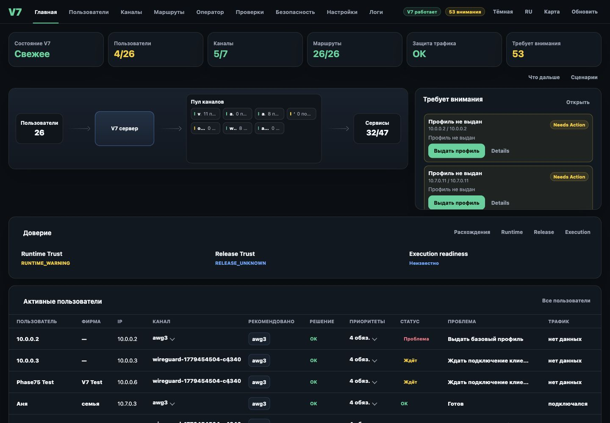
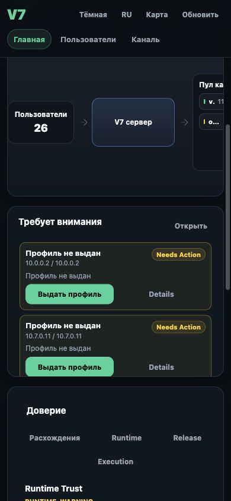

# UX.8 Attention Layer Implementation Report

Date: 2026-06-14

Project: V7 VOZDUH
Program: UX.8_ATTENTION_LAYER_IMPLEMENTATION

## 1. Truth Gate

| Check | Status |
| --- | --- |
| `tools/v7-truth-check --all --json` before implementation | PASS |
| `tools/v7-convergence-status --json` before implementation | PASS |

Result: implementation was allowed to proceed.

## 2. Screenshot Evidence

| Target | Desktop | Mobile | Status |
| --- | --- | --- | --- |
| Overview | `docs/ux8/screenshots/ux8_desktop_overview.jpg` | `docs/ux8/screenshots/ux8_mobile_overview.jpg` | CAPTURED |
| Overview Attention | `docs/ux8/screenshots/ux8_desktop_overview.jpg` | `docs/ux8/screenshots/ux8_mobile_overview_attention.jpg` | CAPTURED |
| Users | `docs/ux8/screenshots/ux8_desktop_users.jpg` | `docs/ux8/screenshots/ux8_mobile_users.jpg` | CAPTURED |
| Channels | `docs/ux8/screenshots/ux8_desktop_channels.jpg` | `docs/ux8/screenshots/ux8_mobile_channels.jpg` | CAPTURED |
| Operator | `docs/ux8/screenshots/ux8_desktop_operator.jpg` | `docs/ux8/screenshots/ux8_mobile_operator.jpg` | CAPTURED |

Screenshots were captured from deployed production admin after UX.8 safe deploy.

Desktop Overview:



Mobile Overview Attention:



## 3. Reuse Audit

| Source | Reused |
| --- | --- |
| Overview Alerts | YES - `buildAlerts()` and existing alert action routing feed Attention items. |
| User Status | YES - derived through existing user rows, `userDrawerContext`, and drawer answer state. |
| Channel Status | YES - derived from existing egress rows, channel health, lifecycle, load, and readiness helpers. |
| Checks | YES - existing service matrix/channel check state is surfaced as Attention only when action is needed. |
| Why Cards | YES - one-line reasons reuse existing human-readable drawer reason helpers; deeper details stay in existing drawers. |
| Recommendations | YES - derived from `operatorDecisionSurface.users_by_ip` and opens existing recommendation/user drawers. |
| Execution Readiness | YES - derived from existing `operatorView` readiness and opens existing Operator area. |
| Route Problems | YES - route and leak signals reuse overview alerts and user check paths. |
| Leak Problems | YES - critical leak/user route risk is elevated without creating a new truth source. |
| Capacity Problems | YES - derived from existing channel load/capacity state. |

## 4. Implementation Summary

Attention Layer was implemented inside the existing overview/admin entry experience.

No new page, menu item, drawer, workflow, endpoint, storage, database, background job, planner, governance path, execution path, or truth source was added.

The overview alert panel now shows a derived operator view:

| Field | Source |
| --- | --- |
| Problem | Existing alert/user/channel/recommendation/readiness signal |
| Severity | Approved levels: Critical, Needs Action, Needs Check, Waiting |
| Object | Existing user/channel/recommendation/system object |
| Reason | Existing human/operator reason helpers |
| Primary Action | Existing object action |
| Details | Existing drawer/tab/detail action |
| Updated | Existing overview refresh timestamp |

Healthy state is calm:

```text
No active issues
Users: X · Channels: Y · Internet working normally
```

Problem state is compact and action-first:

```text
Needs Attention
Critical / Needs Action / Needs Check / Waiting
Problem
Object
Reason
[Primary Action] [Details]
```

## 5. No-New-Source Compliance

| Rule | Status |
| --- | --- |
| No new storage | PASS |
| No new snapshots | PASS |
| No new database | PASS |
| No new background job | PASS |
| No new state owner | PASS |
| No new API owner | PASS |
| No new page | PASS |
| No new drawer | PASS |
| No new workflow | PASS |
| Opens existing objects | PASS |
| Uses existing actions | PASS |

## 6. Runtime Validation

| Check | Status |
| --- | --- |
| Python compile: `python3 -m py_compile admin/v7-admin-api` | PASS |
| Git whitespace check: `git diff --check` | PASS |
| Served `/admin-v2` HTML contains Attention Layer | PASS |
| Extracted served JS syntax: `node --check` | PASS |
| Local login to `/admin-v2` | PASS |
| Local `/health` | PASS |
| Local `/api/session` | PASS |
| Local `/api/overview?force=1` | PASS |
| Local `/api/operator/decision-surface` | PASS |

## 7. Visual Evidence Result

| Requirement | Status |
| --- | --- |
| Desktop overview screenshot | PASS |
| Desktop users screenshot | PASS |
| Desktop channels screenshot | PASS |
| Desktop operator screenshot | PASS |
| Mobile overview screenshot | PASS |
| Mobile overview attention screenshot | PASS |
| Mobile users screenshot | PASS |
| Mobile channels screenshot | PASS |
| Mobile operator screenshot | PASS |

Visual proof is now captured and stored in `docs/ux8/screenshots`.

## 8. Files Changed

| File | Change |
| --- | --- |
| `admin/v7-admin-api` | Added derived Attention Layer to the existing overview experience. |

## 9. Verdict

IMPLEMENTED_WITH_VISUAL_PROOF

Alignment: Architecture rules satisfied. Visual screenshot proof captured.
