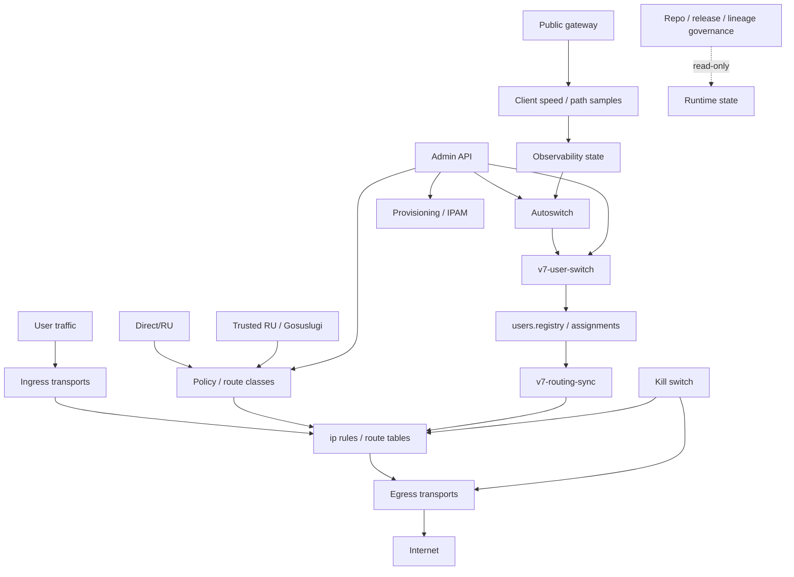

# V7 Vozduh - Full Project Documentation

Дата документа: 2026-05-25.

Актуальное состояние проекта после E31, E32, P1/Wave 1-4 и E35.0/E35.0.1 описано в:

```text
V7_COMPREHENSIVE_PROJECT_DOCUMENTATION.md
```

Этот файл сохраняется как исторический baseline на дату 2026-05-25. Для новых Codex-задач, работы с текущей админкой `/admin-v2`, Evidence/Proposal/Trust поверхностями, production hardening и channel selection audit сначала используйте `V7_COMPREHENSIVE_PROJECT_DOCUMENTATION.md`.

Статус документа: фактическая проектная документация по текущему состоянию репозитория, runtime, governance и control plane.

Документ не является планом миграции, инструкцией по live-apply, разрешением на canary, разрешением на routing-sync, разрешением на user-switch или разрешением на autoswitch apply.

## 1. Короткий фактологический итог

V7 Vozduh - это не VPN-сервис. V7 - платформа маршрутизации интернет-доступа, self-healing routing system и anti-blocking access orchestrator.

VPN, WireGuard, AmneziaWG, VLESS, OpenVPN, sing-box и другие транспортные компоненты в проекте являются нижним транспортным слоем, а не центром продукта.

Главная задача V7:

- сохранять стабильный интернет-доступ;
- скрывать сложность маршрутизации от пользователя;
- автоматически адаптироваться к деградациям;
- снижать ручной SSH-debug и operator firefighting;
- сохранять no-leak safety через kill switch и проверяемый datapath.

Текущее фактическое состояние:

- runtime живой;
- datapath operationally working;
- kill switch сейчас OK;
- user route check сейчас OK;
- provisioning reconcile сейчас OK;
- admin API живой;
- public gateway живой;
- proxy/client telemetry поверхности живые;
- Direct/RU autosync state сейчас OK;
- Trusted RU/Gosuslugi state sensitive и stale;
- autoswitch authority не quiet;
- canary сейчас NO-GO;
- routing mutation сейчас запрещена;
- governance сильно продвинут, но commercial reproducibility incomplete;
- release object есть, но release provenance incomplete;
- runtime lineage частично resolved, но production-only инструменты остаются.

Ключевой текущий blocker:

```text
autoswitch authority is not fully controlled
```

Причина:

```text
systemd timer/service is not the only authority
external non-systemd loop invokes v7-users-autoswitch every 30 seconds
```

Следствие:

```text
quiet-window rehearsal was aborted and restored
one-user canary remains NO-GO
```

## 2. Основные источники фактов

Документ основан на уже созданных repo-side артефактах и read-only truth snapshot:

```text
FULL_PLATFORM_TRUTH_SNAPSHOT.md
docs/track7/truth-snapshot/RUNTIME_IDENTITY_SNAPSHOT.md
docs/track7/truth-snapshot/RUNTIME_GOVERNANCE_SNAPSHOT.md
docs/track7/truth-snapshot/AUTOSWITCH_RUNTIME_SNAPSHOT.md
docs/track7/truth-snapshot/ROUTING_DATAPATH_SNAPSHOT.md
docs/track7/truth-snapshot/KILLSWITCH_RUNTIME_SNAPSHOT.md
docs/track7/truth-snapshot/TRUSTED_RU_RUNTIME_SNAPSHOT.md
docs/track7/truth-snapshot/PROXY_RUNTIME_SNAPSHOT.md
docs/track7/truth-snapshot/PROVISIONING_RUNTIME_SNAPSHOT.md
docs/track7/truth-snapshot/ADMIN_API_RUNTIME_SNAPSHOT.md
docs/track7/truth-snapshot/CONTROL_PLANE_STATUS_SNAPSHOT.md
docs/track7/truth-snapshot/RUNTIME_RISK_MATRIX.md
docs/track7/truth-snapshot/RECOMMENDED_NEXT_STEPS.md
runtime-enumeration.json
runtime-repo-diff.txt
releases/v7-runtime-20260523T174503Z
```

Базовые governance документы:

```text
V7_GOVERNANCE.md
V7_NON_NEGOTIABLES.md
V7_MASTER_ROADMAP.md
V7_PROJECT_DOCUMENTATION.md
```

Control-plane документы:

```text
docs/track7/control-plane/*
```

## 3. Что V7 делает

V7 управляет интернет-доступом пользователей через набор транспортов, маршрутов, route classes, egress-каналов, policy layers, autoswitch logic и safety checks.

Фактическая функциональная модель:

1. Пользователь получает доступ через один из транспортных путей.
2. Пользователь сопоставлен с egress/route table.
3. Routing state определяет, через какой egress уходит пользовательский трафик.
4. Kill switch защищает от silent direct leak.
5. Direct/RU и Trusted RU логика выделяют специальные классы трафика.
6. Autoswitch может двигать пользователей между egress-каналами на основе health/quality/load/policy signals.
7. Admin API и web/admin layer дают оператору управление и наблюдение.
8. Public gateway и client-speed API обслуживают публичные/клиентские поверхности.
9. Governance tooling сравнивает runtime с repo/release и показывает, что еще не воспроизводимо.

## 4. Что V7 не должен делать

По текущему governance:

- не должен быть просто набором VPN-туннелей;
- не должен silently leak traffic;
- не должен silently reroute traffic;
- не должен silently disable protections;
- не должен mass-switch users без high confidence;
- не должен считать fastest route важнее stability;
- не должен запускать apply/mutation без bounded approval;
- не должен считать release reproducibility complete только потому, что release object существует;
- не должен запускать canary при active autoswitch authority;
- не должен считать reconcile FAIL harmless без quiet-window evidence.

## 5. Глобальная архитектурная логика



Главная цепочка воздействия на трафик:

```text
signals/state -> autoswitch/policy decision -> user-switch/routing-sync/policy apply -> route tables/ip rules/nft/proxy -> real traffic path
```

Текущий запрет:

```text
decision and apply layers must not be executed live without separate approval
```

## 6. Основные блоки платформы

### 6.1 Runtime host layer

Факты из snapshot:

- OS: Ubuntu 26.04 LTS;
- kernel: Linux 7.0.0-14-generic;
- host: KVM VM;
- hostname: `v3119922.hosted-by-vdsina.ru`;
- runtime root: `/root/V7-Vozduh`;
- runtime state: `/opt/v7`;
- config state: `/etc/v7`;
- WireGuard/OpenVPN/network state also touches system networking paths.

Назначение:

- держит systemd services/timers;
- держит route tables/ip rules/nft;
- держит runtime registries/state files;
- исполняет production-only tools.

### 6.2 Repo layer

Репозиторий хранит:

- governance docs;
- admin API source or imported runtime source;
- admin_core extracted helpers;
- tests;
- release object;
- runtime enumeration;
- repo-side lineage copies;
- runtime/repo diff tools;
- control-plane preview/check tools.

Ключевые repo paths:

```text
admin/v7-admin-api
admin_core/
tools/
tools/runtime-support/
tests/
hardening/
systemd/
docs/track7/
docs/track7/control-plane/
docs/track7/lineage/
docs/track7/truth-snapshot/
releases/v7-runtime-20260523T174503Z/
runtime-enumeration.json
runtime-repo-diff.txt
```

### 6.3 Admin/API layer

Факты snapshot:

```text
v7-admin-api.service active/running
process=python3 /usr/local/bin/v7-admin-api
listener=127.0.0.1:7080
endpoint_count=192
GET=47
HEAD=8
POST=137
public=19
auth_required=173
critical_risk=13
high_risk=95
medium_risk=37
low_risk=47
csrf_required_count=132
safe_mode_blocked_count=86
```

Роль:

- операторский control surface;
- auth/admin state;
- user/profile/provisioning/action endpoints;
- потенциально опасный mutation surface.

Текущее ограничение:

```text
admin actions must not be executed without explicit approval
```

### 6.4 Datapath/routing layer

Содержит:

- per-user route tables;
- per-user ip rules;
- egress interfaces;
- Direct/RU exceptions;
- Trusted RU sensitive route class;
- kill switch nft/routing protections;
- route checks and reconcile checks.

Факты snapshot:

```text
V7_USER_ROUTE_CHECK=OK
V7_RECONCILE_RESULT=FAIL
V7_RECONCILE_ERRORS=9
V7_PROVISIONING_RECONCILE_CHECK=OK
```

Интерпретация:

```text
datapath appears operational
reconcile checker remains FAIL
root cause not proven under quiet control plane
```

### 6.5 Kill switch layer

Факты snapshot:

```text
V7_KILLSWITCH_CHECK=OK
client_source_set=present
reverse_route_subnet=10.0.0.0/24 present
reverse_route_subnet=10.7.0.0/22 present
direct_leak_drop_rule=present
direct_whitelist_rule=present
direct_fwmark_rule=present
direct_fwmark_precedes_user_rules=OK
nat_awg0=present
nat_awg3=present
nat_tun0=present
nat_v7e06a394c478=present
nat_v7e356a192b79=present
nat_v7edb0c189291=present
mss_clamp=present_nft for observed egresses
```

Роль:

- platform invariant;
- no-leak protection;
- direct leak prevention;
- NAT/MSS safety support;
- dependency for any routing/user movement.

Ограничение:

```text
kill switch OK is not permission to mutate routing
```

### 6.6 Autoswitch layer

Autoswitch предназначен не для fastest-route chasing, а для stability preservation.

Факты snapshot:

```text
v7-users-autoswitch.timer active/enabled
v7-users-autoswitch.service inactive/static
```

Критически важный факт:

```text
/bin/bash -c while true; do v7-egress-history; v7-egress-stability; v7-egress-load; v7-egress-diagnose; v7-state-merge; v7-user-desired-state-save; v7-state-json-save; v7-users-autoswitch; sleep 30; done
```

Это означает:

- systemd timer/service не являются единственным authority;
- stop timer/service недостаточен для quiet window;
- canary attribution невозможна, пока внешний loop активен;
- quiet-window rehearsal E8 был abort/restored.

Текущий autoswitch статус:

```text
control_plane_quiet=false
quiet_window_verified=false
rehearsal_result=aborted_restored
```

### 6.7 User movement layer

Основные инструменты:

```text
v7-user-switch
v7-users-autoswitch
v7-routing-sync
tools/v7-route-movement-preview
```

Логика:

- `v7-user-switch` меняет одного пользователя и users.registry;
- `v7-routing-sync` может применить route/rule state для всех enabled users;
- `v7-users-autoswitch --apply` может двигать пользователей через user-switch;
- `tools/v7-route-movement-preview` строит non-mutating preview.

Текущее правило:

```text
preview allowed
user-switch/routing-sync/autoswitch apply forbidden
```

### 6.8 Provisioning layer

Provisioning отвечает за:

- users.registry;
- egress.registry;
- assignments;
- IPAM;
- egress state;
- provisioning reconcile;
- draft runtime helper logic;
- enable/disable/egress state semantics.

Факты snapshot:

```text
v7-provisioning-reconcile-check=OK
```

Ограничение:

```text
provisioning live flows are not allowed without separate approval
```

### 6.9 Direct/RU layer

Direct/RU layer отвечает за controlled direct routing для разрешенных RU-кейсов.

Факты snapshot:

```text
direct-ru-autosync.state updated=2026-05-25T14:06:04+03:00
status=OK
changed=0
checked_count=8
ok_count=8
stale_count=0
failed_count=0
render=SKIPPED
dnsmasq=active
```

Ограничение:

```text
Direct/RU mutation and auto-sync apply remain forbidden without approval
```

### 6.10 Trusted RU / Gosuslugi layer

Trusted RU/Gosuslugi layer чувствителен к policy/routing decisions.

Факты snapshot:

```text
trusted-ru-diagnostic.state mtime=2026-05-22T23:36:30+03:00 approx
trusted-ru-decision.state mtime=2026-05-07T20:18:38+03:00 approx
route_class=TRUSTED_RU_SENSITIVE
route_class_status=NEEDS_TRUSTED_PATH
current_candidate=vless
candidate_result=VLESS_PARTIAL
blocked=2
missing=0
candidate_vless_failed=2
```

Вывод:

- state sensitive;
- state stale;
- refresh/decision tools can influence downstream operator/policy decisions;
- Госуслуги/Trusted RU нельзя “чинить” или refresh без отдельного approval.

### 6.11 Proxy/public/telemetry layer

Факты snapshot:

```text
v7-admin-api.service active/running
v7-client-speed-api.service active/running
v7-proxy-inbound-happ-test.service active/running
v7-public-gateway.service active/running
0.0.0.0:80 python3 public gateway
*:443 caddy
127.0.0.1:7080 admin API
10.0.0.1:7090 client speed API
127.0.0.1:1080 sing-box
0.0.0.0:1443 sing-box
0.0.0.0:1445 sing-box
```

Роль:

- public profile/delivery/gateway surface;
- client speed API;
- path sample ingest;
- proxy inbound tests;
- sing-box public/proxy endpoints.

Ограничение:

```text
proxy apply/public enable/disable/runtime guard apply remain forbidden
```

### 6.12 Governance/release/lineage layer

Цель:

- понять, что реально есть в runtime;
- что есть в repo;
- что есть в release object;
- какие production-only tools не имеют repo lineage;
- какие tools dangerous;
- какие можно считать resolved repo-side.

Факты snapshot:

```text
runtime_tools=141
authoritative_runtime=26
repo_missing_critical=59
runtime_local_pending_lineage=37
repo_missing_noncritical=19
runtime-critical=26
must_be_release_owned=93
runtime_local_allowed=48
Runtime governance: partial
Authoritative runtime tools: 24
Production-only tools: 56
Named lineage gaps: 56
Critical lineage gaps (known): 33
Unlisted lineage gaps: 0
Safe convergence candidates (known): 4
release_object_ready=true
runtime_lineage=partial
release_provenance=incomplete
production_only_tools=118
lineage_resolved_tools=75
remaining_known_unresolved=43
```

Вывод:

```text
commercial reproducibility is incomplete
```

## 7. Основные runtime state files и что они означают

| Path | Meaning | Current governance note |
|---|---|---|
| `/opt/v7/egress/state/users.registry` | user assignments and user runtime state | must not be changed without explicit mutation approval |
| `/opt/v7/egress/state/egress.registry` | egress registry | read-only inspection allowed |
| `/opt/v7/egress/state/*switch*` | switch/autoswitch state/history | read-only inspection allowed |
| `/opt/v7/egress/state/*autoswitch*` | autoswitch state | critical for quiet-window evidence |
| `/opt/v7/egress/state/*reconnect*` | reconnect/autoswitch related state | can churn under active loop |
| `/opt/v7/egress/state/route-classes.state` | route class state | Direct/RU/Trusted RU sensitive |
| `/opt/v7/egress/state/trusted-ru-diagnostic.state` | Trusted RU diagnostic state | stale/sensitive |
| `/opt/v7/egress/state/trusted-ru-decision.state` | Trusted RU decision state | stale/sensitive |
| `/opt/v7/admin/v7-identity.db` | identity/admin/customer state | not to be modified by docs/audit work |
| `/etc/v7` | config state | mutation forbidden without approval |
| `/etc/wireguard` | WireGuard config state | mutation forbidden without approval |

## 8. Основные команды и их governance class

| Tool | Role | Runtime mutation risk | Current status |
|---|---|---:|---|
| `v7-reconcile-check` | checks route/rule consistency | read-only check intended | FAIL in snapshots |
| `v7-user-route-check` | checks user route behavior | read-only check intended | OK |
| `v7-killswitch-check` | checks kill switch safety | read-only check intended | OK |
| `v7-provisioning-reconcile-check` | provisioning consistency check | read-only check intended | OK |
| `v7-users-autoswitch` | autoswitch decision/apply logic | high | active via timer and external loop |
| `v7-user-switch` | moves one user | high | forbidden now |
| `v7-routing-sync` | applies routing for enabled users | very high | forbidden now |
| `v7-policy-apply` | policy mutation | high | forbidden now |
| `v7-policy-resolve` | policy resolution influence | sensitive | forbidden in live execution now |
| `v7-direct-add-domain` | Direct/RU mutation | high | forbidden now |
| `v7-direct-remove-domain` | Direct/RU mutation | high | forbidden now |
| `v7-direct-auto-sync` | Direct/RU autosync mutation/influence | high | forbidden now |
| `v7-trusted-ru-diagnostic` | probes/writes diagnostic state | sensitive | forbidden now |
| `v7-trusted-ru-refresh-missing` | Trusted RU refresh | sensitive/high | forbidden now |
| `v7-proxy-runtime-guard-apply` | proxy runtime mutation | high | forbidden now |
| `v7-proxy-public-enable` | public proxy mutation | high | forbidden now |
| `v7-proxy-public-disable` | public proxy mutation | high | forbidden now |
| `v7-killswitch-enable` | kill switch mutation | very high | forbidden now |
| `v7-killswitch-disable-temporary` | kill switch weakening | very high | forbidden now |
| `v7-rollback-last-change --apply` | rollback/restore | high/broad | forbidden now |
| `tools/v7-route-movement-preview` | non-mutating preview | low if used with fixtures/read-only inputs | allowed |
| `tools/v7-control-plane-governance-check` | read-only governance checker | low | allowed |
| `tools/v7-runtime-repo-diff` | runtime/repo diff from enumeration | read-only local | allowed |
| `tools/v7-release-lineage-check` | release lineage check | read-only local | allowed |

## 9. Репозиторная структура

### 9.1 Root documentation

| File | Purpose |
|---|---|
| `V7_GOVERNANCE.md` | глобальная конституция продукта и архитектуры |
| `V7_NON_NEGOTIABLES.md` | immutable rules: no silent leaks, bounded autoswitch, calm UX, no chaotic rewrites |
| `V7_MASTER_ROADMAP.md` | стратегические фазы проекта |
| `V7_PROJECT_DOCUMENTATION.md` | предыдущая общая проектная документация |
| `FULL_PLATFORM_TRUTH_SNAPSHOT.md` | текущий read-only truth snapshot |
| `V7_FULL_PROJECT_DOCUMENTATION.md` | этот документ |

### 9.2 Admin backend

| Path | Purpose |
|---|---|
| `admin/v7-admin-api` | admin API monolith/runtime source surface |
| `admin_core/` | extracted admin helpers/modules |
| `tests/` | repo-side static/unit/fixture tests |
| `web/` | admin/frontend artifacts |

### 9.3 Tools

| Path | Purpose |
|---|---|
| `tools/v7-run-tests` | repo test runner |
| `tools/v7-runtime-repo-diff` | compares runtime enumeration and repo lineage |
| `tools/v7-release-lineage-check` | release object/lineage checker |
| `tools/v7-runtime-tool-enumerate` | runtime enumeration tool |
| `tools/v7-control-plane-governance-check` | read-only control-plane governance checker |
| `tools/v7-route-movement-preview` | non-mutating route/user movement planner |
| `tools/runtime-support/` | repo-side copied lineage for production-only runtime tools |

### 9.4 Hardening/systemd

| Path | Purpose |
|---|---|
| `hardening/` | kill switch/provisioning/reconcile hardening scripts |
| `systemd/` | systemd units/timers shipped or documented repo-side |

### 9.5 Track 7 docs

| Path | Purpose |
|---|---|
| `docs/track7/lineage/` | batch lineage metadata |
| `docs/track7/control-plane/` | control-plane governance and canary/quiet-window docs |
| `docs/track7/truth-snapshot/` | latest runtime truth snapshot documents |

### 9.6 Release object

| Path | Purpose |
|---|---|
| `releases/v7-runtime-20260523T174503Z/` | first runtime release object/provenance attempt |

Current release verdict:

```text
release_object_ready=true
runtime_lineage=partial
release_provenance=incomplete
```

## 10. Strategic phases

### Phase 0 - Freeze / Archive / Baseline

Goal:

- freeze current state;
- discover runtime contracts;
- separate legacy;
- build risk map;
- establish safe migration foundation.

Result:

- V7 stopped being undocumented live-change chaos;
- repo/runtime baseline started.

### Phase 1 - Core Routing And Safety Stabilization

Goal:

- deterministic datapath;
- kill switch hardening;
- route reconciliation;
- route verification;
- Direct/RU safety;
- health foundation.

Result:

- V7 becomes safer routing platform, not only transport tunnels.

### Phase 2 - Provisioning And Egress Lifecycle

Goal:

- staged provisioning;
- egress lifecycle;
- quarantine;
- rollback/recovery;
- runtime verification before enable.

Result:

- adding channels becomes safer and reversible.

### Phase 3 - Observability And Diagnostics

Goal:

- unified health model;
- service matrix;
- incident timeline;
- route diagnostics;
- autoswitch explainability.

Result:

- operator sees state/impact/causes instead of raw metric noise.

### Phase 4 - Autoswitch Intelligence And Self-Healing

Goal:

- anti-flapping;
- bounded migrations;
- degradation persistence;
- confidence-based switching.

Result:

- autoswitch preserves stability instead of creating route chaos.

Current reality:

```text
autoswitch governance exists
autoswitch quiet authority is not yet controlled
```

### Phase 5 - Identity, Users And Commercial Multi-Tenant

Goal:

- user lifecycle;
- device lifecycle;
- onboarding;
- safe profile delivery;
- commercial readiness foundation.

Current reality:

- identity/profile lineage resolved repo-side for several tools;
- live identity mutation remains forbidden;
- admin API still has high mutation potential.

### Phase 6 - Admin Platform And Operator Experience

Goal:

- split admin monolith over time;
- modular backend/frontend;
- calm operator UX;
- workflow-oriented UI;
- diagnostics grouping.

Current reality:

- admin API monolith is operational;
- endpoint inventory shows 192 endpoints and high mutation surface;
- extraction into `admin_core/` started;
- full modularization is not complete.

### Phase 6A - Minimal Operator UX Integration

Goal:

- summary-first UX;
- progressive disclosure;
- diagnostic compression.

Current reality:

- governance exists;
- not all runtime complexity is hidden safely yet.

### Phase 7 - Scaling, Reliability, Infrastructure Maturity

Goal:

- multi-egress scale;
- backup/restore maturity;
- upgrade safety;
- disaster recovery;
- runtime persistence.

Current reality:

- release object exists;
- lineage incomplete;
- rollback tooling lineage exists for some tools;
- broad rollback apply remains high risk.

### Phase 8 - Advanced Intelligence And Adaptive Stealth

Goal:

- adaptive stealth;
- predictive degradation;
- bounded adaptive routing;
- explainable intelligence.

Current reality:

- not the current safe execution focus;
- control-plane stabilization comes first.

## 11. Work history and why it matters

### Blocks 1-3: stabilization and deployment baseline

Artifacts include:

```text
BLOCK1_AUTOSWITCH_STABILIZATION_REPORT.md
BLOCK1_1_TELEGRAM_SENTINEL_ADVISORY_REPORT.md
BLOCK2_HEALTH_SEMANTICS_TRUTH_MODEL_REPORT.md
BLOCK2_1_AUTOSWITCH_SIGNAL_REFINEMENT_REPORT.md
BLOCK2_2_CONTROLLED_DRAIN_REBALANCE_REPORT.md
BLOCK3_RUNTIME_CONTRACTS_DEPLOY_BASELINE_REPORT.md
BLOCK3_1_DEPLOY_MANIFEST_BASELINE_REPORT.md
BLOCK3_2_SAFE_ARCHIVE_STALE_EXECUTABLES_REPORT.md
BLOCK3_3_UNKNOWN_RUNTIME_TOOLS_CLASSIFICATION_REPORT.md
BLOCK3_4_FINAL_SUSPICIOUS_EXECUTABLE_ARCHIVE_REPORT.md
```

Meaning:

- stabilized autoswitch semantics;
- formalized health semantics;
- added controlled drain/rebalance concepts;
- began deployment/runtime baseline;
- classified suspicious/stale executables.

### Track 4: platform evolution

Artifact:

```text
TRACK4_PLATFORM_EVOLUTION_REPORT.md
```

Meaning:

- project moved from ad hoc scripts toward platform architecture;
- architecture/governance language became explicit.

### Track 5: admin monolith containment and extraction

Artifacts:

```text
TRACK5_MONOLITH_CONTAINMENT_UX_REPORT.md
TRACK5_1_ENDPOINT_CONTRACT_TESTS_REPORT.md
TRACK5_2_HELPER_EXTRACTION_REPORT.md
TRACK5_3_REGISTRY_READERS_EXTRACTION_REPORT.md
TRACK5_4_TEST_DISCOVERY_EXTRACTION_GATE_REPORT.md
TRACK5_5_EVENTS_HELPERS_EXTRACTION_REPORT.md
```

Meaning:

- admin monolith was analyzed and partially contained;
- helper extraction began;
- endpoint contract tests added;
- registry readers/events helpers extracted;
- full monolith split not complete.

### Track 6: sensitive state hardening dry-run

Artifact:

```text
TRACK6_SENSITIVE_STATE_HARDENING_DRY_RUN_REPORT.md
```

Meaning:

- sensitive state hardening was investigated;
- live hardening/mutation was not automatically assumed.

### Track 7.1-7.4: release object and runtime inventory truth

Artifacts:

```text
TRACK7_1_FIRST_RELEASE_OBJECT_REPORT.md
TRACK7_2_PRODUCTION_ONLY_TOOL_GOVERNANCE_REPORT.md
TRACK7_3_LIVE_RUNTIME_ENUMERATION_REPORT.md
TRACK7_4_RUNTIME_LINEAGE_RESOLUTION_REPORT.md
TRACK7_RELEASE_LINEAGE_PROVENANCE_REPORT.md
runtime-enumeration.json
runtime-repo-diff.txt
```

Meaning:

- first release object created;
- production-only tool governance began;
- live runtime enumeration resolved naming ambiguity;
- runtime inventory became evidence-backed;
- commercial reproducibility remained incomplete.

Key numbers that emerged:

```text
runtime v7 tools=141
runtime-only / production-only initially=118
anonymous lineage gaps=0 after enumeration
critical unresolved lineage remained material
```

### Track 7.5-7.18: lineage resolution batches

Batches resolved repo-side lineage incrementally:

| Track | Scope |
|---|---|
| 7.5 | audit/state support tools |
| 7.6 | observability/capacity support tools |
| 7.7 | runtime health/stability support tools |
| 7.8 | maintenance/node-runtime support tools |
| 7.9 | security/sensitive-state preview-only tools |
| 7.10 | identity/profile support tools |
| 7.11 | admin auth/security runtime tools |
| 7.12 | provisioning support tools |
| 7.13 | backup/rollback support tools |
| 7.14 | profile delivery/token tooling |
| 7.15 | client telemetry/public speed API tools |
| 7.16 | read-only policy/direct/proxy diagnostics |
| 7.17 | Direct/RU mutation governance preview |
| 7.18 | Trusted RU decision/refresh governance |

Meaning:

- source/hash/mode/mtime/reference metadata was preserved for selected runtime tools;
- tools were copied into repo-side lineage area where appropriate;
- governance metadata was added;
- no runtime convergence was claimed;
- no broad VPS import was performed;
- high-risk tools became more visible instead of silently trusted.

Current governance outcome:

```text
lineage_resolved_tools=75
remaining_known_unresolved=43
runtime_lineage=partial
release_provenance=incomplete
```

### Control Plane Deep Governance block

Artifacts:

```text
TRACK7_CONTROL_PLANE_DEEP_GOVERNANCE_REPORT.md
docs/track7/control-plane/TRUSTED_RU_DECISION_GOVERNANCE.md
docs/track7/control-plane/ROUTING_SYNC_GOVERNANCE.md
docs/track7/control-plane/USER_SWITCH_GOVERNANCE.md
docs/track7/control-plane/AUTOSWITCH_GOVERNANCE.md
docs/track7/control-plane/MUTATION_AUTHORITY_MAP.md
docs/track7/control-plane/SAFE_EXECUTION_MODEL.md
docs/track7/control-plane/CONTROL_PLANE_TEST_PLAN.md
```

Meaning:

- mapped the “nervous system”;
- separated decision makers from apply tools;
- identified blast radius;
- formalized safe execution model;
- did not run live mutations.

### Block E1: preview foundation

Artifacts:

```text
BLOCK_E1_ROUTING_USER_SWITCH_PREVIEW_REPORT.md
tools/v7-route-movement-preview
docs/track7/control-plane/ROUTE_MOVEMENT_PREVIEW_SCHEMA.md
docs/track7/control-plane/ONE_USER_CANARY_READINESS.md
```

Meaning:

- created non-mutating planner;
- added fixture/static tests;
- defined preview JSON format;
- did not execute user-switch/routing-sync.

### Block E2: canary readiness audit

Artifacts:

```text
BLOCK_E2_ONE_USER_CANARY_READINESS_REPORT.md
docs/track7/control-plane/LIVE_CANARY_READINESS_AUDIT.md
docs/track7/control-plane/CANARY_CANDIDATE_SELECTION.md
docs/track7/control-plane/CANARY_PREVIEW_OUTPUTS.md
docs/track7/control-plane/AUTOSWITCH_CANARY_INTERFERENCE.md
docs/track7/control-plane/CANARY_ROLLBACK_READINESS.md
docs/track7/control-plane/CANARY_BLAST_RADIUS.md
docs/track7/control-plane/CANARY_GO_NO_GO.md
```

Meaning:

- planned future one-user canary;
- identified candidate/target concepts;
- kept canary NO-GO;
- did not switch users.

### Block E3: blockers resolution planning

Artifacts:

```text
BLOCK_E3_CANARY_BLOCKERS_RESOLUTION_REPORT.md
docs/track7/control-plane/AUTOSWITCH_HOLD_GOVERNANCE.md
docs/track7/control-plane/RECONCILE_FAIL_ANALYSIS.md
docs/track7/control-plane/AWG3_CANARY_READINESS.md
docs/track7/control-plane/ONE_USER_CANARY_GOVERNANCE.md
docs/track7/control-plane/CONTROL_PLANE_RISK_MATRIX.md
```

Meaning:

- formalized why canary remained NO-GO;
- studied autoswitch hold conceptually;
- did not hold autoswitch live.

### Block E4: reconcile truth and routing integrity

Artifacts:

```text
BLOCK_E4_RECONCILE_TRUTH_AND_ROUTING_INTEGRITY_REPORT.md
docs/track7/control-plane/RECONCILE_TRUTH_AUDIT.md
docs/track7/control-plane/ROUTE_TABLE_INTEGRITY_AUDIT.md
docs/track7/control-plane/IP_RULE_INTEGRITY_AUDIT.md
docs/track7/control-plane/DATAPATH_REALITY_AUDIT.md
docs/track7/control-plane/KILLSWITCH_DEPENDENCY_ANALYSIS.md
docs/track7/control-plane/CANARY_INTEGRITY_GATES.md
docs/track7/control-plane/RECONCILE_FALSE_POSITIVE_ANALYSIS.md
```

Meaning:

- routing appeared operational;
- reconcile FAIL looked possibly race/semantic;
- truth under quiet window still unproven;
- no repair was performed.

### Block E5: quiet-window governance

Artifacts:

```text
BLOCK_E5_AUTOSWITCH_QUIET_WINDOW_GOVERNANCE_REPORT.md
docs/track7/control-plane/AUTOSWITCH_AUTHORITY_MAP.md
docs/track7/control-plane/QUIET_WINDOW_DEFINITION.md
docs/track7/control-plane/AUTOSWITCH_FREEZE_MODEL.md
docs/track7/control-plane/MUTATION_FREEZE_BOUNDARIES.md
docs/track7/control-plane/CONTROL_PLANE_STABILITY_SIGNALS.md
docs/track7/control-plane/CANARY_WINDOW_RUNBOOK.md
```

Meaning:

- formalized what “quiet control-plane” means;
- defined mutation freeze boundaries;
- current quiet-window status remained unstable.

### Block E6: rehearsal approval packet

Artifacts:

```text
BLOCK_E6_QUIET_WINDOW_REHEARSAL_REPORT.md
docs/track7/control-plane/QUIET_WINDOW_REHEARSAL_MODEL.md
docs/track7/control-plane/AUTOSWITCH_HOLD_RESTORE_PACKET.md
docs/track7/control-plane/QUIET_WINDOW_VERIFICATION.md
docs/track7/control-plane/RECONCILE_QUIET_WINDOW_EXPERIMENT.md
docs/track7/control-plane/MUTATION_FREEZE_SAFETY_MATRIX.md
docs/track7/control-plane/HUMAN_APPROVAL_MODEL.md
```

Meaning:

- prepared exact hold/restore packet;
- did not execute hold;
- rehearsal status became conditional.

### Block E7: rehearsal execution governance

Artifacts:

```text
BLOCK_E7_QUIET_WINDOW_EXECUTION_GOVERNANCE_REPORT.md
docs/track7/control-plane/QUIET_WINDOW_REHEARSAL_SEQUENCE.md
docs/track7/control-plane/AUTOSWITCH_HOLD_SAFETY_MODEL.md
docs/track7/control-plane/QUIET_WINDOW_EVIDENCE_PACKET.md
docs/track7/control-plane/REHEARSAL_ABORT_CONDITIONS.md
docs/track7/control-plane/REHEARSAL_RESTORE_GUARANTEES.md
docs/track7/control-plane/CANARY_PROMOTION_RULES.md
docs/track7/control-plane/REHEARSAL_OPERATIONAL_RISKS.md
```

Meaning:

- prepared bounded execution governance;
- no rehearsal executed yet.

### Block E8: quiet-window rehearsal execution

Artifact:

```text
BLOCK_E8_QUIET_WINDOW_REHEARSAL_EXECUTION_REPORT.md
docs/track7/control-plane/e8-evidence/*
```

Meaning:

- bounded autoswitch timer/service hold was attempted with explicit approval;
- no canary executed;
- no user moved;
- no routing changed;
- no datapath mutation was performed;
- rehearsal aborted because external autoswitch loop remained active;
- autoswitch timer restored.

Current E8 result:

```text
rehearsal_executed=True
rehearsal_aborted=True
autoswitch_restored=True
quiet_window_verified=False
reconcile_under_quiet=NOT_SAMPLED_ABORTED
current_canary_status=NO-GO
```

## 12. How the blocks connect

The project logic is cumulative:

```text
governance constitution
  -> roadmap phases
  -> runtime inventory
  -> release object
  -> production-only tool lineage
  -> control-plane mutation authority map
  -> preview-only planner
  -> canary readiness
  -> quiet-window governance
  -> bounded rehearsal
  -> only then possible canary discussion
```

No later block cancels earlier safety rules.

Lineage work answers:

```text
what exists in runtime and whether repo/release knows it
```

Control-plane work answers:

```text
who can change traffic path and under what safety gates
```

Preview work answers:

```text
what would change if a user movement were performed
```

Quiet-window work answers:

```text
whether the control plane can be made stable enough to attribute effects
```

Canary work is still blocked because:

```text
quiet-window evidence is not yet successful
```

## 13. Current operational status by layer

| Layer | Current status | Evidence | Main risk |
|---|---|---|---|
| Host/runtime | up | truth snapshot | normal runtime risk |
| Admin API | active | service/listener/endpoints | many high-risk POST/action endpoints |
| Public gateway | active | listener/service | public exposure |
| Client speed API | active | service/listener | telemetry write/privacy risk |
| Proxy/sing-box | active | listeners | public/proxy mutation risk |
| User route check | OK | `v7-user-route-check` | not proof for canary |
| Kill switch | OK | `v7-killswitch-check` | must recheck after any route mutation |
| Provisioning reconcile | OK | `v7-provisioning-reconcile-check` | apply still forbidden |
| Reconcile check | FAIL | `v7-reconcile-check` | unresolved under quiet window |
| Autoswitch | active/not quiet | timer + external loop | can move users concurrently |
| Direct/RU | OK state | autosync state | mutation forbidden |
| Trusted RU | stale/sensitive | decision/diagnostic state | Gosuslugi-sensitive |
| Release lineage | partial | release lineage checker | commercial reproducibility incomplete |
| Runtime/repo governance | partial | runtime diff | production-only unresolved remains |
| Canary | NO-GO | control-plane status | quiet window not verified |

## 14. Decision makers vs appliers

| Question | Current answer |
|---|---|
| Who decides traffic movement? | autoswitch, policy/route class logic, operator/admin actions, Trusted RU/Direct RU decision layers |
| Who applies traffic movement? | `v7-user-switch`, `v7-routing-sync`, policy apply, Direct/RU apply, proxy apply, kill switch mutation tools |
| Who can move one user? | `v7-user-switch`, autoswitch via user-switch |
| Who can affect all enabled users? | `v7-routing-sync`, autoswitch loops, policy/routing changes |
| Who can affect Gosuslugi/Trusted RU? | Trusted RU diagnostic/decision/refresh, policy resolve/apply, route classes, Direct/RU state |
| Who can break leak protection? | kill switch mutation, routing-sync, policy apply, proxy/runtime changes if misused |
| Who can restore? | rollback tools, user switch-back, specific state restore paths |
| Which rollback is clear? | one-user switch-back conceptually |
| Which rollback is unclear/high-risk? | routing-sync, policy/Direct/RU, proxy runtime, kill switch, broad rollback apply |

## 15. Canary status

Current canary status:

```text
NO-GO
```

Reasons:

- autoswitch timer/service active;
- external non-systemd autoswitch loop active;
- quiet-window rehearsal aborted;
- quiet window not verified;
- reconcile FAIL not sampled under quiet window;
- Trusted RU state stale/sensitive;
- canary attribution impossible while users can move concurrently.

Canary cannot be discussed as executable until:

1. every autoswitch authority is mapped;
2. every autoswitch authority has an approved hold/restore model;
3. quiet-window rehearsal succeeds;
4. reconcile behavior is sampled under quiet window;
5. route/rule/registry snapshots are stable;
6. kill switch remains OK;
7. user route check remains OK;
8. provisioning reconcile remains OK;
9. rollback command is explicit;
10. human approval is separate and explicit.

## 16. Current forbidden actions

Forbidden without separate explicit approval:

```text
v7-user-switch
v7-routing-sync
v7-users-autoswitch --apply
v7-policy-apply
v7-policy-apply-systemd
v7-policy-resolve
v7-direct-add-domain
v7-direct-remove-domain
v7-direct-auto-sync
v7-trusted-ru-diagnostic
v7-trusted-ru-refresh-missing
v7-proxy-runtime-guard-apply
v7-proxy-public-enable
v7-proxy-public-disable
v7-killswitch-enable
v7-killswitch-disable-temporary
v7-rollback-last-change --apply
```

Also forbidden:

- live canary;
- user movement;
- routing mutation;
- nftables mutation;
- ip route/ip rule mutation;
- kill switch rebuild/disable;
- Direct/RU mutation;
- Trusted RU refresh/probing;
- proxy runtime mutation;
- deploy/restart not specifically approved;
- chmod/chown;
- deleting/archiving runtime files.

## 17. Safe actions now

Allowed/safe enough:

- read-only snapshots;
- static analysis;
- governance documentation;
- repo-side lineage updates;
- local tests;
- py_compile;
- shell syntax checks;
- runtime/repo diff using existing `runtime-enumeration.json`;
- release lineage check;
- control-plane governance check;
- preview-only planning with `tools/v7-route-movement-preview`;
- read-only runtime checks when explicitly scoped.

## 18. Conditional actions

Conditional actions require separate bounded approval:

| Action | Required precondition |
|---|---|
| second quiet-window rehearsal | external autoswitch loop owner/hold path mapped |
| one-user canary | successful quiet-window rehearsal and explicit canary approval |
| user-switch | preview, rollback, quiet window, human approval |
| routing-sync | not first live mutation; requires broader rollback strategy |
| Trusted RU refresh | explicit Gosuslugi-sensitive approval and no routing apply |
| policy apply | separate policy/routing mutation approval |
| proxy runtime apply | separate public/proxy exposure approval |
| kill switch mutation | separate no-leak safety approval |
| rollback apply | exact rollback target and restore verification |

## 19. Biggest risks

### 19.1 Autoswitch concurrency

The platform can move users independently of the systemd timer/service through an external shell loop.

Risk:

- canary effects cannot be attributed;
- users may move during observation;
- reconcile snapshots can race with state writes;
- route/rule/registry state can change between samples.

### 19.2 `v7-routing-sync`

Risk:

- can affect all enabled users;
- can modify route/rule behavior broadly;
- rollback is not proven as simple one-command restore.

### 19.3 Reconcile FAIL ambiguity

Facts:

- user route check OK;
- kill switch check OK;
- provisioning reconcile OK;
- reconcile check FAIL.

Risk:

- could be semantic/race false-positive;
- could represent real hidden drift;
- not proven under quiet control plane.

### 19.4 Trusted RU/Gosuslugi

Risk:

- stale/sensitive decision state;
- refresh/diagnostic tools can write state;
- downstream policy decisions may be influenced;
- incorrect behavior can affect sensitive RU services.

### 19.5 Admin API mutation surface

Facts:

- 192 endpoints;
- 137 POST;
- 13 critical risk;
- 95 high risk.

Risk:

- accidental admin action can mutate runtime.

### 19.6 Proxy/public exposure

Risk:

- public gateway and sing-box surfaces are active;
- proxy apply tools can affect public path;
- telemetry/public API paths can ingest/write state.

### 19.7 Incomplete commercial reproducibility

Risk:

- release object ready does not mean runtime is fully reproducible;
- production-only tools remain unresolved;
- runtime lineage partial.

## 20. Verification model

Current repo verification tools:

```text
tools/v7-run-tests
tools/v7-control-plane-governance-check --pretty
tools/v7-runtime-repo-diff --runtime-enumeration runtime-enumeration.json --pretty
tools/v7-release-lineage-check --release-dir releases/v7-runtime-20260523T174503Z --pretty
PYTHONPYCACHEPREFIX=/private/tmp python3 -m py_compile admin/v7-admin-api admin_core/*.py tools/v7-release-lineage-check tools/v7-runtime-repo-diff tools/v7-control-plane-governance-check tools/v7-route-movement-preview
git diff --check
```

Latest truth snapshot reported:

```text
tools/v7-run-tests: PASS, 39 tests
tools/v7-control-plane-governance-check --pretty: PASS
tools/v7-runtime-repo-diff --runtime-enumeration runtime-enumeration.json --pretty: PASS, governance partial
tools/v7-release-lineage-check --release-dir releases/v7-runtime-20260523T174503Z --pretty: PASS, release object ready with warnings
py_compile admin/v7-admin-api admin_core/*.py governance tools: PASS
admin endpoint inventory JSON validation: PASS
canary preview JSON validation: PASS
git diff --check: PASS
```

Meaning:

- tests pass;
- governance check passes;
- runtime/repo governance is still partial;
- release lineage has warnings;
- passing tests do not authorize live mutation.

## 21. Current risk matrix

| Layer | Status | Risk | Blast radius | Readiness |
|---|---|---|---|---|
| autoswitch | active, not quiet | high | multi-user | not ready for canary |
| routing-sync | governed, not executed | very high | all enabled users | forbidden now |
| user-switch | preview modeled | high | one user plus routing state | blocked |
| kill switch | check OK | high if mutated | global datapath safety | check-only OK |
| Trusted RU | stale/sensitive | high | sensitive route class | refresh forbidden |
| Direct/RU | state OK | medium/high if mutated | route class/direct paths | mutation forbidden |
| proxy runtime | active | high | public/proxy paths | apply forbidden |
| provisioning | reconcile OK | high if applied | users/egress/IPAM | check-only OK |
| telemetry | active | medium/high privacy/write risk | public telemetry state | service active, mutation forbidden |
| admin API | active | high | broad runtime actions | actions forbidden |
| rollback | lineage mapped partly | high | target-dependent | apply forbidden |
| release governance | partial | commercial risk | reproducibility | not complete |

## 22. What is actually stable

Stable enough for current operation:

- host is up;
- core services active;
- interfaces present;
- public/admin/proxy/telemetry services alive;
- user route check OK;
- kill switch check OK;
- provisioning reconcile OK;
- Direct/RU autosync state OK;
- repo tests/governance checks pass.

## 23. What only appears stable

Looks operational but not proven safe for mutation:

- routing/datapath because reconcile still FAILs;
- autoswitch because it is active but not quiet/controlled;
- Trusted RU because state exists but is stale/sensitive;
- release because object exists but provenance incomplete;
- admin API because service is active but mutation surface is large;
- proxy because service is active but apply safety is not proven.

## 24. What is dangerous

Dangerous now:

- running canary while external autoswitch loop is active;
- running `v7-routing-sync` as first mutation;
- treating reconcile FAIL as harmless;
- refreshing Trusted RU live;
- running Direct/RU/policy apply;
- running proxy runtime apply;
- modifying kill switch;
- broad rollback apply;
- using admin POST/action endpoints casually.

## 25. What is blocked

Blocked:

- one-user canary;
- routing-sync;
- user-switch;
- autoswitch apply;
- policy apply;
- Direct/RU mutation;
- Trusted RU refresh;
- proxy runtime apply;
- kill switch mutation;
- rollback apply;
- commercial reproducibility claim.

## 26. What should happen next

Safe next steps:

1. Map the external non-systemd autoswitch loop owner, launch path, supervision, and restore model.
2. Update autoswitch authority docs/checker so quiet-window status includes that loop.
3. Prepare a second quiet-window rehearsal that can hold every autoswitch authority.
4. Keep all user/routing/policy/proxy/Trusted RU mutations forbidden.
5. Continue lineage resolution for remaining high-risk runtime tools.

Conditional next steps:

1. Repeat quiet-window rehearsal only after separate approval and full autoswitch authority hold model.
2. Re-sample reconcile under a verified quiet window.
3. Discuss canary only if quiet window succeeds and reconcile/routing/kill switch checks stay stable.

Forbidden next steps:

1. Do not run canary now.
2. Do not run user-switch now.
3. Do not run routing-sync now.
4. Do not run autoswitch apply manually.
5. Do not run policy/Direct/RU/proxy/Trusted RU apply.
6. Do not mutate kill switch.

## 27. Glossary

| Term | Meaning |
|---|---|
| datapath | actual packet/routing path through ip rules, route tables, nft, interfaces and egress |
| control plane | logic/tools/services that decide and apply datapath changes |
| egress | outbound channel/interface/transport used for user traffic |
| route class | policy abstraction such as `GLOBAL_FAST`, `GLOBAL_STABLE`, `DIRECT_RU`, `TRUSTED_RU_SENSITIVE` |
| autoswitch | stability-preservation engine that can move users between egress paths |
| user-switch | bounded one-user movement tool |
| routing-sync | broad route/rule apply tool for enabled users |
| kill switch | no-leak invariant protecting against unsafe direct traffic |
| Trusted RU | sensitive RU/Gosuslugi route decision domain |
| Direct/RU | controlled direct routing domain |
| lineage | evidence that runtime tool/source exists repo-side with metadata |
| production-only tool | runtime tool not originally present in repo/release lineage |
| quiet window | control-plane state where autoswitch/user movement/routing mutation is stopped and snapshots remain stable |
| canary | future one-user live movement test, currently blocked |
| preview | non-mutating JSON plan showing what would change |
| apply | live mutation command that changes runtime |

## 28. Rules for the next operator/chat

The next operator/chat must understand these facts before acting:

1. V7 is currently alive; the main blocker is not simple outage.
2. The datapath appears operational, but reconcile FAIL is unresolved under quiet conditions.
3. Autoswitch has at least one external non-systemd authority.
4. Timer/service hold alone is insufficient.
5. Canary is NO-GO.
6. Routing-sync is not an acceptable first live mutation.
7. User-switch can only become candidate canary after quiet-window success.
8. Trusted RU/Gosuslugi is sensitive and stale; do not refresh casually.
9. Admin API is local-bound but has many dangerous endpoints.
10. Release object is not proof of commercial reproducibility.
11. Runtime mutation requires separate, explicit, bounded approval.
12. Documentation/governance progress is not runtime safety proof.

## 29. Runtime mutation statement for this documentation

This documentation task is repo-side documentation work.

```text
Runtime mutation performed by this documentation task: NO
Canary executed by this documentation task: NO
Routing changed by this documentation task: NO
Autoswitch changed by this documentation task: NO
Kill switch changed by this documentation task: NO
Trusted RU refreshed by this documentation task: NO
Proxy/runtime apply executed by this documentation task: NO
```
