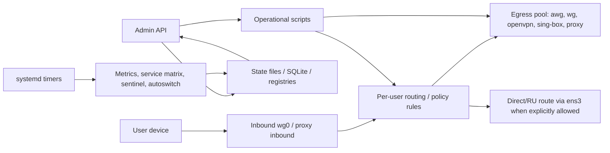

# V7 Vozduh Project Documentation

Дата анализа: 2026-05-22  
Репозиторий: `muhapauka-rgb/V7-Vozduh`  
Локальная ветка анализа: `codex/integratsiya-tunelya`  
Основной принцип безопасности документа: секреты, пароли и токены не фиксируются в тексте.

## 1. Краткая суть проекта

V7 Vozduh - это платформа агрегации и оркестрации VPN-каналов, а не один VPN-сервер.

Система решает задачу:

- принять пользовательский трафик через inbound VPN/прокси;
- закрепить пользователя за внешним egress-каналом;
- не допустить прямых утечек через публичный интерфейс сервера;
- уметь маршрутизировать часть российских направлений иначе, чем глобальный трафик;
- измерять качество каналов;
- автоматически и осторожно переключать пользователей между каналами;
- давать оператору админку для просмотра, диагностики и ручных действий.

Главная архитектурная идея: control plane управляет состоянием и решениями, data plane реально проводит трафик через Linux routing, WireGuard/OpenVPN/AmneziaWG/sing-box и набор shell/Python-скриптов.



## 2. Репозиторий и фактическое состояние

Проект уже находится в рабочей директории и связан с GitHub remote `https://github.com/muhapauka-rgb/V7-Vozduh.git`.

В локальном дереве на момент анализа есть незакоммиченные изменения:

- `admin/v7-admin-api`
- `hardening/v7-killswitch-check`
- `hardening/v7-provisioning-reconcile-check`
- `systemd/v7-users-autoswitch.timer`
- `tools/v7-egress-import-regression`
- `tools/v7-egress-set-state`
- `tools/v7-service-matrix-test`
- `tools/v7-telegram-sentinel`
- `tools/v7-users-autoswitch`
- неотслеживаемый файл `v7-v7-lab-speed-ru_local.db`

Документация ниже описывает именно текущее рабочее дерево, а не только последний commit.

## 3. Структура папок и назначение файлов

```text
.
├── admin/
│   └── v7-admin-api
├── tools/
│   ├── v7-users-autoswitch
│   ├── v7-egress-quality-compact
│   ├── v7-telegram-sentinel
│   ├── v7-service-matrix-test
│   ├── v7-service-matrix-refresh-all
│   ├── v7-path-benchmark
│   ├── v7-path-sample-ingest
│   ├── v7-path-optimizer-advice
│   ├── v7-client-speed-api
│   ├── v7-public-gateway
│   ├── v7-egress-set-state
│   ├── v7-egress-import-regression
│   └── v7-autoswitch-install-systemd
├── hardening/
│   ├── v7-killswitch-enable
│   ├── v7-killswitch-check
│   ├── v7-provisioning-reconcile-check
│   ├── v7-path-guard-repair
│   ├── v7-egress-mtu-probe
│   ├── v7-direct-test-domain
│   ├── v7-direct-diagnose-domain
│   └── v7-direct-render-dnsmasq
├── systemd/
│   ├── v7-users-autoswitch.service
│   ├── v7-users-autoswitch.timer
│   ├── v7-egress-quality-compact.service
│   ├── v7-egress-quality-compact.timer
│   ├── v7-telegram-sentinel.service
│   ├── v7-telegram-sentinel.timer
│   ├── v7-service-matrix-refresh.service
│   ├── v7-service-matrix-refresh.timer
│   └── v7-egress-openvpn@.service
├── design/
│   └── HTML-снимки и варианты админского интерфейса
├── artifacts/
│   └── тестовые WireGuard/AmneziaWG client configs и QR
├── test-results/
│   └── служебный результат тестового запуска
└── V7_*.md
    └── архитектурные планы и отчёты фаз
```

## 4. Смысловые слои системы

### 4.1 Data plane

Data plane - это всё, что реально влияет на путь пакета:

- inbound `wg0` или proxy inbound;
- per-user routing tables;
- `ip rule`;
- nftables kill switch;
- NAT/MASQUERADE;
- egress-интерфейсы `awg*`, `wg*`, `tun*`, `ovpn*`;
- прямой публичный интерфейс `ens3`, разрешённый только для явных direct/RU направлений.

Ключевой invariant из проектных документов:

```text
VPN-подсети 10.0.0.0/24 и 10.7.0.0/22 не должны выходить напрямую через ens3,
кроме явно классифицированного direct/RU трафика.
```

### 4.2 Control plane

Control plane представлен главным образом `admin/v7-admin-api`. Он:

- читает runtime state из `/opt/v7/egress/state`;
- держит настройки и policy в `/etc/v7`;
- управляет auth/RBAC/safe mode;
- показывает UI;
- вызывает операционные команды через `subprocess`;
- создаёт и проверяет egress-драфты;
- управляет пользователями, устройствами, profile delivery и proxy identity;
- строит обзоры, readiness, diagnostics, audit views.

### 4.3 Measurement and decision plane

Этот слой делает измерения и принимает рекомендации:

- `v7-service-matrix-test` проверяет сервисы по egress;
- `v7-telegram-sentinel` быстро следит за Telegram;
- `v7-path-benchmark` меряет throughput, MTU и datapath;
- `v7-egress-quality-compact` сжимает историю качества;
- `v7-users-autoswitch` строит и применяет guarded switching plan.

### 4.4 Presentation layer

UI сейчас существует в двух формах:

- встроенный HTML внутри `admin/v7-admin-api`, особенно `html_page_v2`;
- отдельные HTML-снимки в `design/`, которые выглядят как прототипы/экспорты админки.

## 5. Главный модуль: `admin/v7-admin-api`

Файл: `admin/v7-admin-api`  
Размер: 30025 строк  
Тип: Python HTTP server на `BaseHTTPRequestHandler`, без FastAPI/Flask.

### 5.1 Почему модуль монолитный

В одном файле собраны:

- конфигурация окружения;
- auth/session/RBAC;
- SQLite identity database;
- публичный onboarding `/connect`;
- egress import/parsing/provisioning;
- backup/restore/rollback views;
- traffic and speed views;
- service matrix and autoswitch APIs;
- direct/RU routing APIs;
- profile delivery;
- HTML UI;
- HTTP request router.

Это делает деплой простым: один исполняемый файл можно положить на VPS. Цена - высокая плотность логики и сложность сопровождения.

### 5.2 Верхний слой конфигурации, строки 1-721

Строки 1-28: импорты стандартной библиотеки. Внешних Python-зависимостей в модуле нет.

Строки 31-96: основные runtime paths и параметры:

- `HOST`, `PORT` - адрес админки, по умолчанию `127.0.0.1:7080`;
- `STATE_DIR` - `/opt/v7/egress/state`;
- `PUBLIC_IF` - публичный интерфейс, по умолчанию `ens3`;
- `AUDIT_FILE`, `EVENT_DIR`, `BACKUP_DIR`;
- `AUTH_FILE`, `SAFE_MODE_FILE`;
- директории egress drafts/runtime/openvpn/wireguard/amneziawg;
- identity SQLite database;
- policy files;
- profile delivery and client speed files;
- proxy inbound runtime settings.

Строки 98-148: regex-валидаторы и allowlist-форматы. Они нужны, потому что админка вызывает shell-команды и работает с системными путями. Главная логика: все внешние значения должны быть сведены к безопасным идентификаторам до попадания в команды/пути.

Строки 149-220: описание поддерживаемых клиентов (`karing`, `karing_wg`, `hiddify`, `happ`, `wireguard`) и smart-mode profiles.

Строки 220-721: каталоги сервисов, роли egress, классы доменов, default policy, safe-mode blocked actions, RBAC role levels и минимальные роли для API-действий.

Из этого следует: безопасность админки строится не только на логине, но и на трёх последовательных фильтрах:

1. sanitize input;
2. check role;
3. block dangerous writes in safe mode.

### 5.3 Общие helpers, auth, sessions, строки 722-1756

Ключевые функции:

- `now_iso`, `read_json`, `write_json_atomic`, `write_text_atomic` - единый стиль чтения/атомарной записи state;
- `redact` - защита секретов в JSON-ответах;
- `auth_accounts`, `create_admin_account`, `update_admin_account`, `set_admin_account_password` - multi-account auth;
- `make_session`, `parse_session` - cookie session с HMAC-подписью;
- `login_throttle_state`, `record_login_failure` - ограничение перебора;
- `role_allows`, `role_state_for_session` - RBAC;
- `parse_kv_line`, `parse_registry` - общий parser registry-файлов формата `key=value`;
- `safe_*` функции - нормализация IP, domain, egress id, backup name, delivery token и т.д.

Частная логика:

- admin session хранит `sub`, `role`, `csrf`;
- CSRF проверяется на POST;
- роль вычисляется из session или актуального auth file;
- JSON responses проходят через `redact`.

### 5.4 Identity and onboarding database, строки 1757-4389

Строки 1757-1954: `IDENTITY_SCHEMA`. SQLite хранит:

- группы;
- организации;
- allowed phone list;
- identity users;
- devices;
- pending profiles;
- user metadata;
- access settings;
- onboarding attempts;
- connect sessions;
- provisioning jobs;
- admin table settings.

Строки 1957-2083: инициализация SQLite, миграции колонок, базовое чтение identity rows.

Строки 2086-2666: state builders и access/onboarding helpers:

- обновление pending profiles;
- summary identity state;
- управление connection password;
- upsert group/organization/allowed phones;
- preview/import/export allowed phones;
- rate limiting по IP/телефону.

Строки 2669-2936: connect session lifecycle:

- idempotency key;
- begin/finish session;
- pending queue;
- worker thread.

Строки 2939-3289: user/device issue pipeline:

- `connect_enqueue_onboard`;
- `identity_get_or_create_user`;
- `identity_issue_device`.

Строки 3292-4389: быстрый выпуск конфигов, pending profile activation, user metadata, device revoke/delete, `connect_onboard`.

Логика следования:

```text
/connect form
  -> prequeue validation
  -> connect session
  -> worker queue
  -> user/device lookup or create
  -> config/profile issue
  -> delivery result
  -> audit / state update
```

### 5.5 Egress import, parsing and draft lifecycle, строки 4392-9360

Этот блок превращает внешние VPN/proxy конфиги в управляемые V7 egress records.

Поддерживаемые источники и форматы:

- OpenVPN `.ovpn`;
- Clash YAML proxies;
- Xray links and outbounds;
- Outline/Shadowsocks;
- subscription URL;
- proxy share links: `vless`, `vmess`, `trojan`, `ss`, `hy2`, `hysteria2`, `tuic`, `anytls`, `socks`;
- sing-box outbound/profile fragments;
- QR text candidates.

Ключевые диапазоны:

- 4392-4804: OpenVPN parsing and normalization;
- 4807-4967: Clash parsing and conversion;
- 4976-5240: Xray URI/outbound parser;
- 5254-5346: Outline/Shadowsocks parser;
- 5349-5962: subscription unwrap/fetch/decode and generic endpoint expansion;
- 5965-6487: config preview and QR preview;
- 6490-7069: egress draft creation, state, delete, static checks, preflight;
- 7137-7409: conversion helpers creating proxy/managed drafts;
- 7412-7912: runtime text/sanitize/service checks;
- 7912-8240: runtime run orchestration;
- 8243-8612: pool preview/apply and existing egress update;
- 8615-8750: runtime provision;
- 8753-9193: channel-add pipeline;
- 9196-9360: enable preview/apply/post-enable validation.

Частная логика безопасности:

- URL fetch разрешён только для публичных URL (`egress_url_is_public`);
- draft id и run id валидируются regex;
- дубли интерфейсов и конфигов проверяются fingerprint-ами;
- preflight отделён от apply;
- runtime tests пишутся в отдельную директорию;
- sensitive keys редактируются через `redact`.

### 5.6 Operational wrappers and system state, строки 9363-11397

Этот блок связывает админку с системными командами и state-файлами:

- 9363-9459: summary для restore/rollback/killswitch;
- 9462-9528: capacity pool state;
- 9531-9597: `run_readonly` и `run_action`;
- 9600-10530: smart profile and proxy runtime helpers;
- 10533-10791: audit/event/security audit;
- 10794-10891: backups, disk usage, maintenance settings;
- 10903-11060: speed/traffic state;
- 11063-11143: service matrix and service preferences;
- 11146-11397: policy, org egress policy, autoswitch commands, safe mode, policy update.

Главная логика:

- read-only diagnostics и write actions разведены;
- write action получает `actor`;
- risky changes должны пройти role check и часто confirm token;
- audit пишется после значимых действий.

### 5.7 Service-aware routing, client speed, delivery, readiness, строки 11400-14535

Диапазоны:

- 11400-11655: scoring для service recommendations и egress candidate score;
- 11658-12142: service-aware route dry-run/apply/live rollout;
- 12145-12540: client speed agent state, public speed sample link, ingest client path sample;
- 12543-13002: smart client preferences, profile delivery tokens, QR response;
- 13005-13225: WireGuard artifacts, handshake state, VLESS activity state;
- 13228-13555: desired state and user readiness/onboarding stage;
- 13558-13877: smart profile validation and capabilities;
- 13880-13981: per-user detail builder;
- 13984-14535: egress config export, safe deletion, migration/delete/pause plan, egress detail.

Из этого следует продуктовая модель:

```text
operator sees user readiness
  -> sees missing artifact / no handshake / route mismatch / delivery status
  -> generates or revokes profile
  -> requests client speed sample
  -> system uses sample in future routing decisions
```

### 5.8 Direct/RU routing and overview, строки 14538-15603

Ключевые функции:

- `service_status`, `route_status`;
- `direct_routing_sample_domains`;
- `parse_direct_domain_test`;
- `direct_routing_freshness`;
- `direct_routing_quick`;
- `direct_domain_list_state`;
- `policy_domain_items`;
- `trusted_ru_decision_state`;
- `trusted_ru_diagnostic_state`;
- `trusted_ru_readiness_state`;
- `policy_domain_config_state`;
- `direct_routing_full`;
- `overview`;
- login/connect page builders.

Логика direct/RU:

- обычные RU домены могут быть direct via `ens3`;
- sensitive RU domains требуют `TRUSTED_RU_SENSITIVE`;
- если доверенного RU egress нет, UI должен показывать blocker, а не молча отправлять трафик куда попало.

### 5.9 UI generation, строки 15606-26444

`html_page_v2` занимает строки 15606-26430. Это встроенная админка: HTML, CSS и JavaScript находятся прямо в Python string.

Функциональные зоны UI:

- overview;
- users;
- channels/egress;
- routing/direct RU/service-aware policy;
- identity/onboarding;
- checks/diagnostics;
- settings;
- security/audit;
- logs/events;
- action output panel.

`html_page` на строках 26433-26444 оставлен как редирект/заглушка на `/admin-v2`.

### 5.10 HTTP router, строки 26447-30021

`Handler` - единственная HTTP-точка входа.

Вспомогательные методы:

- `send_json` - JSON + redaction;
- `send_redirect`;
- `send_html`, `send_html_v2`;
- `send_login`, `send_connect`;
- `require_auth`;
- `require_csrf`;
- `require_role`;
- `require_action_access`;
- `require_get_access`.

GET endpoints:

- `/` -> redirect to `/admin-v2`;
- `/admin-v2`;
- `/health`;
- `/login`;
- `/connect`;
- `/api/session`;
- `/api/overview`;
- `/api/state`;
- `/api/users`;
- `/api/egress`;
- `/api/traffic/summary`;
- `/api/traffic/user`;
- `/api/traffic/channel`;
- `/api/traffic/live/user`;
- `/api/traffic/live/channel`;
- `/api/egress-config`;
- `/api/egress-config-export`;
- `/api/egress-detail`;
- `/api/user-history`;
- `/api/user-detail`;
- `/api/profile-delivery-status`;
- `/api/identity`;
- `/api/diagnostics`;
- `/api/killswitch`;
- `/api/egress-drafts`;
- `/api/installer`;
- `/api/proxy-inbound-preflight`;
- `/api/direct-routing`;
- `/api/events`;
- `/api/policy`;
- `/api/org-egress-policy`;
- `/api/autoswitch-plan`;
- `/api/backups`;
- `/api/log-maintenance`;
- `/api/admin-accounts`;
- `/api/security-audit`;
- `/api/security-audit-export`;
- `/api/backup-download`;
- `/api/client-artifact`;
- `/api/smart-client-profile`;
- `/api/client-profile-capabilities`;
- public speed/profile routes.

POST action groups:

- auth: `/login`, `/logout`;
- safe mode and admin accounts;
- backup/maintenance/rollback;
- identity and onboarding;
- user lifecycle;
- smart profile and profile delivery;
- egress lifecycle and draft lifecycle;
- direct/RU routing;
- policy and org policy;
- autoswitch;
- service-aware routing;
- proxy inbound/runtime/public exposure;
- trusted RU diagnostics;
- service preferences.

## 6. Autoswitch engine: `tools/v7-users-autoswitch`

Файл: `tools/v7-users-autoswitch`  
Размер: 1546 строк

Назначение: построить guarded plan переключения пользователей между egress-каналами и, при явном `--apply`, применить ограниченный набор безопасных move operations через существующую команду `v7-user-switch`.

Главные структуры:

- `User`, строки 213-219;
- `Egress`, строки 223-247;
- `Candidate`, строки 251-257;
- `AutoswitchPlanner`, строки 260-1507.

Ключевые блоки:

- 26-88: default policy для switch/quality/load/reconnect/safety;
- 91-209: JSON/registry helpers;
- 261-317: загрузка state/policy/org policy;
- 319-356: safety state compaction;
- 361-444: health/load summary;
- 446-548: загрузка egress/users и capacity;
- 573-642: reconnect observation;
- 653-751: history, group usage, user freeze, safety summary;
- 753-807: `plan`;
- 819-915: decision per user;
- 917-1268: candidate scoring, gates, explanations;
- 1296-1384: move selection and projection;
- 1386-1507: apply, safety updates, route verification;
- 1510-1542: CLI parser and main.

Логика принятия решения:

```text
load users + egress + matrix + speed + quality + org policy
  -> build candidates
  -> hard gates: disabled, maintenance, failed service, org mismatch, overload
  -> score: speed + stability + latency + service + load + policy + sticky
  -> require min improvement
  -> select bounded moves
  -> optional apply
  -> update safety / verify routes
```

Почему это так: система обслуживает живых пользователей, поэтому важнее не максимальная скорость, а отсутствие флаппинга, перегруза и массового неверного переключения.

## 7. Measurement tools

### 7.1 `tools/v7-service-matrix-test`

Размер: 553 строки.

Назначение: проверить доступность сервисов через конкретный egress/interface.

Ключевые элементы:

- `SERVICE_CATALOG`, `ROUTE_CLASS_SERVICE_MAP`, Telegram endpoints;
- `run_curl_check` - HTTP check через interface;
- `tcp_connect_sample` - TCP sample с bind to device;
- `run_telegram_check` - специальный Telegram check;
- `route_class_fitness` - выводит пригодность egress для route classes;
- `update_matrix` - пишет `/opt/v7/egress/state/service-matrix.json`.

### 7.2 `tools/v7-service-matrix-refresh-all`

Размер: 159 строк.

Назначение: прочитать `egress.registry`, запустить checker для каждого egress и записать event.

Особенность: это orchestrator поверх `v7-service-matrix-test`, а не новый checker.

### 7.3 `tools/v7-telegram-sentinel`

Размер: 489 строк.

Назначение: быстрый отдельный sentinel для Telegram, который чаще обычной service matrix ловит деградацию Telegram.

Логика:

- читает egress registry;
- проверяет endpoints Telegram через bind-to-interface TCP;
- обновляет matrix row и sentinel state;
- при hard-blocked состоянии может вызвать autoswitch.

### 7.4 `tools/v7-path-benchmark`

Размер: 356 строк.

Назначение:

- измерить server-to-egress speed через `curl --interface`;
- подобрать safe MTU payload ladder;
- проверить nftables coverage;
- соединить server measurements с client path samples.

Выходной файл по умолчанию: `/opt/v7/egress/state/egress-speed.json`.

### 7.5 `tools/v7-path-sample-ingest`

Размер: 180 строк.

Назначение: принять client-side path sample, нормализовать ingress type (`vless`, `wireguard`, `amneziawg`) и обновить bounded history.

Почему нужен: server-to-egress speed не показывает реальную скорость client -> V7 -> egress -> Internet. Клиентский sample закрывает этот пробел.

### 7.6 `tools/v7-path-optimizer-advice`

Размер: 212 строк.

Назначение: построить рекомендации по путям на основании benchmark data.

Логика: сравнить path matrix с baseline и выдать status/advice для каждого egress.

### 7.7 `tools/v7-egress-quality-compact`

Размер: 228 строк.

Назначение: не хранить бесконечные логи качества. Скрипт строит:

- EMA windows `5m`, `1h`, `24h`, `7d`;
- bounded ring последних samples.

Этот compact summary затем читает autoswitch.

## 8. Public/client tools

### 8.1 `tools/v7-client-speed-api`

Размер: 528 строк.

Назначение: маленький HTTP-сервер для публичной страницы speed-test.

Основные функции:

- читает users/egress registry;
- определяет client IP;
- отдаёт HTML page;
- принимает speed sample;
- завершает pending command;
- вызывает `v7-path-sample-ingest`.

Поток:

```text
admin creates speed request
  -> user opens public speed-test link
  -> page measures sample
  -> POST stores sample
  -> path-sample-ingest merges data
  -> admin overview sees fresh client speed
```

### 8.2 `tools/v7-public-gateway`

Размер: 189 строк.

Назначение: публичный reverse gateway с allowlist путей.

Логика:

- разрешает только явно перечисленные public paths;
- ограничивает body size;
- проксирует к admin upstream;
- умеет health endpoint;
- не должен превращаться в полный публичный доступ к админке.

## 9. Egress lifecycle tools

### 9.1 `tools/v7-egress-set-state`

Размер: 302 строки.

Назначение: перевести egress в `enabled`, `disabled`, `maintenance`, опционально применить runtime up/down.

Логика:

- валидирует egress id;
- ищет строку в `egress.registry`;
- проверяет protocol/interface/config;
- для `openvpn` использует systemd template `v7-egress-openvpn@.service` или daemon fallback;
- для WireGuard/AmneziaWG использует соответствующий quick tool;
- делает backup registry/flags;
- rebuild killswitch;
- пишет audit через `v7-audit-log`, если доступен.

### 9.2 `tools/v7-egress-import-regression`

Размер: 385 строк.

Назначение: regression test для egress import/parsing логики админки.

Особенность: он загружает `admin/v7-admin-api` через `runpy`, перенастраивает временные пути и проверяет разные варианты импортируемых конфигов.

### 9.3 `tools/v7-autoswitch-install-systemd`

Размер: 80 строк.

Назначение: установить autoswitch, quality compaction, telegram sentinel, service matrix refresh и OpenVPN template в `/usr/local/bin` и `/etc/systemd/system`.

## 10. Hardening scripts

### 10.1 `hardening/v7-killswitch-enable`

Размер: 98 строк.

Назначение: создать nftables/ip rule структуру, которая запрещает прямой выход VPN-подсетей через `ens3`, кроме direct-mark traffic.

Ключевые параметры:

- VPN subnets: `10.0.0.0/24`, `10.7.0.0/22`;
- public interface: `ens3`;
- direct fwmark: `0x77`;
- direct table: `70`;
- egress interfaces из `egress.registry`.

### 10.2 `hardening/v7-killswitch-check`

Размер: 236 строк.

Назначение: проверить инварианты kill switch:

- nftables table/chains exist;
- direct table/rule exists;
- VPN subnet не утекает напрямую;
- egress interfaces учтены;
- users registry и egress registry согласованы.

### 10.3 `hardening/v7-provisioning-reconcile-check`

Размер: 171 строка.

Назначение: read-only reconciliation check между registry, routing, NAT, egress и provisioning state.

### 10.4 `hardening/v7-path-guard-repair`

Размер: 143 строки.

Назначение: guard/repair script для path health. Запускает безопасные шаги, ведёт state и audit.

### 10.5 `hardening/v7-egress-mtu-probe`

Размер: 94 строки.

Назначение: проверить MTU ladder для egress interfaces через `ping -M do`.

### 10.6 Direct/RU helpers

- `v7-direct-render-dnsmasq` - генерирует dnsmasq config из `/etc/v7/direct/domains.conf`;
- `v7-direct-test-domain` - быстрый тест домена, DNS и mark rule;
- `v7-direct-diagnose-domain` - расширенная диагностика direct domain path.

## 11. systemd units

### Autoswitch

- `v7-users-autoswitch.service` запускает `/usr/local/bin/v7-users-autoswitch --apply`;
- `v7-users-autoswitch.timer` запускает его через 2 минуты после boot и затем каждые 20 секунд.

### Quality compaction

- `v7-egress-quality-compact.service`;
- timer каждые 5 минут после стартовой задержки 3 минуты.

### Telegram sentinel

- `v7-telegram-sentinel.service` с `--threshold-seconds 14 --timeout 1`;
- timer каждые 4 секунды.

### Service matrix refresh

- `v7-service-matrix-refresh.service`;
- timer каждые 15 минут с randomized delay.

### OpenVPN egress

`v7-egress-openvpn@.service` запускает:

```text
openvpn --config /etc/v7/egress-openvpn/%i.ovpn
```

Unit ограничивает filesystem через `ProtectSystem=full`, но оставляет write paths для runtime и state.

## 12. Design directory

`design/` содержит HTML-снимки интерфейса, а не исходный frontend-проект.

Основные файлы:

- `v7-admin-working-current.html` - рабочий текущий UI snapshot с tabs overview/users/channels/routing/checks/settings/security/logs;
- `v7-admin-alternative-dashboard.html` и копии `Норм *` - варианты альтернативного dashboard;
- `v7-admin-live-7080-current.html` - экспорт live admin page;
- `v7-admin-page-export.html` - компактный design export.

Вывод: дизайн сейчас живёт как статические HTML-прототипы и встроенная HTML-строка в Python, без отдельного frontend build pipeline.

## 13. Existing project documents

Документы `V7_*.md` фиксируют историю и архитектуру:

- `V7_MASTER_PLAN.md` - главный план и non-negotiables;
- `V7_PROVISIONING_ARCHITECTURE.md` - будущий control plane, DB source of truth, IPAM, reconciliation;
- `V7_DIRECT_RU_ROUTING.md` - архитектура direct/RU routing;
- `V7_TRUSTED_RU_EGRESS_PLAN.md` - trusted RU route class;
- `V7_DATAPATH_OPTIMIZER_PLAN.md` - план оптимизатора путей;
- `V7_ADMIN_PHASE21...PHASE26...` - отчёты по lifecycle, egress details, safe mode, RBAC, admin accounts, security audit;
- `V7_PHASE27_30...PHASE34...` - Direct/RU, registry-driven routing, N-egress core, autoswitch engine.

Практически эти документы объясняют "почему" текущий код устроен именно так: система растёт по фазам от ручного VPS orchestration к управляемой платформе.

## 14. Основные сквозные сценарии

### 14.1 Login and admin action

```text
GET /login
  -> POST /login
  -> verify password
  -> create signed session cookie
  -> UI calls API with CSRF
  -> Handler.require_auth
  -> Handler.require_action_access
  -> safe mode check
  -> run action
  -> audit
```

### 14.2 User provisioning/onboarding

```text
/connect or admin action
  -> identity DB
  -> allowed phone / org / group checks
  -> device issue
  -> WireGuard/smart profile generation
  -> profile delivery token
  -> user readiness updates
```

### 14.3 Egress addition

```text
operator submits config/link/QR/subscription
  -> config preview
  -> draft create
  -> static checks
  -> preflight
  -> runtime test
  -> pool preview
  -> apply/provision
  -> enable validation
```

### 14.4 Direct/RU routing

```text
domain class registry
  -> dnsmasq/direct config
  -> nft dynamic destination set
  -> fwmark 0x77
  -> routing table 70 via ens3
  -> kill switch permits only marked direct traffic
```

### 14.5 Autoswitch

```text
systemd timer
  -> quality summary + speed + matrix + sentinel + org policy
  -> guarded plan
  -> bounded selected moves
  -> v7-user-switch
  -> verify route
  -> update safety state
```

## 15. State files and contracts

Наиболее важные runtime contracts:

- `/opt/v7/egress/state/users.registry` - пользователи, IP, egress assignment;
- `/opt/v7/egress/state/egress.registry` - egress pool;
- `/opt/v7/egress/state/egress-speed.json` - speed benchmark;
- `/opt/v7/egress/state/service-matrix.json` - service checks per egress;
- `/opt/v7/egress/state/telegram-sentinel.json` - Telegram sentinel state;
- `/opt/v7/egress/state/egress-quality-summary.json` - compact quality windows;
- `/opt/v7/egress/state/autoswitch-safety.json` - anti-flapping state;
- `/etc/v7/policy.json` - platform policy;
- `/etc/v7/org-egress-policy.json` - org isolation and egress group policy;
- `/opt/v7/admin/v7-identity.db` - identity/onboarding SQLite;
- `/etc/v7/admin/auth.json` - admin users/password hashes/roles;
- `/etc/v7/admin/safe-mode.json` - safe mode.

## 16. Безопасность и ограничения

Сильные стороны:

- нет внешних Python-зависимостей в admin API;
- много `safe_*` validators;
- RBAC разбит на viewer/operator/admin/owner;
- safe mode блокирует destructive/write actions;
- JSON output redaction;
- CSRF for POST;
- login throttling;
- audit trail;
- egress import проходит preview/preflight/runtime/provision stages.

Риски:

- `admin/v7-admin-api` слишком большой для простого сопровождения;
- встроенный HTML/JS усложняет review UI-изменений;
- много shell/system commands, поэтому validators критичны;
- часть операций рассчитана на root/system context;
- server state является смесью registry files, SQLite, JSON и Linux runtime;
- production actions завязаны на внешние команды, которых нет в репозитории (`v7-user-switch`, `v7-routing-sync`, `v7-audit-log`, etc.);
- тестовое покрытие в репозитории в основном точечное, наиболее явно есть egress import regression.

## 17. Проверки, выполненные при анализе

Без запуска production actions:

- `python3 -m py_compile` для всех Python scripts - успешно после переноса pycache во временную директорию;
- `bash -n` для shell hardening scripts и `tools/v7-egress-set-state` - успешно;
- `sh -n` для `tools/v7-autoswitch-install-systemd` - успешно.

Первая попытка Python compile упала не из-за синтаксиса, а из-за запрета записи bytecode cache в системную cache-директорию macOS. Повтор с `PYTHONPYCACHEPREFIX=/private/tmp/v7_pycache` прошёл успешно.

## 18. Что логически следует из архитектуры

1. Пока source of truth распределён по files/SQLite/Linux runtime, reconciliation checks обязательны. Без них UI может показывать одно, а routing table делать другое.

2. Kill switch является фундаментом. Direct/RU routing должен добавляться как исключение через mark/table, а не как разрешение всего `ens3`.

3. Autoswitch не должен быть просто "выбрать самый быстрый". Поэтому в нём есть sticky bonus, cooldown, freeze counters, org isolation, service matrix gates и bounded moves.

4. Client-side speed samples нужны, потому что серверные speed tests не видят качество последней мили пользователя.

5. Trusted RU egress - отдельная route class, потому что sensitive RU сервисы могут блокировать обычный VPS/direct/VPN source IP даже при правильной маршрутизации.

6. Admin API вырос как операторский control plane вокруг уже работающего shell-core. Поэтому безопаснее постепенно выделять модули, чем переписывать всё сразу.

## 19. Рекомендуемое разбиение на будущие модули

Текущий монолит можно постепенно разделить так:

- `auth.py` - sessions, RBAC, account management;
- `state.py` - atomic JSON, registry parsing, safe validators;
- `identity.py` - SQLite schema and onboarding;
- `egress_import.py` - parsers for OpenVPN/Clash/Xray/Outline/subscription;
- `egress_lifecycle.py` - draft/preflight/runtime/provision/apply;
- `policy.py` - direct/RU/service-aware/org policy;
- `profiles.py` - smart profile generation and delivery;
- `traffic.py` - traffic DB and speed state;
- `audit.py` - normalized events/security audit;
- `views.py` or separate frontend - HTML/JS UI.

Такой split можно делать без смены runtime модели: сначала переносить функции без изменения поведения, затем добавлять tests.

## 20. Краткий индекс строк по ключевым файлам

```text
admin/v7-admin-api
  1-721       config, constants, policies, RBAC maps
  722-1756    helpers, auth, sessions, safe validators
  1757-4389   identity SQLite, onboarding, device/profile issue
  4392-9360   egress import, drafts, runtime test, provision/enable
  9363-11397  operational wrappers, audit, backups, traffic, policy
  11400-14535 service-aware routing, client speed, delivery, readiness, egress detail
  14538-15603 direct/RU, trusted RU, overview, login/connect pages
  15606-26444 embedded admin UI
  26447-30021 HTTP Handler and main

tools/v7-users-autoswitch
  26-88       default policies
  213-257     User/Egress/Candidate dataclasses
  260-1507    AutoswitchPlanner
  753-807     plan()
  819-1268    user decision, gates, scoring, explanations
  1386-1507   apply and verification

tools/v7-service-matrix-test
  24-75       service catalog and constants
  191-253     route class fitness
  256-433     HTTP/TCP/Telegram checks
  458-485     matrix update

tools/v7-client-speed-api
  32-252      state, commands, sample ingest
  255-409     public page
  412-518     HTTP handler

tools/v7-egress-set-state
  15-53       usage, validation, command lookup
  65-186      interface up/down
  188-203     killswitch rebuild
  209-302     state transition, backup, audit

hardening/v7-killswitch-enable
  4-40        constants and subnet parsing
  41-98       nft/direct table generation and activation

systemd/
  timers      autoswitch 20s, sentinel 4s, quality 5m, matrix 15m
```

