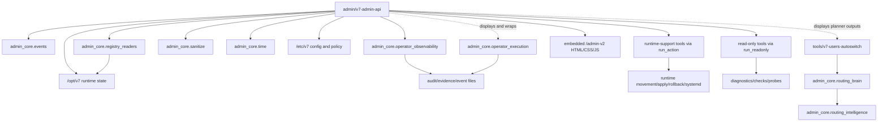

# API.1 Dependency Graph

## High-Level Graph

## Direct Imports

`admin/v7-admin-api` imports standard library modules plus:

| Import | Current role | Extraction note |
|---|---|---|
| `admin_core.events` | event reading and formatting | Keep as read-only dependency |
| `admin_core.operator_observability` | operator overview, timeline, audit/evidence views | Extend for read-only API view extraction |
| `admin_core.registry_readers` | shared key/value registry parsing | Reuse and extend cautiously |
| `admin_core.sanitize` | redaction/sanitization | Good stable helper dependency |
| `admin_core.time` | time formatting helpers | Good stable helper dependency |

## Coupling Classes

| Coupling | Risk | Why |
|---|---|---|
| HTTP routing and auth inside `Handler` | HIGH | Any split can change status codes, redirects, CSRF, role checks, or response shapes. |
| `run_action` runtime commands | CRITICAL | This is the mutation boundary for user movement, egress state, policy, rollback, systemd, and proxy runtime operations. |
| `audit_admin` writer | HIGH | Audit integrity and accountability depend on exact behavior. |
| closure writer | HIGH | Closure ownership is operator-facing and linked to runtime outcomes. |
| identity DB writes | HIGH | User/device/profile issuance can affect access and delivery. |
| egress draft apply/provision | HIGH | Changes runtime channel state. |
| route/policy writes | HIGH | Can change traffic path selection. |
| read-only registry builders | LOW/MEDIUM | Safe if snapshots and redaction are preserved. |
| event/audit readers | LOW/MEDIUM | Safe if writer remains untouched and pagination/retention semantics stay fixed. |
| pure parsers/serializers | LOW | Safe when covered by before/after fixtures. |

## Low-Risk Extraction Direction

The safest first dependencies to move outward are deterministic read-only helpers that already depend on `admin_core` or parse immutable snapshots:

- registry row normalization;
- overview sub-summary builders;
- event/audit/evidence serializers;
- service matrix summaries;
- route-class readers;
- preview-only parser output formatters.

## High-Risk Coupling To Leave In Place

Do not extract first:

- `Handler.do_GET`;
- `Handler.do_POST`;
- `require_auth`;
- CSRF and role enforcement;
- `run_action`;
- action endpoint bodies;
- `audit_admin`;
- closure append/write functions;
- identity creation/revoke/profile issuance;
- policy/direct/trusted RU apply handlers;
- rollback apply handlers;
- `html_page_v2` as a whole.

## Dependency Verdict

The dependency graph is complete enough to start API.2 as a read-only decomposition block. It is not safe to start with action handlers, auth, routing, execution, governance mutation, rollback, or embedded UI separation.
