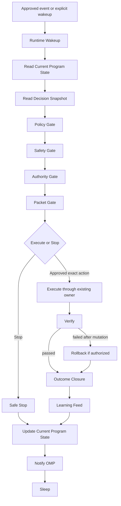

# V7 Runtime Model

Status: canonical design
Program: `V7.RUNTIME.DESIGN.PROGRAM`
Phase: DESIGN_ONLY
Need New Owner: FALSE

## Purpose

The V7 Runtime Model defines how Runtime executes the already-approved V7 Decision Model.

Runtime is not a decision maker.
Runtime does not invent decisions.
Runtime executes, stops, verifies, rolls back, records outcomes, and feeds learning only through existing V7 owners.

Runtime is the thin execution path:

```text
Event
  -> Runtime Wakeup
  -> Read Current Program State
  -> Read Decision Snapshot
  -> Policy
  -> Safety
  -> Authority
  -> Packet
  -> Execute OR Stop
  -> Verify
  -> Rollback if needed
  -> Outcome
  -> Learning
  -> Update Current Program State
  -> Notify OMP
  -> Sleep
```

This document is design-only. It does not implement a daemon, timer, event consumer change, autonomous execution, apply path, user movement, planner change, governance change, execution change, or truth-source change.

## Runtime Laws

Runtime inherits the permanent Decision Model and Engineering Principles laws:

1. Decision != Execution.
2. Policy before Action.
3. Desired State before Current Action.
4. Runtime must stay thin.
5. Background builds knowledge.
6. Safety before Confidence.
7. Blast Radius before Scale.
8. Verify every mutation.
9. Rollback before Trust.
10. Learn only from observed outcomes.
11. Escalation is a valid decision.
12. Reconciliation instead of reaction.

Runtime applies these laws by spending prepared knowledge and stopping whenever an existing owner cannot prove eligibility, authority, safety, verification, or rollback readiness.

## Wakeup Model

Runtime may wake only from approved existing sources:

| Wakeup source | Existing owner | Runtime rule |
| --- | --- | --- |
| Explicit operator or OMP invocation | OMP, Current Program State | Allowed as manual governed wakeup. |
| Certified regression event | Event Sources / Regression Evidence, Event Trigger Certification | Allowed only when the event is already observed by existing read/probe owners. |
| Existing governed canary dry-run cycle | Governed Canary Knowledge-Gated Dry-Run Cycle | Allowed as read-only or authority-gated lifecycle continuation. |
| Resume from recorded state | Current Program State, execution packet, restore barrier, outcome records | Allowed only if the recorded generation and idempotency key still match current reality. |

Runtime must not create a new daemon, enable a timer, move users because time passed, consume unapproved events, or mutate runtime state merely because it woke up.

## Inputs

Runtime consumes only existing-owner inputs:

| Input | Existing owner |
| --- | --- |
| Current Program State | `docs/programs/V7_CURRENT_PROGRAM_STATE.md` |
| Decision Snapshot | Decision Model Reference, operator decision surface, knowledge-to-decision integration |
| Desired State and Policy Basis | Planner / Autoswitch, OMP, policy gates |
| Evidence Quality and Knowledge Snapshot | Knowledge Quality Model, Background knowledge owners |
| Safety Gates | Safety-Bounded Authority, Runtime Readiness, restore barrier |
| Authority State | OMP, Current Program State, explicit operator approval |
| Execution Packet / Preview | `tools/v7-operator-execution-packet`, `admin_core/operator_execution.py` |
| Rollback Target | Restore Barrier / Rollback |
| Verification Plan | Event Trigger Certification, Runtime Readiness, truth/convergence surfaces |
| Learning Path | Decision To Outcome To Learning Integration, feedback and learning owners |

Runtime must not read unrelated historical reports, perform broad audits, perform long historical recomputation, synthesize evidence, or turn diagnostics into a decision owner.

## Outputs

Runtime may produce only bounded existing-owner outputs:

| Output | Existing owner |
| --- | --- |
| Stop reason | Current Program State, OMP |
| Execution result | Existing governed execution owner, only after explicit authority |
| Verification result | Runtime Readiness, truth/convergence, verification owners |
| Rollback result | Restore Barrier / Rollback |
| Outcome closure | Feedback and learning owners |
| Learning feed | Decision To Outcome To Learning Integration |
| OMP notification | Current Program State and OMP continuation state |
| Audit trail / report | Existing documentation and evidence surfaces |

Runtime output is not a new truth source. Runtime output must reference existing owner evidence and must never fabricate success.

## Forbidden Inside Runtime

Runtime must not:

1. Invent decisions.
2. Create a planner.
3. Create governance.
4. Create execution.
5. Create a truth source.
6. Create synthetic evidence.
7. Lower confidence, trust, prediction, suitability, or autonomy floors.
8. Enable a daemon or timer.
9. Change event consumers.
10. Perform autonomous apply.
11. Move users without explicit approved authority.
12. Write the restore barrier without explicit approved authority.
13. Apply rollback without explicit approved authority.
14. Run broad analytics, broad audits, or long historical recomputation in the event path.
15. Treat stale packet state as executable.
16. Retry the same blocked work without new evidence, new authority, or changed state.

## Ownership Boundaries

| Domain | Belongs to | Runtime relationship |
| --- | --- | --- |
| Knowledge building | Background | Runtime consumes prepared snapshots only. |
| Decision semantics | Decision Model | Runtime reads decision snapshots; it does not decide. |
| Optimization and continuation | OMP | Runtime reports stop/outcome state and receives next authorized task direction. |
| Current volatile program state | Current Program State | Runtime reads and updates only through the existing state owner in a future implementation. |
| Policy and candidate ranking | Planner / Autoswitch | Runtime enforces planner/policy output; it does not rank alternatives. |
| Packet construction | Execution Packet owner | Runtime requires packet validity before action. |
| Restore barrier and rollback | Restore Barrier / Rollback | Runtime stops unless barrier and rollback readiness are proven. |
| Verification | Runtime Readiness, truth/convergence, event certification | Runtime verifies every mutation and fails closed on unknown state. |
| Outcome learning | Feedback and learning owners | Runtime feeds only observed outcomes after verification or rollback outcome. |

## Runtime Pipeline

| Stage | Runtime action | Required input | Existing owner | Stop condition |
| --- | --- | --- | --- | --- |
| Event | Accept approved event or manual wakeup. | Event id or explicit operator/OMP invocation. | Event Sources / OMP | Unapproved event. |
| Runtime Wakeup | Create or resume lifecycle attempt. | Runtime state pointer, decision id, generation. | Current Program State | Duplicate active attempt or loop guard. |
| Read Current Program State | Load current bottleneck, HLA, packet freshness, authority boundary. | Current Program State. | Current Program State | Missing, stale, or contradictory state. |
| Read Decision Snapshot | Load existing decision output. | Decision id, action, subject, desired/current state, risk, blast radius. | Decision Model, decision surface | No decision, stale decision, unsupported vocabulary. |
| Policy | Confirm desired state, action vocabulary, eligibility, and policy basis. | Policy gates, candidate ranking, desired state. | Planner / Autoswitch, OMP | Policy block or no eligible subject. |
| Safety | Confirm evidence quality, health, freshness, blast radius, rollback target. | Knowledge snapshot, safety gates, restore preview. | Safety-Bounded Authority, Runtime Readiness | Safety block, freshness block, rollback missing. |
| Authority | Confirm execution authority for exact bounded action. | Authority state, explicit approval if required. | OMP, operator approval, Current Program State | `AUTHORITY_BOUNDARY`. |
| Packet | Build or load existing execution packet. | Packet id, selected move hash, generation, verification plan. | Execution Packet owner | Packet invalid, stale, or generation mismatch. |
| Execute OR Stop | Execute only if authority and packet are valid; otherwise stop. | Approved exact action. | Existing governed execution owner | Stop reason present, no explicit apply approval. |
| Verify | Verify mutation or no-op result. | Verification plan and runtime evidence. | Runtime Readiness, truth/convergence | Verification failed or inconclusive. |
| Rollback if needed | Roll back only if execution happened and rollback authority exists. | Rollback target, restore barrier state. | Restore Barrier / Rollback | Rollback authority missing or rollback failed. |
| Outcome | Close exact observed outcome. | Execution/verification/rollback facts. | Feedback owners | No observed outcome. |
| Learning | Feed only real observed outcome. | Outcome closure record. | Learning owners | Outcome unverified or synthetic. |
| Update Current Program State | Record stop/outcome/next safe action. | Lifecycle result. | Current Program State | State generation conflict. |
| Notify OMP | Surface result for next HLA and bottleneck decision. | Updated Current Program State. | OMP | OMP notification unavailable. |
| Sleep | Terminate safe and await next approved wakeup. | Final state. | Runtime Model | Any unresolved unsafe state stops before sleep. |

## Runtime Lifecycle Diagram



## Runtime State Machine

| State | Entry condition | Allowed next state | Safe stop |
| --- | --- | --- | --- |
| `ASLEEP` | No active approved wakeup. | `WOKEN` | N/A |
| `WOKEN` | Approved wakeup received. | `STATE_LOADED` | `UNAPPROVED_WAKEUP` |
| `STATE_LOADED` | Current Program State loaded. | `DECISION_LOADED` | `CURRENT_STATE_UNAVAILABLE`, `STATE_CONFLICT` |
| `DECISION_LOADED` | Decision snapshot loaded. | `POLICY_CHECKED` | `NO_DECISION`, `STALE_DECISION`, `UNSUPPORTED_ACTION` |
| `POLICY_CHECKED` | Policy and eligibility pass. | `SAFETY_CHECKED` | `POLICY_BLOCK`, `ELIGIBILITY_BLOCK` |
| `SAFETY_CHECKED` | Safety, freshness, blast, rollback pass. | `AUTHORITY_CHECKED` | `SAFETY_BLOCK`, `ROLLBACK_UNAVAILABLE`, `FRESHNESS_BLOCK` |
| `AUTHORITY_CHECKED` | Exact authority exists or stop classified. | `PACKET_READY` | `AUTHORITY_BOUNDARY` |
| `PACKET_READY` | Packet is valid for current generation. | `EXECUTING` or `STOPPED` | `PACKET_INVALID`, `DUPLICATE_WORK` |
| `EXECUTING` | Explicit approved execution starts. | `VERIFYING` | `EXECUTION_REFUSED` |
| `VERIFYING` | Verification plan runs. | `ROLLING_BACK` or `OUTCOME_CLOSING` | `VERIFY_FAILED_NO_MUTATION`, `VERIFY_INCONCLUSIVE` |
| `ROLLING_BACK` | Mutation happened and verification failed. | `OUTCOME_CLOSING` | `ROLLBACK_REQUIRED_OPERATOR` |
| `OUTCOME_CLOSING` | Verified execution or rollback outcome exists. | `LEARNING_FEED` | `OUTCOME_UNAVAILABLE` |
| `LEARNING_FEED` | Real observed outcome is available. | `STATE_UPDATED` | `LEARNING_SKIPPED_NO_REAL_OUTCOME` |
| `STATE_UPDATED` | Current Program State reflects stop/outcome. | `OMP_NOTIFIED` | `STATE_UPDATE_CONFLICT` |
| `OMP_NOTIFIED` | OMP can compute next action. | `TERMINATED_SAFE` | `OMP_NOTIFY_FAILED` |
| `TERMINATED_SAFE` | Lifecycle is closed. | `ASLEEP` | N/A |

## Responsibility Matrix

| Responsibility | Background | Decision Model | Runtime | OMP | Existing owner reused |
| --- | --- | --- | --- | --- | --- |
| Build knowledge | Owns | Reads as evidence | Consumes snapshot | Uses result | Knowledge Quality, intelligence, service matrix |
| Define decision vocabulary | No | Owns | Validates only | Uses | Decision Model Reference |
| Rank candidate moves | No | Reads | Does not rank | Coordinates | Planner / Autoswitch |
| Enforce policy | Provides data | Defines decision basis | Checks pass/fail | Owns continuation meaning | Planner / policy gates |
| Check safety | Provides data | Requires safety | Checks pass/fail | Blocks if unsafe | Safety-Bounded Authority, Runtime Readiness |
| Require authority | No | Marks authority need | Stops or proceeds | Owns authority boundary | OMP, operator approval |
| Build packet | No | References packet need | Requires packet | Uses packet state | Execution Packet owner |
| Execute exact action | No | No | Calls existing owner only after authority | Authorizes or stops | Autoswitch Runtime Owner / governed execution |
| Verify | Provides read models | Requires verification | Runs verification stage | Reads result | Runtime Readiness, truth/convergence |
| Rollback | Provides target state | Requires rollback path | Calls existing rollback only if needed | Reads result | Restore Barrier / Rollback |
| Close outcome | Provides observed facts | Requires outcome | Records exact outcome | Uses for next bottleneck | Feedback owners |
| Feed learning | Owns learning stores | Requires real outcome | Sends observed outcome only | Uses new maturity | Learning owners |
| Update current state | No | No | Produces lifecycle result | Owns program continuation | Current Program State |

## Mapping Runtime -> Existing Owners

| Runtime responsibility | Existing V7 owner |
| --- | --- |
| Wakeup classification | Event-Driven Autonomy Contract, Event Trigger Certification, OMP |
| Event evidence | Event Sources / Regression Evidence |
| Current state read/update | V7 Current Program State |
| Decision snapshot | Decision Model Reference, operator decision surface |
| Desired/current reconciliation | Decision Model, Planner / Autoswitch |
| Policy and eligibility | Planner / Autoswitch, OMP |
| Health, freshness, evidence quality | Knowledge Quality Model, Runtime Readiness |
| Blast radius | Safety-Bounded Authority, Autonomy Risk Tier Floors |
| Authority gate | OMP, explicit operator approval |
| Packet | Execution Packet owner |
| Restore barrier | Restore Barrier / Rollback |
| Execution | Existing governed execution path only after authority |
| Verification | Runtime Readiness, truth/convergence, event certification |
| Rollback | Restore Barrier / Rollback |
| Outcome closure | Operator execution feedback |
| Learning | Decision To Outcome To Learning Integration |
| OMP notification | Current Program State, OMP |

Need New Owner remains `FALSE`.

## Stop Conditions

Runtime must stop safely on:

1. `UNAPPROVED_WAKEUP`
2. `CURRENT_STATE_UNAVAILABLE`
3. `STATE_CONFLICT`
4. `NO_DECISION`
5. `STALE_DECISION`
6. `UNSUPPORTED_ACTION`
7. `POLICY_BLOCK`
8. `ELIGIBILITY_BLOCK`
9. `SAFETY_BLOCK`
10. `FRESHNESS_BLOCK`
11. `ROLLBACK_UNAVAILABLE`
12. `AUTHORITY_BOUNDARY`
13. `PACKET_INVALID`
14. `DUPLICATE_WORK`
15. `LOOP_GUARD`
16. `VERIFY_FAILED_NO_MUTATION`
17. `VERIFY_INCONCLUSIVE`
18. `ROLLBACK_REQUIRED_OPERATOR`
19. `OUTCOME_UNAVAILABLE`
20. `LEARNING_SKIPPED_NO_REAL_OUTCOME`
21. `STATE_UPDATE_CONFLICT`
22. `OMP_NOTIFY_FAILED`

Stop is a valid runtime outcome. A stopped runtime must record the exact stop reason and must not silently retry.

## Restart Behavior

Runtime survives restart by reconstructing lifecycle state from existing durable identifiers:

- `decision_id`
- `operation_id`
- `packet_id`
- selected move hash
- current state generation
- approved plan lock generation
- restore barrier generation
- rollback target
- verification result id
- outcome closure id

On restart Runtime must:

1. reload Current Program State;
2. reload the decision snapshot;
3. compare decision, packet, selected move hash, and generation;
4. detect whether execution already happened;
5. verify existing outcome before retrying;
6. fail closed if mutation state is unknown;
7. request operator/OMP authority if rollback or recovery requires apply.

Runtime must not repeat an execution merely because process memory was lost.

## Duplicate Work Detection

Runtime detects duplicate work with an idempotency key:

```text
decision_id
  + subject
  + action
  + current_state_generation
  + target
  + packet_id
  + selected_move_hash
```

If the idempotency key already has a terminal result, Runtime reuses the result and updates Current Program State if needed.
If the key is active, Runtime stops with `DUPLICATE_WORK`.
If the key conflicts with current generation, Runtime stops with `STALE_DECISION` or `STATE_CONFLICT`.

## Loop Avoidance

Runtime avoids loops by requiring a material change before retry:

- new event evidence;
- changed Current Program State generation;
- refreshed decision snapshot;
- changed authority state;
- changed packet generation;
- resolved stop condition;
- explicit operator or OMP continuation.

The same stop reason for the same idempotency key must not trigger another execution attempt.
Runtime must not oscillate between execute, verify, rollback, and retry without a new decision snapshot and explicit authority.

## Idempotency Strategy

Each runtime stage is read-before-write and generation-checked.

Runtime must:

1. compute the idempotency key before packet execution;
2. use existing packet/restore/rollback identifiers instead of process-local memory;
3. verify whether the exact action already completed;
4. treat verified completion as success without repeating mutation;
5. treat unknown mutation state as unsafe and stop;
6. update Current Program State only after terminal stop/outcome classification;
7. feed learning once per verified observed outcome.

## Current Program State Update

Runtime updates Current Program State only as a future existing-owner implementation detail.
The update must include:

- lifecycle id;
- decision id;
- operation id;
- packet id;
- stop reason or outcome;
- authority boundary status;
- verification status;
- rollback status;
- learning status;
- next safe action;
- whether packet state is stale;
- whether OMP must recompute the HLA.

Runtime must not use Current Program State as a new truth source for runtime facts. Runtime facts still come from existing runtime/readiness/truth/convergence owners.

## OMP Notification

Runtime notifies OMP by publishing a terminal lifecycle result through Current Program State:

| Runtime result | OMP meaning |
| --- | --- |
| Safe stop | Recompute bottleneck and HLA from stop reason. |
| Verified success | Close current action and consider next highest leverage action. |
| Verification failure | Prioritize rollback or recovery gate. |
| Rollback required | Stop at authority boundary unless already approved. |
| Learning fed | Recompute maturity/trust/suitability only from real outcome. |

OMP remains the execution authority and optimizer.

## Learning Feed

Runtime feeds learning only after an observed outcome exists.

Allowed learning inputs:

- verified execution result;
- verified no-op result;
- verified rollback result;
- explicit operator outcome;
- runtime evidence that proves the effect of the exact action.

Forbidden learning inputs:

- simulated success;
- stale packet assumptions;
- expected outcomes that never happened;
- diagnostic guesses;
- confidence projections without observed result.

## Failure Behavior

Runtime fails closed.

| Failure | Required behavior |
| --- | --- |
| Missing state | Stop before packet. |
| Stale decision | Stop before policy. |
| Policy/safety block | Stop before authority. |
| Missing authority | Stop at `AUTHORITY_BOUNDARY`. |
| Packet mismatch | Stop before execute. |
| Execution error before mutation | Stop and record no mutation. |
| Execution error after possible mutation | Verify, then rollback if authorized, else escalate. |
| Verification failure | Rollback if authorized, else escalate. |
| Rollback failure | Stop, preserve evidence, require operator authority. |
| Outcome unavailable | Do not feed learning. |
| State update conflict | Stop and require OMP reconciliation. |

## Observability Strategy

Runtime observability must expose:

- lifecycle id;
- idempotency key fingerprint;
- decision id;
- operation id;
- packet id;
- stage;
- state transition;
- owner called;
- input generation;
- stop reason;
- authority status;
- packet freshness;
- verification status;
- rollback status;
- outcome status;
- learning status;
- OMP notification status.

Runtime observability must not become a new truth source.
It must point to existing owner evidence and preserve enough identifiers for restart and duplicate detection.

## Implementation Roadmap

This roadmap is not implementation approval.

1. Finalize documentation contract and ADR.
2. Audit existing owner fields for the required lifecycle identifiers in read-only mode.
3. Specify read-only Runtime lifecycle schema without changing runtime behavior.
4. Add tests/spec fixtures for state machine, stop conditions, and idempotency without runtime mutation.
5. Add a read-only runtime preview over existing owners.
6. Add manual authority-gated invocation only after explicit approval.
7. Add bounded execution integration only after explicit approval and restore-barrier readiness.
8. Add verified outcome closure and learning feed only from real observed outcomes.
9. Consider daemon/event automation only after separate ADR, certification, and explicit approval.

Runtime is design-ready for a future implementation phase.
Runtime is not implemented by this document.
