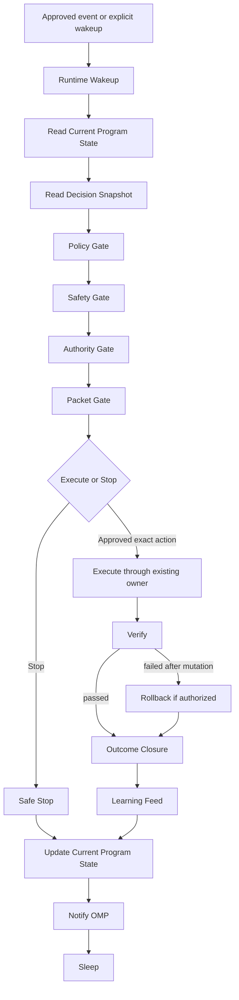

# V7 Runtime Model

Status: canonical design
Program: `V7.RUNTIME.DESIGN.PROGRAM`
Phase: DESIGN_ONLY
Need New Owner: FALSE

## Purpose

The V7 Runtime Model defines how Runtime executes the already-approved V7 Decision Model.

Runtime is not a decision maker.
Runtime does not invent decisions.
Runtime executes, stops, verifies, rolls back, records outcomes, and feeds learning only through existing V7 owners.

Runtime executes certified action classes only when OMP and authority policy have promoted that class.
Runtime does not promote classes by itself.

Runtime may self-approve operational decisions only inside an approved Delegated Autonomy Policy.
Runtime may not self-approve policy expansion, new action classes, blast-radius increases, lower gates, or authority expansion.

Runtime is the thin execution path:

```text
Event
  -> Runtime Wakeup
  -> Read Current Program State
  -> Read Decision Snapshot
  -> Policy
  -> Safety
  -> Action-Class / Policy Authority
  -> Fresh Packet
  -> Execute OR Stop
  -> Verify
  -> Rollback if needed
  -> Outcome
  -> Learning
  -> Update Current Program State
  -> Notify OMP
  -> Sleep
```

This document is design-only. It does not implement a daemon, timer, event consumer change, autonomous execution, apply path, user movement, planner change, governance change, execution change, or truth-source change.

## Runtime Laws

Runtime inherits the permanent Decision Model and Engineering Principles laws:

1. Decision != Execution.
2. Policy before Action.
3. Desired State before Current Action.
4. Runtime must stay thin.
5. Background builds knowledge.
6. Safety before Confidence.
7. Blast Radius before Scale.
8. Verify every mutation.
9. Rollback before Trust.
10. Learn only from observed outcomes.
11. Escalation is a valid decision.
12. Reconciliation instead of reaction.

Runtime applies these laws by spending prepared knowledge and stopping whenever an existing owner cannot prove eligibility, authority, safety, verification, or rollback readiness.

## Runtime Time Architecture

Status: `RT_PHASE_1_CANONICAL`
Owner: `V7_RUNTIME_MODEL`
Phase: documentation/program alignment only.

V7's time architecture separates slow knowledge work from the live execution path.

This is not performance tuning.
It is the architecture of time for a production control plane:

```text
Observation Plane
  -> World Model Plane
  -> Planning Plane
  -> Execution Plane
  -> Verification Plane
  -> Feedback / Learning Plane
  -> OMP / Certification Plane
```

Permanent principle:

```text
Slow knowledge work should be prepared outside the execution path wherever safety permits.
Execution consumes prepared knowledge, then applies live safety gates.
```

### Time Architecture Planes

| Plane | Purpose | Owns | Must not own | Existing owner / read model | Relationship to Runtime | Relationship to OMP | Future automation role |
| --- | --- | --- | --- | --- | --- | --- | --- |
| Observation Plane | Observe current production reality. | Health, service matrix, sentinel, quality, route/runtime, channel status, evidence freshness. | Execution authority, movement, policy expansion, certification. | Service matrix, quality compact, Telegram sentinel, runtime truth, route reality. | Supplies trusted evidence to Runtime through prepared read models and live freshness checks. | Supplies evidence used by OMP certification and maturity. | Continuous observation becomes the input to event-driven autonomy. |
| World Model Plane | Maintain the current known state of users, channels, services, policies, capacity, trust, and evidence. | Current state summaries, intelligence snapshots, trust/evidence summaries, CPS-visible state. | Apply, rollback, autonomous authority, broad recomputation inside Runtime. | Intelligence snapshots, Current Program State, Knowledge Plane, read-model owners. | Runtime consumes compact state, not raw historical scans. | OMP reads it to decide next work, certification, and authority boundaries. | Becomes continuous only after bounded automation and data scale controls are certified. |
| Planning Plane | Prepare candidate readiness, target readiness, risk estimates, rollback/no-rollback plan, and bounded execution candidates. | Candidate universe, target readiness, policy fit, risk classification, capacity/blast hints. | Runtime apply, authority expansion, final live safety bypass. | Planner/autoswitch, operator decision surface, A5/A6/B13 owners. | Runtime consumes prepared decisions and must still revalidate live gates. | OMP certifies planner/read-model reliability before increasing authority. | Evolves toward desired-safe-state delta planning through existing owners. |
| Execution Plane | Perform the shortest safe execute-or-stop action. | Lease-bound execution, STOP_SAFE, apply, rollback if required, terminal runtime result. | Slow knowledge building, broad audits, raw history scans, policy design, certification. | Runtime Model, governed transaction owner, autoswitch owner, packet/lease owner, restore barrier. | This is Runtime's thin path. It remains deterministic and fail-closed. | OMP consumes results and stop reasons; it does not execute inside Runtime. | Can become bounded autonomous only after A5/A6/B13/B16 and authority approval. |
| Verification Plane | Prove whether the user/action is safe after mutation. | Post-apply verification, safety proof, rollback trigger. | Prediction-only success, synthetic evidence, authority promotion. | Verification/runtime readiness owners, truth/convergence surfaces where applicable. | Runtime must verify every mutation. | OMP consumes verified outcomes for certification. | Verification latency becomes a measured part of reaction latency. |
| Feedback / Learning Plane | Convert terminal outcomes into feedback, trust, evidence, and learning. | Terminal classification, feedback, learning, evidence inventory, trust/recommendation updates. | Runtime apply authority, synthetic outcome creation, certification by itself. | Feedback/learning owners, evidence inventory, trust/read-model owners. | Runtime feeds it only from observed outcomes. | OMP consumes materialized learning for promotion and maturity. | Becomes incremental and latency-aware after measurement exists. |
| OMP / Certification Plane | Decide maturity, certification, authority, backlog progression, and stop/continue. | Production maturity, capability progress, certification status, authority recommendation, next OMP step. | Runtime execution, live mutation, duplicate roadmap. | OMP, Current Program State, Implementation Backlog, Production Maturity Model. | Runtime notifies OMP after outcomes/stops; Runtime does not certify itself. | This is OMP's operating plane. | Decides when Phase 2 automation-time work may start. |

Completion condition for RT1:

```text
All runtime time planes are named, owned, bounded, and mapped to existing owners.
```

Validation:

- no new owner;
- no new runtime path;
- no automation;
- no user movement;
- no authority expansion.

## Reaction Latency Model

Status: `RT_PHASE_1_CANONICAL`
Owner: `V7_RUNTIME_MODEL`

Canonical definition:

```text
Reaction Latency =
  Observation Latency
  + Decision Latency
  + Execution Latency
  + Verification Latency
  + Feedback / Learning Latency
```

Component definitions:

| Component | Definition | Primary owner | User outage relevance |
| --- | --- | --- | --- |
| Observation Latency | Time from real degradation/failure to trusted evidence. | Observation Plane owners. | Direct. |
| Decision Latency | Time from trusted evidence to eligible decision or `STOP_SAFE`. | Planning Plane, Decision Model, A6/runtime eligibility owners. | Direct. |
| Execution Latency | Time from authority/eligibility to completed apply or `STOP_SAFE`. | Execution Plane owners. | Direct when apply is allowed. |
| Verification Latency | Time from apply to verified safe/unsafe outcome. | Verification Plane owners. | Direct until safety is known. |
| Feedback / Learning Latency | Time from terminal outcome to materialized feedback, learning, evidence, and OMP visibility. | Feedback / Learning Plane and OMP. | Product maturity latency; usually not direct outage time. |

User recovery latency is mainly:

```text
Observation Latency
  + Decision Latency
  + Execution Latency
  + Verification Latency
```

Feedback / Learning Latency affects product maturity, future decisions, certification, and trust.

Phase 1 does not define numeric latency SLOs.
Phase 1 does not create latency gates.
Phase 1 only makes latency visible, owned, and reportable.

Completion condition for RT2:

```text
Reaction Latency and all components are defined without numeric SLOs or runtime gates.
```

## Thin Runtime Path Contract

Status: `RT_PHASE_1_CANONICAL`
Owner: `V7_RUNTIME_MODEL`

Runtime execution path must stay:

- short;
- deterministic;
- lease-bound;
- fail-closed.

Runtime must not become the place where slow knowledge work is performed.
Runtime may only do work that must be live for safety.

Allowed live execution work:

- freshness recheck;
- authority generation / authority match;
- action class / policy match;
- source eligibility;
- target eligibility;
- lease validation;
- restore barrier;
- rollback/no-rollback readiness;
- anti-flap / movement protection;
- selected move identity verification;
- apply;
- verification;
- rollback if required;
- `STOP_SAFE`.

Work that should be prepared earlier where safe:

- health history;
- service matrix;
- quality summaries;
- trust summaries;
- candidate universe;
- target readiness summaries;
- capacity summaries;
- rollback readiness summaries;
- A4/B13 evidence summaries;
- risk classification;
- cohort/user suitability;
- marginal evidence value;
- operator/runtime read models.

Permanent engineering rule:

```text
Every future owner must justify why a computation remains in Runtime
if it can be safely prepared earlier.
```

This rule never finishes.
It is a continuing engineering law.

Completion condition for RT3:

```text
Runtime remains the thin live path; slow knowledge work is assigned to prepared owners unless safety requires live execution.
```

## Latency Ownership And Live/Precompute Matrix

Status: `RT_PHASE_1_CANONICAL`
Owner: `V7_RUNTIME_MODEL`

This is the canonical matrix.
Other documents may reference it but must not duplicate it as a second owner.

| Stage | Existing owner | Files / modules | Latency contribution | Can be precomputed? | Must stay live? | Safety reason | Future optimization opportunity | Measurement field |
| --- | --- | --- | --- | --- | --- | --- | --- | --- |
| Observation | Service matrix, quality compact, Telegram sentinel, route/runtime truth | `tools/v7-service-matrix-refresh-all`, `tools/v7-egress-quality-compact`, `tools/v7-telegram-sentinel`, runtime state readers | Probe cadence and evidence freshness. | `YES` | `PARTIAL` | Runtime needs current enough evidence but should not run broad probes inside apply. | Continuous observation and fresher summaries. | `observation_latency` |
| Snapshot / read model | Intelligence snapshots, Knowledge Plane, read-model owners | `admin_core/intelligence_snapshots.py`, `admin_core/intelligence_workers.py`, `admin_core/autonomy_trust_acceleration.py` | Aggregation and summarization time. | `YES` | `NO` | Expensive aggregation must stay outside Runtime. | Incremental summaries and hot read models. | `world_model_latency` |
| Candidate generation | Planner/autoswitch, operator decision surface | `tools/v7-users-autoswitch`, `admin_core/operator_decision_surface.py` | Candidate universe and scoring time. | `PARTIAL` | `PARTIAL` | Candidate preparation can be early; final decision must match fresh state. | Candidate readiness and marginal evidence value precompute. | `candidate_generation_latency` |
| Eligibility | Runtime eligibility, action-class enablement, policy gates | `admin_core/autonomy_trust_acceleration.py`, `tools/v7-autonomy-trust-evidence-inventory`, `admin_core/operator_execution_pipeline.py` | Gate arbitration time. | `PARTIAL` | `YES` | Final execute/stop must reflect live authority, freshness, blast, rollback, anti-flap, and verification. | A6 centralized eligibility read model. | `decision_latency` |
| Decision | Decision Model, decision surface, governed pipeline | `admin_core/operator_decision_surface.py`, `admin_core/operator_execution_pipeline.py` | Time to produce committed eligible decision or stop. | `YES` after commit | `PARTIAL` | Committed decision may be reused until material change; live gates still apply. | Decision freshness lifetime and material-change checks. | `decision_latency` |
| Packet / lease | Packet owner and execution lease owner | `tools/v7-operator-execution-packet`, `admin_core/operator_execution.py` | Fresh execution artifact and lease binding time. | `PARTIAL` | `YES` | Packet is transient and must match current authority/policy/class bounds. | Faster committed-preview to lease binding. | `execution_latency` |
| Restore barrier | Restore / rollback owners | `admin_core/operator_execution.py`, restore-barrier state | Safety clearance time. | `NO` | `YES` | Restore barrier must be current at commit. | Prepared rollback summaries, live final clearance. | `execution_latency` |
| Apply | Existing autoswitch owner | `tools/v7-users-autoswitch` | Irreversible mutation time. | `NO` | `YES` | Apply is the commit/mutation point and must be deterministic and fail-closed. | Keep path short; no broad scans. | `execution_latency` |
| Verify | Verification/runtime readiness owners | governed transaction / verification owners | Post-apply proof time. | `NO` | `YES` | Prediction cannot replace verification. | Fast service-specific verification. | `verification_latency` |
| Rollback / no-rollback | Restore barrier / rollback / autoswitch rollback owners | `admin_core/operator_execution.py`, `tools/v7-users-autoswitch` | Compensation decision/action time. | `PARTIAL` plan | `YES` | Plan can be prepared; action must respond to observed outcome. | Automatic rollback authority only after B16 certification. | `rollback_latency` |
| Feedback | Feedback owner | `admin_core/operator_execution_feedback.py` | Terminal outcome materialization time. | `PARTIAL` | `PARTIAL` | Must use real terminal state and observed outcome. | Automatic terminal propagation. | `feedback_latency` |
| Learning | Learning/evidence owners | `admin_core/operator_execution_feedback.py`, `admin_core/autonomy_trust_acceleration.py`, intelligence workers | Trust/evidence update time. | `YES` | `NO` | Learning is not part of user recovery fast path. | Incremental learning and compact evidence summaries. | `learning_latency` |
| OMP / CPS | OMP, Current Program State, Production Maturity Model | `docs/programs/OPERATIONAL_MATURITY_PROGRAM.md`, `docs/programs/V7_CURRENT_PROGRAM_STATE.md`, `docs/reference/V7_PRODUCTION_MATURITY_MODEL.md` | Certification and program visibility time. | `YES` | `NO` | Program maturity is not live mutation. | Faster status recalculation after outcomes. | `omp_visibility_latency` |

Completion condition for RT4:

```text
Every current runtime path stage has an owner, precompute/live classification, safety reason, future optimization path, and measurement field.
```

## Phase 2 Automation-Time Contract

Status: `DEFERRED_UNTIL_BOUNDED_AUTONOMY_CERTIFIED`
Owner: `V7_RUNTIME_MODEL` for the contract; OMP for execution order.

Phase 2 is not optional.
It is deferred because it requires bounded automation, real latency data, certified runtime eligibility, and explicit authority.

Phase 2 must not start until:

- bounded automation is certified;
- A5 class-level blast-radius evidence is complete;
- A6 runtime eligibility arbitration is complete;
- B13 metric reliability is complete;
- rollback/verification authority is certified where required;
- Product Scale Objectives remain satisfied;
- OMP authorizes Phase 2 work through the existing backlog/authority model.

| Phase 2 item | Purpose | Why not Phase 1 | Dependency | Existing likely owner | Safety condition before implementation | Expected output |
| --- | --- | --- | --- | --- | --- | --- |
| Continuous World Model | Keep current state hot and queryable. | Requires scale-safe data freshness and bounded automation consumers. | A6, B13, Product Scale Objectives. | Intelligence snapshots, Knowledge Plane, runtime read models. | No heavy runtime scans; indexed/aggregated data. | Current-state read model with latency fields. |
| Continuous Candidate Readiness | Maintain eligible candidate readiness before events. | Candidate readiness must not become autonomous movement. | A5, A6, B13. | Planner/autoswitch, operator decision surface. | Read-only until authority and eligibility pass. | Candidate readiness summary. |
| Continuous Target Readiness | Maintain safe target readiness and capacity state. | Needs blast/capacity certification. | A5, B14, C7. | Planner capacity/load, service matrix, quality compact. | Target eligibility must still be live-checked. | Target readiness read model. |
| Precomputed Recovery Plans | Prepare likely rollback/recovery options. | Recovery plans cannot replace live verification/rollback readiness. | A3, B8, B10, B16. | Restore/rollback owners, recovery admission. | Live restore barrier remains mandatory. | Recovery plan preview/read model. |
| Desired Safe State | Express where users/channels should safely converge. | Desired state must not bypass current evidence and authority. | A6, B12, B13. | Runtime Model, OMP, planner owners. | Must be bounded by policy and blast radius. | Desired safe state artifact. |
| Desired-State Delta Planner | Compute bounded delta from current to desired safe state. | A planner rewrite is forbidden; must evolve through existing planner. | Desired Safe State, A6, B13. | Existing planner/autoswitch. | Delta execution must be bounded, verified, and reversible where required. | Bounded delta plan. |
| Safe Execution Queue | Schedule safe bounded execution attempts. | Queue implies automation and must wait for authority. | Bounded autonomy, A6, B16. | Governed transaction/runtime owners. | One queue item must still pass all live gates. | Auditable execution queue. |
| Rate Limits | Prevent overreaction and storm behavior. | Needs real latency and blast evidence. | A5, B19, B20. | Anti-flap, blast-radius, runtime eligibility owners. | Hard failure override and anti-flap arbitration certified. | Rate-limit policy/read model. |
| Blast-Radius Scheduling | Sequence actions by certified blast budget. | Depends on A5 and authority. | A5, B14, C7. | Blast-radius/action-class owners. | No silent blast expansion. | Schedule bounded by class/policy. |
| Bounded Parallelism | Execute multiple safe actions when certified. | Forbidden before bounded automation and blast proof. | A5, A6, B13, B16. | Runtime/OMP/action-class owners. | Certified max concurrency and rollback/verification capacity. | Parallel execution envelope. |
| Latency Budget | Define measured target budgets. | Phase 1 has no numeric gates or SLOs. | Real latency data, bounded automation. | OMP, Production Maturity Model, Runtime Model. | Must not create unsafe fast action incentives. | Latency budget per action class. |
| Decision Freshness Lifetime | Define how long decisions remain valid by class. | Requires real freshness/material-change evidence. | A2, A6, C6, B18. | Freshness and lease owners. | Material state change gate remains mandatory. | Class-specific freshness lifetime. |
| Runtime Performance Dashboard | Expose latency and fast-path health. | Needs measured fields and stable read models. | Latency instrumentation. | Admin/read-model owners. | Dashboard must not become decision owner. | Operator/engineering latency surface. |
| Reaction Latency Certification | Certify reaction latency behavior by class. | Needs data, authority, and bounded automation. | Latency budgets, runtime dashboard, A6/B13. | OMP, Runtime Model, Production Maturity Model. | Certification cannot bypass safety gates. | Certified reaction-latency status. |

Completion condition for RT6:

```text
Phase 2 scope, dependencies, owners, safety conditions, and expected outputs are defined without implementing Phase 2.
```

## Wakeup Model

Runtime may wake only from approved existing sources:

| Wakeup source | Existing owner | Runtime rule |
| --- | --- | --- |
| Explicit operator or OMP invocation | OMP, Current Program State | Allowed as manual governed wakeup. |
| Certified regression event | Event Sources / Regression Evidence, Event Trigger Certification | Allowed only when the event is already observed by existing read/probe owners. |
| Existing governed canary dry-run cycle | Governed Canary Knowledge-Gated Dry-Run Cycle | Allowed as read-only or authority-gated lifecycle continuation. |
| Resume from recorded state | Current Program State, execution packet, restore barrier, outcome records | Allowed only if the recorded generation and idempotency key still match current reality. |

Runtime must not create a new daemon, enable a timer, move users because time passed, consume unapproved events, or mutate runtime state merely because it woke up.

## Inputs

Runtime consumes only existing-owner inputs:

| Input | Existing owner |
| --- | --- |
| Current Program State | `docs/programs/V7_CURRENT_PROGRAM_STATE.md` |
| Decision Snapshot | Decision Model Reference, operator decision surface, knowledge-to-decision integration |
| Desired State and Policy Basis | Planner / Autoswitch, OMP, policy gates |
| Evidence Quality and Knowledge Snapshot | Knowledge Quality Model, Background knowledge owners |
| Safety Gates | Safety-Bounded Authority, Runtime Readiness, restore barrier |
| Authority State | OMP, Current Program State, approved Action Class authority, explicit operator approval only when still required |
| Action Class State | OMP Autonomy Promotion Engine, Current Program State |
| Execution Packet / Preview | `tools/v7-operator-execution-packet`, `admin_core/operator_execution.py` |
| Rollback Target | Restore Barrier / Rollback |
| Verification Plan | Event Trigger Certification, Runtime Readiness, truth/convergence surfaces |
| Learning Path | Decision To Outcome To Learning Integration, feedback and learning owners |

Runtime must not read unrelated historical reports, perform broad audits, perform long historical recomputation, synthesize evidence, or turn diagnostics into a decision owner.

## Outputs

Runtime may produce only bounded existing-owner outputs:

| Output | Existing owner |
| --- | --- |
| Stop reason | Current Program State, OMP |
| Execution result | Existing governed execution owner, only after explicit authority |
| Verification result | Runtime Readiness, truth/convergence, verification owners |
| Rollback result | Restore Barrier / Rollback |
| Outcome closure | Feedback and learning owners |
| Learning feed | Decision To Outcome To Learning Integration |
| OMP notification | Current Program State and OMP continuation state |
| Audit trail / report | Existing documentation and evidence surfaces |

Runtime output is not a new truth source. Runtime output must reference existing owner evidence and must never fabricate success.

## Action-Class Authority

Runtime must evaluate authority at the action-class level before packet execution.

The primary approval object is the Action Class.
The packet is a fresh execution artifact.

Runtime must not depend on a long-lived operator-approved packet for autonomous or class-approved work.
Runtime must generate or consume a fresh packet immediately before execution through the existing packet owner and then verify that the packet belongs to an approved class.

Runtime never asks:

```text
Approve Packet
```

when the action class is already:

```text
AUTONOMOUS_RUNTIME
```

and all of the following remain inside the certified class bounds:

- policy;
- subject;
- target class;
- blast radius;
- freshness;
- safety;
- rollback/no-rollback path;
- verification;
- learning;
- authority generation.

Runtime must ask, stop, or escalate when:

- the action class is `NOT_CERTIFIED`;
- the action class is `GOVERNED_ONLY`;
- the action class is only `CERTIFIED_FOR_CLASS_APPROVAL` and class approval has not been granted;
- authority is exceeded;
- policy changed;
- risk exceeds certified blast radius;
- freshness, safety, rollback/no-rollback, verification, or learning requirements fail;
- the packet identity does not match the approved class/policy bounds.

Action-class authority does not let Runtime invent decisions.
Runtime still consumes prepared decisions and packets from existing owners.

Runtime must verify every fresh packet against:

- approved Action Class;
- authority generation;
- policy;
- subject;
- target class;
- selected move hash;
- freshness;
- safety gates;
- rollback/no-rollback readiness;
- verification readiness;
- blast-radius bounds.

If the packet does not match the approved class, Runtime must stop at `OPERATIONAL_AUTHORITY`, `ENGINEERING_AUTHORITY`, or `UNSAFE_IMPLEMENTATION` depending on whether the problem is missing exact production approval, missing engineering authority/policy/class approval, or identity/safety mismatch.

This section does not enable runtime apply, autonomous execution, daemon/timer behavior, user movement, rollback apply, or authority expansion.
It defines the future rule for when packet-level approval is no longer required for a certified class.

## Delegated Autonomy Policy Gate

Delegated Autonomy Policy is the bounded self-approval contract.

Runtime may execute automatically only when all of the following are true:

1. action belongs to an approved policy;
2. action class is certified or policy explicitly allows governed learning mode;
3. fresh packet is generated immediately before execution;
4. packet matches policy;
5. rollback is ready;
6. verification is ready;
7. anti-flap passes;
8. blast radius is within policy;
9. evidence is not stale;
10. failure mode is known.

If any gate fails, Runtime stops.

Runtime may decide:

- this fresh packet is inside policy;
- this safety gate passes;
- this rollback path is ready;
- this verification path is ready;
- this action should stop.

Runtime may not decide:

- expand policy;
- add a new action class;
- increase max users per action;
- lower confidence, trust, suitability, freshness, rollback, verification, anti-flap, or blast-radius requirements;
- convert governed learning mode into production autonomy.

Current default policy is read-only and not approved:

```text
policy_id: dap_default_tier1_readonly
state: NOT_APPROVED
current_mode: CLASS_APPROVAL
target_mode: DELEGATED_AUTONOMY
max_users_per_action: 1
runtime_apply_enabled: NO
```

## Forbidden Inside Runtime

Runtime must not:

1. Invent decisions.
2. Create a planner.
3. Create governance.
4. Create execution.
5. Create a truth source.
6. Create synthetic evidence.
7. Lower confidence, trust, prediction, suitability, or autonomy floors.
8. Enable a daemon or timer.
9. Change event consumers.
10. Perform autonomous apply.
11. Move users without explicit approved authority.
12. Write the restore barrier without explicit approved authority.
13. Apply rollback without explicit approved authority.
14. Run broad analytics, broad audits, or long historical recomputation in the event path.
15. Treat stale packet state as executable.
16. Retry the same blocked work without new evidence, new authority, or changed state.

## Ownership Boundaries

| Domain | Belongs to | Runtime relationship |
| --- | --- | --- |
| Knowledge building | Background | Runtime consumes prepared snapshots only. |
| Decision semantics | Decision Model | Runtime reads decision snapshots; it does not decide. |
| Optimization and continuation | OMP | Runtime reports stop/outcome state and receives next authorized task direction. |
| Current volatile program state | Current Program State | Runtime reads and updates only through the existing state owner in a future implementation. |
| Policy and candidate ranking | Planner / Autoswitch | Runtime enforces planner/policy output; it does not rank alternatives. |
| Packet construction | Execution Packet owner | Runtime requires packet validity before action. |
| Restore barrier and rollback | Restore Barrier / Rollback | Runtime stops unless barrier and rollback readiness are proven. |
| Verification | Runtime Readiness, truth/convergence, event certification | Runtime verifies every mutation and fails closed on unknown state. |
| Outcome learning | Feedback and learning owners | Runtime feeds only observed outcomes after verification or rollback outcome. |

## Runtime Pipeline

| Stage | Runtime action | Required input | Existing owner | Stop condition |
| --- | --- | --- | --- | --- |
| Event | Accept approved event or manual wakeup. | Event id or explicit operator/OMP invocation. | Event Sources / OMP | Unapproved event. |
| Runtime Wakeup | Create or resume lifecycle attempt. | Runtime state pointer, decision id, generation. | Current Program State | Duplicate active attempt or loop guard. |
| Read Current Program State | Load current bottleneck, HLA, packet freshness, and normalized authority class. | Current Program State. | Current Program State | Missing, stale, or contradictory state. |
| Read Decision Snapshot | Load existing decision output. | Decision id, action, subject, desired/current state, risk, blast radius. | Decision Model, decision surface | No decision, stale decision, unsupported vocabulary. |
| Policy | Confirm desired state, action vocabulary, eligibility, and policy basis. | Policy gates, candidate ranking, desired state. | Planner / Autoswitch, OMP | Policy block or no eligible subject. |
| Safety | Confirm evidence quality, health, freshness, blast radius, rollback target. | Knowledge snapshot, safety gates, restore preview. | Safety-Bounded Authority, Runtime Readiness | Safety block, freshness block, rollback missing. |
| Authority | Confirm action-class authority, delegated policy bounds, packet-level fallback only if the class is still `GOVERNED_ONLY`, and certified policy bounds. | Action class state, delegated policy state, authority state, class approval or explicit packet approval when required. | OMP Autonomy Promotion Engine, Delegated Autonomy Policy preview, operator approval, Current Program State | `OPERATIONAL_AUTHORITY`, `ENGINEERING_AUTHORITY`, policy not approved, action class not approved for runtime, authority exceeded, policy changed, risk exceeds certified blast radius. |
| Packet | Generate or consume a fresh execution packet immediately before execution. | Packet id, selected move hash, generation, verification plan, action-class mapping. | Execution Packet owner | Packet invalid, stale, generation mismatch, class mismatch, authority mismatch, policy mismatch. |
| Execute OR Stop | Execute only if authority and packet are valid; otherwise stop. | Approved exact action. | Existing governed execution owner | Stop reason present, no explicit apply approval. |
| Verify | Verify mutation or no-op result. | Verification plan and runtime evidence. | Runtime Readiness, truth/convergence | Verification failed or inconclusive. |
| Rollback if needed | Roll back only if execution happened and rollback authority exists. | Rollback target, restore barrier state. | Restore Barrier / Rollback | Rollback authority missing or rollback failed. |
| Outcome | Close exact observed outcome. | Execution/verification/rollback facts. | Feedback owners | No observed outcome. |
| Learning | Feed only real observed outcome. | Outcome closure record. | Learning owners | Outcome unverified or synthetic. |
| Update Current Program State | Record stop/outcome/next safe action. | Lifecycle result. | Current Program State | State generation conflict. |
| Notify OMP | Surface result for next HLA and bottleneck decision. | Updated Current Program State. | OMP | OMP notification unavailable. |
| Sleep | Terminate safe and await next approved wakeup. | Final state. | Runtime Model | Any unresolved unsafe state stops before sleep. |

## Terminal Outcome Classification

Runtime outcome classification must use the final terminal transaction state, not an intermediate apply result.

Canonical classification order:

```text
Apply
  -> Verification
  -> Rollback / No-Rollback
  -> Terminal Transaction State
  -> Outcome Classification
  -> Feedback
  -> Learning
  -> Trust
  -> Evidence
  -> Promotion
```

Canonical terminal classifications:

| Terminal facts | Outcome classification | Learning rule | Promotion rule |
| --- | --- | --- | --- |
| Apply PASS, Verification PASS, Rollback NOT_REQUIRED | `SUCCESS` | Positive learning; trust, prediction confidence, recommendation confidence, and representative success evidence may increase from real observation. | May count as success evidence when other A4 gates pass. |
| Apply PASS, Verification FAIL, Rollback COMPLETED | `ROLLBACK_SUCCESS` | Rollback learning; rollback knowledge, failure-family knowledge, and recovery confidence may increase; recommendation confidence for this condition must decrease or stay non-positive. | Must not count as successful move evidence or increase promotion readiness as success. |
| Apply PASS, Verification FAIL, Rollback FAILED | `ROLLBACK_FAILURE` | Failure learning; rollback failure knowledge, recovery investigation priority, and risk knowledge may increase. | Must not count as success evidence. |
| Apply FAIL | `APPLY_FAILURE` | Failure learning only. | Must not count as success evidence. |
| STOP_SAFE before Apply | `NO_EXECUTION` | No production outcome learning; preserve stop reason only. | Must not increase maturity, authority, or promotion readiness. |

Rollback must never be reclassified as `SUCCESS`.
Representative evidence may include success, rollback, and failed outcomes, but each category must preserve its own semantics.
Feedback, learning, trust, evidence inventory, and promotion owners must consume the terminal classification rather than inferring success from `apply_result` alone.

## Runtime Lifecycle Diagram



## Runtime State Machine

| State | Entry condition | Allowed next state | Safe stop |
| --- | --- | --- | --- |
| `ASLEEP` | No active approved wakeup. | `WOKEN` | N/A |
| `WOKEN` | Approved wakeup received. | `STATE_LOADED` | `UNAPPROVED_WAKEUP` |
| `STATE_LOADED` | Current Program State loaded. | `DECISION_LOADED` | `CURRENT_STATE_UNAVAILABLE`, `STATE_CONFLICT` |
| `DECISION_LOADED` | Decision snapshot loaded. | `POLICY_CHECKED` | `NO_DECISION`, `STALE_DECISION`, `UNSUPPORTED_ACTION` |
| `POLICY_CHECKED` | Policy and eligibility pass. | `SAFETY_CHECKED` | `POLICY_BLOCK`, `ELIGIBILITY_BLOCK` |
| `SAFETY_CHECKED` | Safety, freshness, blast, rollback pass. | `AUTHORITY_CHECKED` | `SAFETY_BLOCK`, `ROLLBACK_UNAVAILABLE`, `FRESHNESS_BLOCK` |
| `AUTHORITY_CHECKED` | Action-class, policy, and exact packet authority if required exist or stop is classified. | `PACKET_READY` | `OPERATIONAL_AUTHORITY`, `ENGINEERING_AUTHORITY`, `ACTION_CLASS_UNCERTIFIED`, `POLICY_CHANGED`, `RISK_EXCEEDS_CERTIFIED_BLAST_RADIUS` |
| `PACKET_READY` | Packet is valid for current generation. | `EXECUTING` or `STOPPED` | `PACKET_INVALID`, `DUPLICATE_WORK` |
| `EXECUTING` | Explicit approved execution starts. | `VERIFYING` | `EXECUTION_REFUSED` |
| `VERIFYING` | Verification plan runs. | `ROLLING_BACK` or `OUTCOME_CLOSING` | `VERIFY_FAILED_NO_MUTATION`, `VERIFY_INCONCLUSIVE` |
| `ROLLING_BACK` | Mutation happened and verification failed. | `OUTCOME_CLOSING` | `ROLLBACK_REQUIRED_OPERATOR` |
| `OUTCOME_CLOSING` | Verified execution or rollback outcome exists. | `LEARNING_FEED` | `OUTCOME_UNAVAILABLE` |
| `LEARNING_FEED` | Real observed outcome is available. | `STATE_UPDATED` | `LEARNING_SKIPPED_NO_REAL_OUTCOME` |
| `STATE_UPDATED` | Current Program State reflects stop/outcome. | `OMP_NOTIFIED` | `STATE_UPDATE_CONFLICT` |
| `OMP_NOTIFIED` | OMP can compute next action. | `TERMINATED_SAFE` | `OMP_NOTIFY_FAILED` |
| `TERMINATED_SAFE` | Lifecycle is closed. | `ASLEEP` | N/A |

## Responsibility Matrix

| Responsibility | Background | Decision Model | Runtime | OMP | Existing owner reused |
| --- | --- | --- | --- | --- | --- |
| Build knowledge | Owns | Reads as evidence | Consumes snapshot | Uses result | Knowledge Quality, intelligence, service matrix |
| Define decision vocabulary | No | Owns | Validates only | Uses | Decision Model Reference |
| Rank candidate moves | No | Reads | Does not rank | Coordinates | Planner / Autoswitch |
| Enforce policy | Provides data | Defines decision basis | Checks pass/fail | Owns continuation meaning | Planner / policy gates |
| Check safety | Provides data | Requires safety | Checks pass/fail | Blocks if unsafe | Safety-Bounded Authority, Runtime Readiness |
| Promote action class | Provides outcome evidence | No | Consumes promoted class state only | Owns Autonomy Promotion Engine | OMP, Current Program State, certified reports |
| Require authority | No | Marks authority need | Stops or proceeds by class/policy/packet authority | Owns normalized authority class | OMP, operator approval |
| Build packet | No | References packet need | Requires packet | Uses packet state | Execution Packet owner |
| Execute exact action | No | No | Calls existing owner only after authority | Authorizes or stops | Autoswitch Runtime Owner / governed execution |
| Verify | Provides read models | Requires verification | Runs verification stage | Reads result | Runtime Readiness, truth/convergence |
| Rollback | Provides target state | Requires rollback path | Calls existing rollback only if needed | Reads result | Restore Barrier / Rollback |
| Close outcome | Provides observed facts | Requires outcome | Records exact outcome | Uses for next bottleneck | Feedback owners |
| Feed learning | Owns learning stores | Requires real outcome | Sends observed outcome only | Uses new maturity | Learning owners |
| Update current state | No | No | Produces lifecycle result | Owns program continuation | Current Program State |

## Mapping Runtime -> Existing Owners

| Runtime responsibility | Existing V7 owner |
| --- | --- |
| Wakeup classification | Event-Driven Autonomy Contract, Event Trigger Certification, OMP |
| Event evidence | Event Sources / Regression Evidence |
| Current state read/update | V7 Current Program State |
| Decision snapshot | Decision Model Reference, operator decision surface |
| Desired/current reconciliation | Decision Model, Planner / Autoswitch |
| Policy and eligibility | Planner / Autoswitch, OMP |
| Health, freshness, evidence quality | Knowledge Quality Model, Runtime Readiness |
| Blast radius | Safety-Bounded Authority, Autonomy Risk Tier Floors |
| Action class promotion | OMP Autonomy Promotion Engine |
| Authority gate | OMP, explicit operator approval, approved action-class policy |
| Packet | Execution Packet owner |
| Restore barrier | Restore Barrier / Rollback |
| Execution | Existing governed execution path only after authority |
| Verification | Runtime Readiness, truth/convergence, event certification |
| Rollback | Restore Barrier / Rollback |
| Outcome closure | Operator execution feedback |
| Learning | Decision To Outcome To Learning Integration |
| OMP notification | Current Program State, OMP |

Need New Owner remains `FALSE`.

## Stop Conditions

Runtime must stop safely on:

1. `UNAPPROVED_WAKEUP`
2. `CURRENT_STATE_UNAVAILABLE`
3. `STATE_CONFLICT`
4. `NO_DECISION`
5. `STALE_DECISION`
6. `UNSUPPORTED_ACTION`
7. `POLICY_BLOCK`
8. `ELIGIBILITY_BLOCK`
9. `SAFETY_BLOCK`
10. `FRESHNESS_BLOCK`
11. `ROLLBACK_UNAVAILABLE`
12. `OPERATIONAL_AUTHORITY`
13. `ENGINEERING_AUTHORITY`
14. `ACTION_CLASS_UNCERTIFIED`
15. `POLICY_CHANGED`
16. `RISK_EXCEEDS_CERTIFIED_BLAST_RADIUS`
17. `PACKET_INVALID`
18. `DUPLICATE_WORK`
18. `LOOP_GUARD`
19. `VERIFY_FAILED_NO_MUTATION`
20. `VERIFY_INCONCLUSIVE`
21. `ROLLBACK_REQUIRED_OPERATOR`
22. `OUTCOME_UNAVAILABLE`
23. `LEARNING_SKIPPED_NO_REAL_OUTCOME`
24. `STATE_UPDATE_CONFLICT`
25. `OMP_NOTIFY_FAILED`

Stop is a valid runtime outcome. A stopped runtime must record the exact stop reason and must not silently retry.

## Restart Behavior

Runtime survives restart by reconstructing lifecycle state from existing durable identifiers:

- `decision_id`
- `operation_id`
- `packet_id`
- selected move hash
- current state generation
- approved plan lock generation
- restore barrier generation
- rollback target
- verification result id
- outcome closure id

On restart Runtime must:

1. reload Current Program State;
2. reload the decision snapshot;
3. compare decision, packet, selected move hash, and generation;
4. detect whether execution already happened;
5. verify existing outcome before retrying;
6. fail closed if mutation state is unknown;
7. request operator/OMP authority if rollback or recovery requires apply.

Runtime must not repeat an execution merely because process memory was lost.

## Duplicate Work Detection

Runtime detects duplicate work with an idempotency key:

```text
decision_id
  + subject
  + action
  + current_state_generation
  + target
  + packet_id
  + selected_move_hash
```

If the idempotency key already has a terminal result, Runtime reuses the result and updates Current Program State if needed.
If the key is active, Runtime stops with `DUPLICATE_WORK`.
If the key conflicts with current generation, Runtime stops with `STALE_DECISION` or `STATE_CONFLICT`.

## Execution Lease

After a governed packet reaches `READY_FOR_APPROVAL`, the existing packet owner may create an execution lease.

The execution lease binds operator approval to one immutable execution packet:

- packet id;
- decision id;
- operation id;
- authority generation;
- selected move hash;
- subject;
- target;
- rollback manifest;
- approved plan lock.

While the lease is active, Runtime and OMP must not regenerate the decision, selected move hash, target, or execution packet. Planner refresh is allowed only as a freshness check. The executable packet is read from the lease and remains the approved packet.

The lease may be invalidated only by:

- timeout;
- execution finished;
- rollback finished;
- operator cancel;
- materially changed source state.

The lease is not a new truth source. It is a packet-owner execution guard that points back to the approved packet, Current Program State, restore barrier, and runtime evidence.

## Loop Avoidance

Runtime avoids loops by requiring a material change before retry:

- new event evidence;
- changed Current Program State generation;
- refreshed decision snapshot;
- changed authority state;
- changed packet generation;
- resolved stop condition;
- explicit operator or OMP continuation.

The same stop reason for the same idempotency key must not trigger another execution attempt.
Runtime must not oscillate between execute, verify, rollback, and retry without a new decision snapshot and explicit authority.

## Idempotency Strategy

Each runtime stage is read-before-write and generation-checked.

Runtime must:

1. compute the idempotency key before packet execution;
2. use existing packet/restore/rollback identifiers instead of process-local memory;
3. verify whether the exact action already completed;
4. treat verified completion as success without repeating mutation;
5. treat unknown mutation state as unsafe and stop;
6. update Current Program State only after terminal stop/outcome classification;
7. feed learning once per verified observed outcome.

## Current Program State Update

Runtime updates Current Program State only as a future existing-owner implementation detail.
The update must include:

- lifecycle id;
- decision id;
- operation id;
- packet id;
- stop reason or outcome;
- normalized authority class;
- verification status;
- rollback status;
- learning status;
- next safe action;
- whether packet state is stale;
- whether OMP must recompute the HLA.

Runtime must not use Current Program State as a new truth source for runtime facts. Runtime facts still come from existing runtime/readiness/truth/convergence owners.

## OMP Notification

Runtime notifies OMP by publishing a terminal lifecycle result through Current Program State:

| Runtime result | OMP meaning |
| --- | --- |
| Safe stop | Recompute bottleneck and HLA from stop reason. |
| Verified success | Close current action and consider next highest leverage action. |
| Verification failure | Prioritize rollback or recovery gate. |
| Rollback required | Stop at `OPERATIONAL_AUTHORITY` unless already approved. |
| Learning fed | Recompute maturity/trust/suitability only from real outcome. |

OMP remains the execution authority and optimizer.

## Learning Feed

Runtime feeds learning only after an observed outcome exists.

Allowed learning inputs:

- verified execution result;
- verified no-op result;
- verified rollback result;
- explicit operator outcome;
- runtime evidence that proves the effect of the exact action.

Forbidden learning inputs:

- simulated success;
- stale packet assumptions;
- expected outcomes that never happened;
- diagnostic guesses;
- confidence projections without observed result.

## Failure Behavior

Runtime fails closed.

| Failure | Required behavior |
| --- | --- |
| Missing state | Stop before packet. |
| Stale decision | Stop before policy. |
| Policy/safety block | Stop before authority. |
| Missing exact production authority | Stop at `OPERATIONAL_AUTHORITY`. |
| Missing engineering authority, class approval, autonomous policy, runtime capability, or blast-radius approval | Stop at `ENGINEERING_AUTHORITY`. |
| Packet mismatch | Stop before execute. |
| Execution error before mutation | Stop and record no mutation. |
| Execution error after possible mutation | Verify, then rollback if authorized, else escalate. |
| Verification failure | Rollback if authorized, else escalate. |
| Rollback failure | Stop, preserve evidence, require operator authority. |
| Outcome unavailable | Do not feed learning. |
| State update conflict | Stop and require OMP reconciliation. |

## Observability Strategy

Runtime observability must expose:

- lifecycle id;
- idempotency key fingerprint;
- decision id;
- operation id;
- packet id;
- stage;
- state transition;
- owner called;
- input generation;
- stop reason;
- authority status;
- packet freshness;
- execution lease id and status;
- verification status;
- rollback status;
- outcome status;
- learning status;
- OMP notification status.

Runtime observability must not become a new truth source.
It must point to existing owner evidence and preserve enough identifiers for restart and duplicate detection.

## Implementation Roadmap

This roadmap is not implementation approval.

1. Finalize documentation contract and ADR.
2. Audit existing owner fields for the required lifecycle identifiers in read-only mode.
3. Specify read-only Runtime lifecycle schema without changing runtime behavior.
4. Add tests/spec fixtures for state machine, stop conditions, and idempotency without runtime mutation.
5. Add a read-only runtime preview over existing owners.
6. Add manual authority-gated invocation only after explicit approval.
7. Add bounded execution integration only after explicit approval and restore-barrier readiness.
8. Add verified outcome closure and learning feed only from real observed outcomes.
9. Consider daemon/event automation only after separate ADR, certification, and explicit approval.

Runtime is design-ready for a future implementation phase.
Runtime is not implemented by this document.
