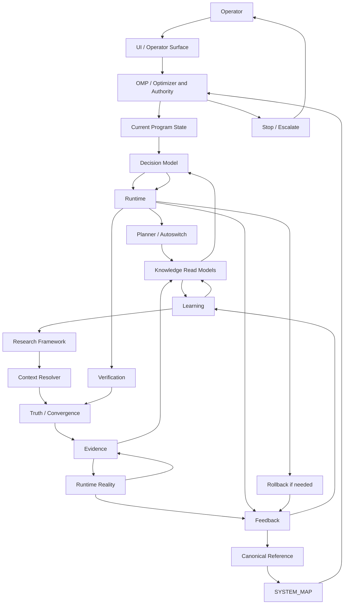
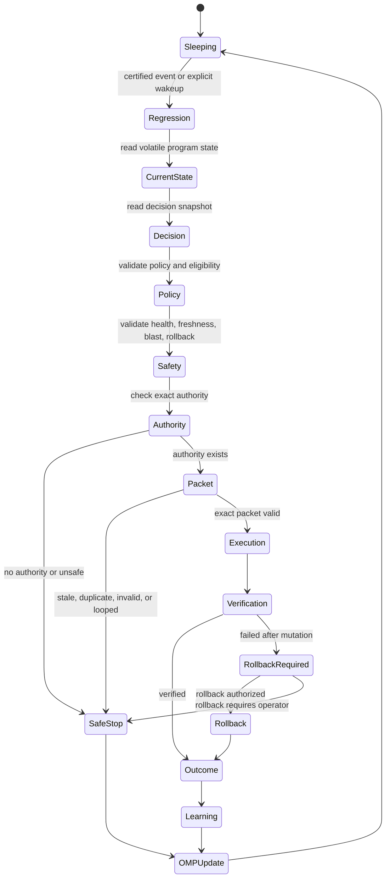

# V7 System Architecture

Status: canonical final architecture
Program: `V7.SYSTEM.ARCHITECTURE.SYNTHESIS`
Phase: FINAL_ARCHITECTURE_SYNTHESIS
Need New Owner: FALSE
Architecture Verdict: ARCHITECTURE_COMPLETE

## Purpose

V7 is one integrated production routing control plane.

It observes runtime reality, turns reality into evidence, turns evidence into knowledge, turns knowledge into decisions, executes only authorized decisions, verifies every effect, learns only from observed outcomes, and returns to sleep.

The architecture is event-driven, policy-first, safety-bounded, reversible, and learning-oriented.

This document is architecture-only. It does not implement code, runtime, daemon, timer, apply, user movement, planner redesign, governance redesign, execution redesign, truth-source creation, or synthetic evidence.

## Complete System Diagram



Integrated control loop:

```text
Operator
  -> UI
  -> OMP
  -> Current Program State
  -> Decision Model
  -> Runtime
  -> Planner
  -> Knowledge
  -> Learning
  -> Research Framework
  -> Context Resolver
  -> Truth
  -> Evidence
  -> Runtime Reality
  -> Feedback
  -> Canonical Reference
  -> SYSTEM_MAP
  -> OMP
```

V7 is not a chain of documents.
V7 is a control system with stable owners:

- OMP decides what work is highest leverage and where authority stops.
- Current Program State carries volatile continuation state.
- Decision Model defines decision semantics.
- Runtime executes or stops on approved decision snapshots.
- Planner ranks and blocks candidate movement.
- Knowledge builds compact read models.
- Learning closes the outcome loop.
- Research Framework improves architecture methodology.
- Context Resolver keeps Codex and operators from loading unrelated context.
- Truth/convergence verify reality.
- Evidence and runtime reality ground every claim.
- Feedback turns execution results into learning.
- Canonical Reference and SYSTEM_MAP preserve durable meaning and ownership.

## Responsibility Matrix

| Subsystem | Purpose | Owner | Inputs | Outputs | Consumers | Stop Conditions |
| --- | --- | --- | --- | --- | --- | --- |
| Operator | Grants authority, reviews escalations, starts governed work. | Human operator | UI state, OMP stop reason, packet preview, approval question. | Approval, rejection, explicit instruction. | UI, OMP, Runtime authority gate. | No approval, unclear authority, unsafe request. |
| UI | Presents operator-first state and actions. | Admin UI / operator surfaces | Runtime reality, planner decisions, user/channel state, stop reasons. | Operator-visible decisions, alerts, approval previews. | Operator, OMP. | Contradictory state, no actionable safe command. |
| OMP | Optimizes what V7 should do next and owns authority boundary meaning. | Operational Maturity Program | Current Program State, canonical truth, SYSTEM_MAP, runtime verification, stop/outcome. | HLA, bottleneck, stop reason, safe next action, authority boundary. | Codex, Runtime, Current Program State, Operator. | `AUTHORITY_BOUNDARY`, `REAL_WORLD_LIMIT`, `UNSAFE_IMPLEMENTATION`, `FUNDAMENTAL_ARCHITECTURE_GAP`. |
| Current Program State | Carries volatile current bottleneck, HLA, packet freshness, metrics, and continuation state. | Current Program State owner | OMP result, runtime lifecycle result, verification status. | Current state snapshot, next safe action, approval question. | OMP, Runtime, Codex. | Stale packet, state conflict, missing generation, unresolved stop reason. |
| Decision Model | Defines canonical decision loop, vocabulary, gates, and output shape. | Decision Model Reference | Event/question, current state, desired state, policy, evidence quality, risk, authority, rollback, verification. | Decision snapshot, action vocabulary, stop/escalation meaning. | Runtime, OMP, UI, Planner. | No decision, unsupported action, stale decision, missing authority/verification path. |
| Runtime | Executes approved decision snapshots through existing owners or stops safely. | Runtime Model over existing runtime owners | Approved wakeup, Current Program State, Decision Snapshot, policy, safety, authority, packet. | Execution/stop result, verification result, rollback result, outcome, learning feed, OMP notification. | OMP, Feedback, Learning, Truth. | `AUTHORITY_BOUNDARY`, `VERIFY_FAILED`, `ROLLBACK_REQUIRED`, `LOOP_GUARD`, `DUPLICATE_WORK`, stale packet. |
| Planner | Ranks and blocks candidate moves under policy and runtime gates. | Planner / Autoswitch | User/channel state, policies, service/route/runtime/capacity evidence, knowledge overlays. | Candidate decisions, selected move, blockers, selected move hash. | Decision Model, Runtime, UI, packet owner. | No eligible candidate, policy block, capacity block, route/runtime block, stale snapshot. |
| Knowledge | Builds compact read models from evidence and history. | Knowledge Quality, intelligence, routing foundation, trust/suitability owners | Evidence, runtime reality, service matrix, quality summaries, feedback, outcome history. | Knowledge snapshots, maturity, suitability, confidence, trust, routing readiness. | Decision Model, Planner, OMP, Runtime. | Insufficient freshness, missing real outcome, low confidence for autonomy tier. |
| Learning | Converts verified outcomes into future knowledge. | Decision To Outcome To Learning Integration | Verified execution outcome, rollback result, operator feedback, closure records. | Updated trust, suitability, prediction, decision effectiveness, knowledge growth. | Knowledge, OMP, Decision Model. | No observed outcome, synthetic evidence, verification incomplete. |
| Research Framework | Governs future architectural research and reusable principle extraction. | Research Framework | Research question, Context Resolver, mature production sources, V7 mapping. | Engineering laws, comparison matrices, gap classifications, canonical recommendations. | Canonical Reference, SYSTEM_MAP, OMP, Decision Model. | Unvalidated sources, no reuse analysis, no V7 mapping, no canonical recommendation. |
| Context Resolver | Selects minimum working context for each task. | Context Resolver | Task type, Kernel, OMP, canonical truth, SYSTEM_MAP, relevant ADRs. | Working set, maximum-context boundary. | Codex, Research Framework, OMP. | Ambiguous task requiring smaller safe set, unrelated reports, packet state for non-execution task. |
| Truth | Verifies repository, runtime, deployment, and convergence alignment. | Truth / Convergence | Runtime fingerprint, repo commit, deploy files, approved commands. | PASS/FAIL, alignment status, blockers, warnings. | OMP, Runtime, Canonical Reference. | Failed truth, failed convergence, unknown runtime state. |
| Evidence | Preserves observed facts and reports. | Evidence owners / reports / runtime read models | Runtime reality, tests, service checks, dry-runs, outcome records. | Evidence records, reports, audit facts. | Knowledge, Research Framework, Canonical Reference. | Synthetic evidence, stale evidence, evidence contradiction. |
| Runtime Reality | Physical production state and final verification ground. | Runtime state and deployed tools | Live runtime files, registries, services, runtime fingerprints. | Observed reality, readiness, mutation facts. | Truth, Evidence, Runtime, UI. | Unreadable runtime, unknown mutation state, runtime mismatch. |
| Feedback | Captures post-action operator and system outcome facts. | Operator execution feedback | Execution result, verification result, rollback result, operator response. | Closure record, feedback record, learning input. | Learning, OMP, Knowledge. | No verified effect, no closure path, contradictory feedback. |
| Canonical Reference | Stores durable current system meaning. | Canonical Reference | Stable conclusions, ADRs, truth, reports, SYSTEM_MAP. | Current system truth. | Codex, OMP, Research Framework, SYSTEM_MAP. | Meaning changed without update, contradiction with runtime/ADR. |
| SYSTEM_MAP | Maps owners, files, truths, and topology. | SYSTEM_MAP | Canonical Reference, ADRs, owner inventory, runtime evidence. | Ownership map, reuse surface, duplicate detector basis. | OMP, Context Resolver, Research Framework, Codex. | Missing owner, duplicate owner, stale topology. |

## Information Flow

End-to-end information flow:

```text
event
  -> event evidence
  -> current state
  -> knowledge snapshot
  -> decision snapshot
  -> runtime authority check
  -> packet / stop
  -> execution if authorized
  -> verification
  -> rollback if needed
  -> outcome closure
  -> feedback
  -> learning
  -> updated knowledge
  -> future decisions
```

Information moves in one direction during runtime execution:

1. Runtime reality produces observable facts.
2. Evidence owners record facts without invention.
3. Knowledge owners compact evidence into read models.
4. Decision Model turns current state, desired state, policy, evidence, safety, authority, and rollback readiness into a decision snapshot.
5. Runtime consumes the decision snapshot without re-deciding.
6. Verification and rollback produce outcome facts.
7. Feedback records the actual effect.
8. Learning updates future knowledge.
9. OMP uses the new state to recompute bottleneck and highest leverage action.

## Execution Flow

When a regression occurs:

1. A certified existing event source observes a channel, service, route, runtime, capacity, or user-impact regression.
2. Runtime may wake only if the event is approved or already certified by existing event owners.
3. Runtime reads Current Program State.
4. Runtime reads an existing Decision Snapshot.
5. Decision Model validates action vocabulary, desired state, current state, evidence quality, policy, risk, blast radius, authority requirement, rollback target, verification plan, outcome closure plan, and learning path.
6. Planner / Autoswitch remains the only candidate ranking and movement-blocker owner.
7. Runtime checks policy and eligibility.
8. Runtime checks safety: health, freshness, restore barrier, rollback target, verification plan, blast radius.
9. Runtime checks authority.
10. If authority is missing, Runtime stops at `AUTHORITY_BOUNDARY`.
11. If authority exists, Runtime requires a fresh packet for the current generation.
12. If packet is stale, invalid, duplicate, or looped, Runtime stops.
13. If the packet is valid and exact execution authority exists, Runtime calls the existing governed execution owner.
14. Runtime verifies the effect.
15. If verification fails after mutation, Runtime rolls back if rollback authority exists; otherwise it escalates.
16. Runtime closes the observed outcome.
17. Runtime feeds learning only from observed outcome.
18. Runtime updates Current Program State with terminal result.
19. Runtime notifies OMP.
20. OMP recomputes next bottleneck and safe next action.
21. System returns to sleep.

## Knowledge Flow

Knowledge is a closed loop:

```text
Reality
  -> Evidence
  -> Knowledge
  -> Decision
  -> Outcome
  -> Learning
  -> Knowledge
```

Rules:

- Reality is the only source of runtime facts.
- Evidence preserves observed facts.
- Knowledge compacts evidence into decision-ready read models.
- Decision uses knowledge but does not mutate reality.
- Outcome is accepted only after verification.
- Learning updates knowledge only from observed outcome.
- Synthetic evidence never enters the loop.

## Authority Flow

| Question | Owner |
| --- | --- |
| Who decides what action is semantically valid? | Decision Model over existing decision owners. |
| Who ranks candidate movement? | Planner / Autoswitch. |
| Who decides what work matters next? | OMP. |
| Who grants execution authority when boundary is crossed? | Operator through OMP authority boundary. |
| Who executes? | Runtime through existing governed execution owners only. |
| Who verifies? | Runtime Readiness, truth/convergence, verification owners. |
| Who rolls back? | Existing Restore Barrier / Rollback owners, only if authorized. |
| Who learns? | Feedback and Learning owners. |
| Who updates OMP meaning? | OMP, only when scheduler/optimizer meaning changes. |
| Who updates Current State? | Current Program State owner after safe action or approved execution changes volatile state. |
| Who preserves durable architecture meaning? | Canonical Reference and SYSTEM_MAP. |

Authority does not flow from confidence alone.
Authority flows from exact approved action, safety, packet validity, restore barrier, rollback readiness, verification plan, and explicit authority tier.

## Lifecycle Diagram



## Scaling Model

V7 scales to `100+` channels and `10000+` users because Runtime does not grow with raw data volume.

Scaling mechanism:

1. Background systems process large evidence sets.
2. Knowledge owners compact evidence into read models.
3. Planner evaluates candidates through existing policy/gate owners.
4. Decision Model consumes structured current state, desired state, policy, evidence quality, risk, authority, packet, rollback, and verification fields.
5. Runtime executes only the selected exact decision snapshot.
6. Runtime uses identifiers, generations, hashes, packet ids, and stop reasons instead of scanning history.
7. Learning updates future knowledge outside the runtime event path.

Runtime event-time work is bounded by:

- one approved wakeup;
- one Current Program State read;
- one Decision Snapshot;
- one policy/safety/authority check;
- one packet;
- one execution or stop;
- one verification;
- one outcome/learning handoff.

Adding users or channels increases background knowledge work, not runtime thinking work.

## Failure Model

| Stop | Meaning | Survival behavior |
| --- | --- | --- |
| `AUTHORITY_BOUNDARY` | Exact action requires explicit authority before restore-barrier write, apply, user movement, rollback apply, daemon/timer enablement, or authority expansion. | Stop, preserve packet/decision ids, publish exact approval question, notify OMP, sleep. |
| `REAL_WORLD_LIMIT` | The system cannot learn or prove more because the required real-world outcome has not happened. | Stop without inventing evidence, preserve current reality limit, wait for governed/manual real outcome. |
| `UNSAFE_IMPLEMENTATION` | Proposed work would lower floors, bypass authority, create unsafe mutation, or run outside existing owners. | Reject implementation path, return to semantic reuse, require safer existing-owner design. |
| `FUNDAMENTAL_ARCHITECTURE_GAP` | Existing owners cannot provide required capability even by composition or extension. | Stop, require ADR and architecture decision before implementation. Current synthesis finds no such gap. |
| `VERIFY_FAILED` | Execution result cannot be proven correct. | If no mutation happened, stop; if mutation may have happened, verify state, rollback if authorized, otherwise escalate. |
| `ROLLBACK_REQUIRED` | Verification failed after mutation or state is unsafe and rollback/recovery is needed. | Use existing rollback owner if authorized; otherwise stop at authority boundary with evidence preserved. |
| `LOOP_GUARD` | Same work would repeat without new evidence, state, authority, or packet generation. | Stop, record repeated idempotency key/stop reason, require material change before retry. |
| `DUPLICATE_WORK` | Same decision/action/generation/packet is already active or terminal. | Reuse terminal result if complete; otherwise stop without re-executing. |

V7 survives failure by failing closed.
No failure path authorizes synthetic success, silent retry, hidden mutation, or duplicated execution.

## Architectural Health Check

| Subsystem | Classification | Why |
| --- | --- | --- |
| Operator | COMPLETE | Authority and escalation are first-class; execution stops before human authority boundaries. |
| UI | COMPLETE | Operator surface exists as consumer of decisions, state, and approval previews; UI is not an architecture blocker. |
| OMP | COMPLETE | Scheduler, optimizer, bottleneck, HLA, authority boundary, semantic reuse, and duplicate detection are defined. |
| Current Program State | COMPLETE | Volatile state is separated from stable OMP/kernel rules. Stale packet is a current state fact, not architecture weakness. |
| Decision Model | COMPLETE | Decision loop, vocabulary, laws, comparison matrix, output shape, reuse, and extension boundary are canonical. |
| Runtime Model | COMPLETE | Thin runtime lifecycle, inputs, outputs, stops, restart, idempotency, failure, and OMP notification are designed. |
| Planner / Autoswitch | COMPLETE | Candidate ranking and blockers have a single existing owner; no planner redesign needed. |
| Knowledge | COMPLETE | Knowledge quality, intelligence, routing foundation, trust, suitability, and read-model patterns already exist. |
| Learning | COMPLETE | Decision-to-outcome-to-learning and feedback paths exist; missing real outcomes are reality limits, not architecture gaps. |
| Research Framework | COMPLETE | Research workflow, engineering laws, comparison matrix, V7 mapping, gap classification, and reuse analysis are governed. |
| Context Resolver | COMPLETE | Minimum working-set loading prevents context overflow and unrelated-state contamination. |
| Truth / Convergence | COMPLETE | Repository/runtime/deploy alignment and runtime truth verification are established. |
| Evidence | COMPLETE | Evidence is preserved as observed facts and reports; synthetic evidence remains forbidden. |
| Runtime Reality | COMPLETE | Runtime remains final reality and verification surface, not a new documentation truth source. |
| Feedback | COMPLETE | Post-action feedback and closure feed learning without becoming movement authority. |
| Canonical Reference | COMPLETE | Durable system meaning has a single canonical preservation surface. |
| SYSTEM_MAP | COMPLETE | Owner/topology map supports reuse and duplicate detection. |
| New planner | UNNECESSARY | Existing Planner / Autoswitch is sufficient. |
| New governance | UNNECESSARY | OMP, Safety-Bounded Authority, authority boundary, and operator approval are sufficient. |
| New execution | UNNECESSARY | Existing governed execution, packet, restore, rollback, and feedback owners are sufficient. |
| New truth source | UNNECESSARY | Truth/convergence and runtime reality are sufficient. |
| Timer movement | UNNECESSARY | Event-driven autonomy rejects blind timer movement. |
| Synthetic evidence | UNNECESSARY | Real observed outcomes are required for trust and learning. |

No subsystem is classified `FUNDAMENTAL_GAP`.
No subsystem is classified `PARTIAL` for architecture.

## Optional Improvements

These are optional scale or maturity extensions, not release-blocking architectural weaknesses:

1. Direct client telemetry as an additional evidence class.
2. 10k-scale cohort/SLA aggregate views.
3. Long-horizon evidence aging and retirement.
4. Operator-free quarantine/recovery certification after separate authority and safety proof.

Optional improvement count: `4`.

## Semantic Reuse Result

Existing owners cover the full system architecture.

| Field | Result |
| --- | --- |
| Existing semantic coverage | `100%` for final architecture ownership. |
| Need New Owner | `FALSE` |
| New planner needed | `FALSE` |
| New governance needed | `FALSE` |
| New execution needed | `FALSE` |
| New truth source needed | `FALSE` |
| New evidence source required for architecture | `FALSE` |
| Runtime implementation required for architecture synthesis | `FALSE` |

## Duplicate Detector Result

| Area | Verdict |
| --- | --- |
| Duplicate planner | `NONE` |
| Duplicate governance | `NONE` |
| Duplicate execution | `NONE` |
| Duplicate truth source | `NONE` |
| Duplicate evidence collector | `NONE` |
| Duplicate runtime owner | `NONE` |
| Duplicate lifecycle | `NONE` |
| Duplicate architecture owner | `NONE` |

The system architecture is an integration of existing owners, not a new parallel system.

## Final Question

If V7 were released today as a production routing platform for `10000+` users, what architectural weaknesses remain?

ARCHITECTURE_COMPLETE

Remaining architectural weaknesses: `0`.

This answer excludes implementation status, missing data, missing evidence, and authority boundaries by design.
