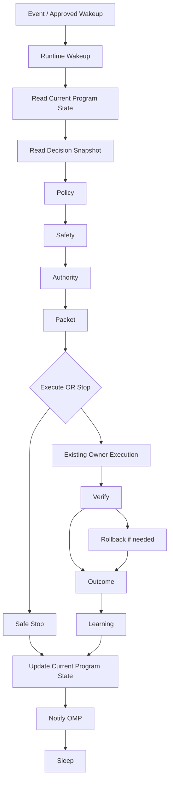

# V7 Runtime Model Design Report

Status: DESIGN_COMPLETE
Program: `V7.RUNTIME.DESIGN.PROGRAM`
Date: 2026-06-25
Need New Owner: FALSE

## Purpose

This report records the design-phase result for executable V7 Runtime using the completed V7 Decision Model.

No runtime code was implemented.
No daemon, timer, event consumer, autonomous execution, apply path, user movement, planner, governance, execution, or truth source was changed.

## Context Working Set

Loaded through the Context Resolver architecture-design rule and explicit task request:

- `docs/reference/V7_KERNEL.md`
- `docs/reference/V7_CONTEXT_RESOLVER.md`
- `docs/programs/OPERATIONAL_MATURITY_PROGRAM.md`
- `docs/programs/V7_CURRENT_PROGRAM_STATE.md`
- `docs/reference/V7_ENGINEERING_PRINCIPLES.md`
- `docs/reference/V7_DECISION_MODEL.md`
- `docs/reference/V7_CANONICAL_REFERENCE.md`
- `docs/reference/SYSTEM_MAP.md`
- Relevant ADRs:
  - `docs/decisions/ADR-V7-SAFETY-BOUNDED-AUTHORITY.md`
  - `docs/decisions/ADR-EVENT-DRIVEN-AUTONOMY.md`
  - `docs/decisions/ADR-V7-KERNEL-AND-STATE-SPLIT.md`
  - `docs/decisions/ADR-V7-WORLD-CLASS-DECISION-MODEL.md`

No historical reports were intentionally loaded.

## Semantic Reuse Audit

Equivalent runtime ingredients already exist across V7:

| Runtime need | Existing owner |
| --- | --- |
| Event-driven model | Event-Driven Autonomy Contract |
| Current state | V7 Current Program State |
| Decision semantics | V7 Decision Model |
| Policy and candidate ranking | Planner / Autoswitch |
| Safety and authority split | Safety-Bounded Authority |
| Packet preview | Execution Packet owner |
| Restore barrier | Restore Barrier / Rollback |
| Verification | Runtime Readiness, truth/convergence |
| Feedback | Operator execution feedback |
| Learning | Decision To Outcome To Learning Integration |
| Program continuation | OMP |

Result: extend by documentation and composition.
No new runtime owner is required.

## Duplicate Detector Result

No duplicate runtime owner was created.

Rejected duplicates:

- new planner;
- new governance layer;
- new execution path;
- new truth source;
- new daemon/timer authority;
- new event consumer;
- new learning source;
- new documentation state source for runtime facts.

Runtime is a lifecycle contract that composes existing owners.

## Design Verdict

Runtime executes approved decisions only.

Runtime is responsible for:

1. waking from approved sources;
2. reading Current Program State;
3. reading an existing Decision Snapshot;
4. enforcing policy;
5. enforcing safety;
6. enforcing authority;
7. requiring a valid packet;
8. executing only through existing owners when explicitly authorized;
9. verifying every mutation;
10. rolling back if needed and authorized;
11. closing observed outcomes;
12. feeding learning only from real outcomes;
13. updating Current Program State;
14. notifying OMP;
15. terminating safely.

Runtime is not responsible for:

- inventing decisions;
- ranking candidates;
- creating policy;
- building knowledge;
- lowering floors;
- creating synthetic evidence;
- bypassing authority;
- enabling timers or daemons;
- moving users without explicit approval.

## Runtime Lifecycle Diagram



## Runtime State Machine

| State | Meaning | Terminal stop if blocked |
| --- | --- | --- |
| `ASLEEP` | Runtime has no active approved work. | N/A |
| `WOKEN` | Runtime received approved wakeup. | `UNAPPROVED_WAKEUP` |
| `STATE_LOADED` | Current Program State loaded. | `CURRENT_STATE_UNAVAILABLE`, `STATE_CONFLICT` |
| `DECISION_LOADED` | Existing decision snapshot loaded. | `NO_DECISION`, `STALE_DECISION` |
| `POLICY_CHECKED` | Policy and eligibility checked. | `POLICY_BLOCK`, `ELIGIBILITY_BLOCK` |
| `SAFETY_CHECKED` | Safety, freshness, blast radius, rollback checked. | `SAFETY_BLOCK`, `ROLLBACK_UNAVAILABLE` |
| `AUTHORITY_CHECKED` | Exact authority checked. | `AUTHORITY_BOUNDARY` |
| `PACKET_READY` | Packet valid for current generation. | `PACKET_INVALID`, `DUPLICATE_WORK` |
| `EXECUTING` | Existing owner executes exact approved action. | `EXECUTION_REFUSED` |
| `VERIFYING` | Runtime verifies result. | `VERIFY_FAILED_NO_MUTATION`, `VERIFY_INCONCLUSIVE` |
| `ROLLING_BACK` | Runtime invokes rollback if authorized. | `ROLLBACK_REQUIRED_OPERATOR` |
| `OUTCOME_CLOSING` | Observed outcome is closed. | `OUTCOME_UNAVAILABLE` |
| `LEARNING_FEED` | Real outcome feeds learning. | `LEARNING_SKIPPED_NO_REAL_OUTCOME` |
| `STATE_UPDATED` | Current Program State records terminal result. | `STATE_UPDATE_CONFLICT` |
| `OMP_NOTIFIED` | OMP can continue. | `OMP_NOTIFY_FAILED` |
| `TERMINATED_SAFE` | Runtime sleeps safely. | N/A |

## Runtime Responsibility Matrix

| Responsibility | Runtime decision | Existing owner |
| --- | --- | --- |
| Wakeup | Accept only approved event/manual/OMP resume. | Event-Driven Autonomy Contract, OMP |
| Current state | Read and later update lifecycle result. | Current Program State |
| Decision | Read snapshot only. | Decision Model |
| Policy | Check pass/fail. | Planner / Autoswitch, OMP |
| Safety | Check pass/fail. | Safety-Bounded Authority, Runtime Readiness |
| Authority | Stop unless exact authority exists. | OMP, operator approval |
| Packet | Require valid packet and generation. | Execution Packet owner |
| Execute | Call existing owner only after authority. | Autoswitch Runtime Owner / governed execution |
| Verify | Verify exact result. | Runtime Readiness, truth/convergence |
| Rollback | Use existing rollback only if needed and authorized. | Restore Barrier / Rollback |
| Outcome | Record observed outcome. | Feedback owners |
| Learning | Feed only verified real outcomes. | Learning owners |
| OMP | Notify by Current Program State. | OMP |

## Mapping Runtime -> Existing Owners

Runtime is mapped entirely to existing owners:

- Event and wakeup: Event-Driven Autonomy Contract, Event Trigger Certification.
- State: V7 Current Program State.
- Decision: V7 Decision Model and existing decision surfaces.
- Policy/candidate: Planner / Autoswitch.
- Safety: Safety-Bounded Authority and Runtime Readiness.
- Authority: OMP and explicit operator approval.
- Packet: Execution Packet owner.
- Restore/rollback: Restore Barrier / Rollback.
- Verification: Runtime Readiness, truth/convergence.
- Outcome: Operator execution feedback.
- Learning: Decision To Outcome To Learning Integration.
- Continuation: OMP.

Need New Owner: FALSE.

## Stop Conditions

Runtime stop conditions are canonicalized in `docs/reference/V7_RUNTIME_MODEL.md`.
The most important stops are:

- `NO_DECISION`
- `STALE_DECISION`
- `POLICY_BLOCK`
- `SAFETY_BLOCK`
- `AUTHORITY_BOUNDARY`
- `PACKET_INVALID`
- `DUPLICATE_WORK`
- `LOOP_GUARD`
- `VERIFY_INCONCLUSIVE`
- `ROLLBACK_REQUIRED_OPERATOR`
- `OUTCOME_UNAVAILABLE`

Stop is valid and safe.
Runtime must never convert a stop into implicit retry or apply.

## Restart Behavior

Runtime restart uses existing durable identifiers:

- `decision_id`
- `operation_id`
- `packet_id`
- selected move hash
- current state generation
- restore barrier generation
- rollback target
- verification result id
- outcome closure id

If Runtime cannot prove whether a mutation happened, it fails closed and escalates.

## Failure Behavior

Runtime failure behavior is fail-closed:

- before mutation, stop and record reason;
- after possible mutation, verify first;
- if verification fails and rollback is authorized, rollback;
- if rollback needs authority, stop and escalate;
- if no real observed outcome exists, do not feed learning.

## Idempotency Strategy

Runtime idempotency key:

```text
decision_id
  + subject
  + action
  + current_state_generation
  + target
  + packet_id
  + selected_move_hash
```

The idempotency key prevents duplicate execution, looped retries, and restart-driven repeat mutation.

## Observability Strategy

Runtime observability records lifecycle metadata only:

- lifecycle id;
- idempotency key fingerprint;
- stage;
- owner;
- input generation;
- stop reason;
- authority status;
- verification status;
- rollback status;
- outcome status;
- learning status;
- OMP notification status.

This is not a new truth source.

## Implementation Roadmap

1. Documentation contract and ADR.
2. Read-only field audit of existing owner identifiers.
3. Read-only schema/spec for lifecycle state.
4. State-machine and idempotency tests.
5. Read-only Runtime preview.
6. Manual authority-gated invocation after explicit approval.
7. Bounded execution integration after explicit approval.
8. Verified outcome closure and learning feed from real outcomes.
9. Separate ADR before daemon, timer, event automation, or autonomous apply.

## Verification Scope

Required verification for this design phase:

- `tools/v7-truth-check --all --json`
- `tools/v7-convergence-status --json`

No runtime mutation, no apply, and no user movement are part of this design report.
