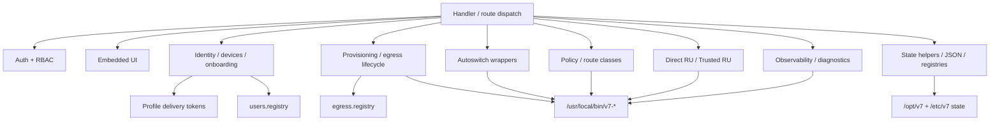

# V7 Track 5 - Admin Monolith Boundary Map

Purpose: map `admin/v7-admin-api` before extraction. This is a containment document, not a rewrite plan.

Current size:

```text
admin/v7-admin-api: 30067 lines
```

## Top-Level Runtime Shape

| Area | Approx Lines | Current Responsibility | Runtime Criticality |
|---|---:|---|---|
| constants, paths, route class metadata | 1-721 | path contracts, roles, policy defaults, UI metadata | Critical |
| common helpers | 722-1756 | IO, JSON/text writes, redaction, parsing, safe validators | Critical |
| identity/onboarding/profile issuance | 1757-4389 | identity DB, users/orgs/devices, onboarding sessions, profile issue/revoke | Critical |
| egress import/provisioning lifecycle | 4392-9360 | config parsing, drafts, runtime tests, quarantine, enable gates | High |
| diagnostics and maintenance | 9363-11145 | backups, disk, traffic, service matrix, speed, event normalization | Medium/high |
| policy/autoswitch/service-aware routing | 11146-12142 | policy writes, autoswitch wrappers, route scoring, service-aware dry-run/apply | Critical |
| profile delivery and client readiness | 12145-13981 | public profile tokens, client artifacts, readiness maps, smart profiles | Critical |
| egress deletion/pause/details | 13984-14535 | migration plans, delete/pause, config export | Critical |
| direct/RU and Trusted RU summaries | 14538-15032 | direct domain tests, policy domain state, trusted RU diagnostics/readiness | Critical and sensitive |
| overview aggregation | 15035-15252 | operator summary, cached overview | High |
| public/admin HTML rendering | 15253-26488 | login/connect/admin UI and embedded JS | Medium/high |
| HTTP handler/router | 26489-30067 | auth gates, route dispatch, endpoint response schemas | Critical |

## Subsystem Map

### Auth / Session

Primary ranges:

- auth helpers: `815-1206`
- route auth gates: `26549-26626`
- login/logout actions: `27252-27315`

State/contracts:

- `/etc/v7/admin/auth.json`
- `/etc/v7/admin/safe-mode.json`
- cookies/session signature

Coupling:

- `Handler.require_auth`
- role maps and `ACTION_MIN_ROLE`
- audit logging

Extraction risk:

- Medium. Extract only after endpoint auth behavior is frozen.

### RBAC

Primary ranges:

- dangerous action set: `474-559`
- action role map: `574-718`
- runtime checks: `26595-26626`

Coupling:

- every `/api/actions/*`;
- safe mode;
- role escalation audit.

Extraction risk:

- Medium/high. A small error silently changes operator powers.

### Identity / Onboarding / Devices

Primary ranges:

- schema and DB helpers: `1770-2068`
- identity state/read models: `2068-2242`
- org/group/phone lifecycle: `2242-2586`
- connect sessions: `2608-2976`
- device/profile issue/revoke: `2976-4207`

State/contracts:

- `/opt/v7/admin/v7-identity.db`
- profile delivery tokens
- users registry interaction
- client artifacts

Coupling:

- profile delivery;
- proxy identity binding;
- public `/connect`;
- admin user/device workflows.

Extraction risk:

- High for writes, medium for read models.

### Provisioning / Egress Lifecycle

Primary ranges:

- parsers/import: `4392-6490`
- draft lifecycle: `6495-7412`
- runtime test/preflight/quarantine: `7505-8243`
- pool/apply/provision/enable: `8243-9309`

State/contracts:

- `/etc/v7/egress-drafts`
- `/opt/v7/admin/egress-draft-tests`
- `/etc/v7/egress-runtime`
- `/opt/v7/egress/state/egress.registry`
- `/opt/v7/egress/state/users.registry`

Shell coupling:

- proxy runtime helper;
- OpenVPN runtime processes;
- egress set-state tools.

Extraction risk:

- Read-only parsers: medium/low.
- apply/provision/enable: high.

### Observability / Diagnostics

Primary ranges:

- restore/rollback summaries: `9363-9407`
- kill switch summaries: `9407-9462`
- capacity/readiness: `9462-9531`
- readonly shell wrapper: `9531-9563`
- traffic/service matrix/events: `10549-11125`

State/contracts:

- service matrix;
- speed summaries;
- audit/events;
- traffic SQLite.

Extraction risk:

- Low for pure formatters.
- Medium for shell wrappers and state readers.

### Autoswitch Wrappers

Primary ranges:

- autoswitch plan/dry-run/apply: `11235-11272`
- channel UI calls: embedded JS and `/api/actions/autoswitch-*`

Shell coupling:

- `/usr/local/bin/v7-users-autoswitch`

Extraction risk:

- Dry-run wrapper: medium.
- apply wrapper: high; do not extract first.

### Policy / Route Classes / Service-Aware Routing

Primary ranges:

- policy state/writes: `11146-11400`
- service recommendations: `11409-11658`
- service-aware route dry-run/apply preview: `11658-12142`

State/contracts:

- `/etc/v7/policy.json`
- `/etc/v7/org-egress-policy.json`
- `/opt/v7/policy/route-classes.registry`

Extraction risk:

- High. Policy writes affect route decisions and operator trust.

### Direct/RU and Trusted RU

Primary ranges:

- direct routing summaries: `14538-14744`
- trusted RU decision/diagnostics/readiness: `14744-15032`
- actions: `28900-28970`, `29902-30032`

State/contracts:

- `/etc/v7/direct/domains.conf`
- `/etc/v7/policy/direct_ru_domains.conf`
- `/etc/v7/policy/trusted_ru_sensitive_domains.conf`
- trusted RU diagnostic state files.

Extraction risk:

- High. Do not extract during Track 5.

### UI Rendering

Primary ranges:

- public connect pages: `15294-15605`
- admin v2 HTML/JS/CSS: `15606-26475`
- legacy admin page: `26475-26488`

Coupling:

- fetches many `/api/*` endpoints;
- depends on response shapes;
- contains action confirmations and operator workflows.

Extraction risk:

- Medium/high. Split only after endpoint contracts are frozen.

### HTTP Handler / Router

Primary ranges:

- handler class: `26489-30067`
- GET endpoints: `26669-27200`
- POST endpoints: `27200-30056`

Endpoint count observed:

- total route branches discovered: `186`
- large action surface under `/api/actions/*`

Extraction risk:

- High. Do not split until contract tests exist.

## Dependency Graph



## Coupling Hotspots

1. `Handler` directly dispatches both read and mutating routes.
2. Embedded UI expects many implicit JSON shapes.
3. State helpers are global and used everywhere.
4. Shell tools are called by PATH and not all have repo lineage.
5. Identity and profile delivery cross over with routing/user registries.
6. Provisioning lifecycle can write multiple runtime files.
7. Direct/RU and Trusted RU are mixed with policy, UI text, and shell diagnostics.
8. Audit is present but not uniformly enforced for every risky operation.

## Runtime-Critical Boundaries

Do not change in Track 5:

- kill switch checks;
- route assignment and user switching;
- autoswitch apply behavior;
- direct/RU and Trusted RU behavior;
- provisioning enable/apply;
- profile token consumption;
- policy apply;
- Handler response shapes.

